# GCP Monitoring & Observability

## Overview

Google Cloud Monitoring & Observability helps teams observe infrastructure, services, and applications from a single operational plane. It combines metrics, logs, traces, errors, dashboards, profiling, and alerting into a workflow that supports faster detection, triage, and resolution.

This guide consolidates key concepts and practical commands for operating Google Cloud workloads with Cloud Monitoring, Cloud Logging, Cloud Trace, Error Reporting, alerting, SLO management, dashboards, the Ops Agent, and Cloud Profiler.

## Core Capabilities Map

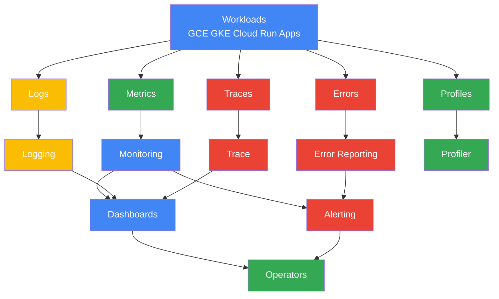

## Document Usage

- Use this document as a practical runbook and reference.
- Replace placeholder values such as `PROJECT_ID`, `SERVICE_NAME`, and `POLICY_ID` with real values.
- Run `gcloud auth login` and `gcloud config set project PROJECT_ID` before executing commands.
- Some features can also be configured in the Google Cloud console, but CLI examples are included for repeatability.

---

# 1. Cloud Monitoring

## 1.1 Mermaid Diagram

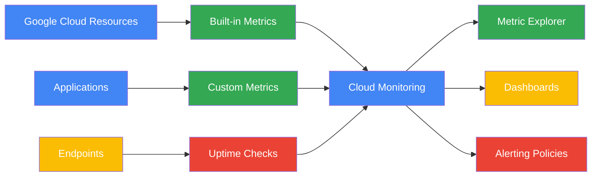

## 1.2 Explanation

Cloud Monitoring is the metrics-centric part of Google Cloud observability. It collects platform metrics from GCE, GKE, Cloud Run, load balancers, databases, and other managed services. It also supports user-defined custom metrics so that application signals can be visualized beside infrastructure signals.

Key capabilities include:

- Metrics collection from Google Cloud services.
- Uptime checks for public or private endpoints.
- Dashboards for service health, capacity, and business KPIs.
- Metric Explorer for ad hoc investigation.
- Custom metrics for domain-specific telemetry.
- Alerting based on thresholds, anomalies, absence, or query logic.

Cloud Monitoring is often the first stop for answering questions such as:

- Is the service healthy?
- Is latency rising?
- Are errors increasing?
- Is capacity close to exhaustion?
- Did a deployment change CPU, memory, or request behavior?

## 1.3 `gcloud` Commands

Set the target project:

```bash
gcloud config set project PROJECT_ID
```

List notification channels commonly paired with monitoring alerts:

```bash
gcloud alpha monitoring channels list
```

List uptime checks:

```bash
gcloud alpha monitoring uptime list
```

Describe an uptime check:

```bash
gcloud alpha monitoring uptime describe UPTIME_CHECK_ID
```

List alerting policies:

```bash
gcloud alpha monitoring policies list
```

Describe an alerting policy:

```bash
gcloud alpha monitoring policies describe POLICY_ID
```

List groups that can be used for scoping dashboards or alerts:

```bash
gcloud alpha monitoring groups list
```

Create a dashboard from JSON definition:

```bash
gcloud monitoring dashboards create --config-from-file=dashboard.json
```

List dashboards:

```bash
gcloud monitoring dashboards list
```

Describe a dashboard:

```bash
gcloud monitoring dashboards describe DASHBOARD_ID
```

Delete a dashboard:

```bash
gcloud monitoring dashboards delete DASHBOARD_ID
```

Create a custom metric descriptor:

```bash
gcloud monitoring metrics-descriptors create custom.googleapis.com/app/request_count \
  --description="Application request count" \
  --display-name="App Request Count" \
  --metric-kind=counter \
  --value-type=int64
```

List custom metric descriptors:

```bash
gcloud monitoring metrics-descriptors list --filter='metric.type = starts_with("custom.googleapis.com/")'
```

Describe a metric descriptor:

```bash
gcloud monitoring metrics-descriptors describe custom.googleapis.com/app/request_count
```

## 1.4 Best Practices

- Track golden signals: latency, traffic, errors, and saturation.
- Standardize labels such as environment, region, service, team, and version.
- Use custom metrics only for high-value signals to control cardinality and cost.
- Prefer dashboards that answer operational questions, not dashboards that merely display data.
- Create separate views for executives, service owners, and on-call engineers.
- Validate uptime checks from multiple regions when testing global services.
- Treat metric naming conventions as part of platform governance.
- Avoid overly granular labels that explode time-series count.
- Review alert thresholds regularly after traffic or architecture changes.
- Document metric ownership for every production service.

---

# 2. Cloud Logging

## 2.1 Mermaid Diagram

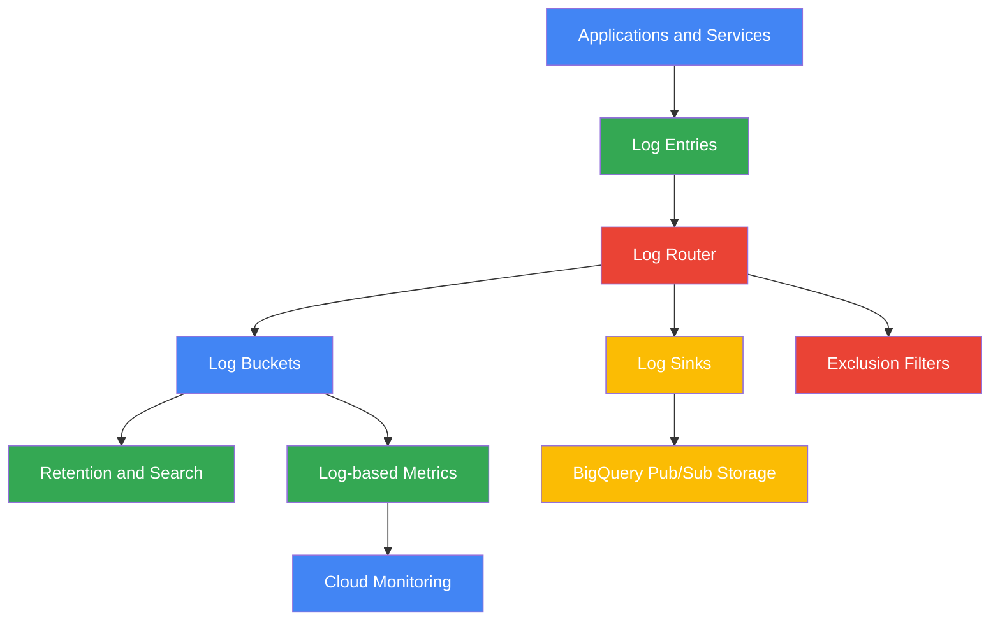

## 2.2 Explanation

Cloud Logging centralizes platform and application logs. Logs are ingested by the Log Router, which applies inclusion and exclusion logic and then routes entries to destinations such as log buckets, BigQuery datasets, Pub/Sub topics, or Cloud Storage buckets.

Important components:

- **Log Router** handles routing logic.
- **Log Buckets** store log data with retention settings.
- **Log Sinks** export selected logs.
- **Exclusion Filters** suppress noisy or low-value logs.
- **Log-based Metrics** turn log patterns into numeric metrics that can power dashboards and alerts.

This service is critical for forensic investigation, compliance retention, security analytics, and debugging.

## 2.3 `gcloud` Commands

List log buckets:

```bash
gcloud logging buckets list --location=global
```

Describe a log bucket:

```bash
gcloud logging buckets describe _Default --location=global
```

Create a custom log bucket:

```bash
gcloud logging buckets create app-audit-bucket \
  --location=global \
  --retention-days=30
```

Update retention on a bucket:

```bash
gcloud logging buckets update app-audit-bucket \
  --location=global \
  --retention-days=90
```

List sinks:

```bash
gcloud logging sinks list
```

Create a sink to BigQuery:

```bash
gcloud logging sinks create app-errors-bq \
  bigquery.googleapis.com/projects/PROJECT_ID/datasets/log_analytics \
  --log-filter='severity>=ERROR'
```

Create a sink to Cloud Storage:

```bash
gcloud logging sinks create app-archive \
  storage.googleapis.com/BUCKET_NAME \
  --log-filter='resource.type="gce_instance"'
```

Describe a sink:

```bash
gcloud logging sinks describe app-errors-bq
```

Delete a sink:

```bash
gcloud logging sinks delete app-archive
```

Read recent error logs:

```bash
gcloud logging read 'severity>=ERROR' --limit=20 --format=json
```

Read logs for a specific Cloud Run service:

```bash
gcloud logging read 'resource.type="cloud_run_revision" AND resource.labels.service_name="SERVICE_NAME"' --limit=50
```

Create a counter log-based metric:

```bash
gcloud logging metrics create error_count \
  --description='Counts error log entries' \
  --log-filter='severity>=ERROR'
```

Create a distribution log-based metric:

```bash
gcloud logging metrics create request_latency \
  --description='Latency distribution from logs' \
  --log-filter='jsonPayload.latency:*' \
  --value-extractor='EXTRACT(jsonPayload.latency)' \
  --bucket-options='linear(0,100,20)'
```

List log-based metrics:

```bash
gcloud logging metrics list
```

Describe a log-based metric:

```bash
gcloud logging metrics describe error_count
```

Delete a log-based metric:

```bash
gcloud logging metrics delete error_count
```

## 2.4 Best Practices

- Structure application logs in JSON for better filtering and parsing.
- Always include correlation IDs, trace IDs, user-safe request context, and severity.
- Create export sinks for security, audit, and long-term analytics use cases.
- Use exclusion filters carefully to reduce cost without losing investigative value.
- Separate high-retention compliance logs from short-lived application debug logs.
- Build log-based metrics for recurring failure patterns.
- Avoid logging secrets, tokens, or PII.
- Standardize log schemas across teams.
- Use dedicated buckets for sensitive workloads when retention policies differ.
- Test sink writer permissions immediately after creation.

---

# 3. Cloud Trace

## 3.1 Mermaid Diagram

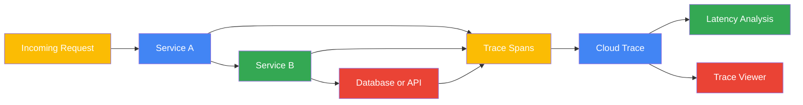

## 3.2 Explanation

Cloud Trace provides distributed tracing across service boundaries. A single request can produce a trace made up of spans that capture operation timing, parent-child relationships, and metadata. This helps teams locate latency bottlenecks in microservice or service-mesh architectures.

Core concepts:

- **Trace**: end-to-end request journey.
- **Span**: a timed operation within the trace.
- **Root span**: initial request span.
- **Child spans**: downstream calls such as RPCs, SQL queries, or internal operations.
- **Latency analysis**: inspection of where time is spent.

Trace is especially valuable when users report slowness but logs alone do not clearly show where delay originates.

## 3.3 `gcloud` Commands

Cloud Trace is most commonly explored in the console or via API clients, but the following CLI-oriented commands help with setup and related diagnostics.

Enable the Trace API:

```bash
gcloud services enable cloudtrace.googleapis.com
```

List enabled services to confirm Trace API availability:

```bash
gcloud services list --enabled | grep cloudtrace.googleapis.com
```

Read logs containing trace fields:

```bash
gcloud logging read 'trace:*' --limit=20 --format=json
```

Read logs for a specific trace ID pattern:

```bash
gcloud logging read 'trace:"projects/PROJECT_ID/traces/TRACE_ID"' --limit=50
```

Describe application default credentials used by tracing libraries:

```bash
gcloud auth application-default print-access-token
```

Set project metadata often used by instrumented apps:

```bash
gcloud config set project PROJECT_ID
```

Verify APIs relevant to tracing and telemetry:

```bash
gcloud services list --enabled | egrep 'cloudtrace|logging|monitoring'
```

## 3.4 Best Practices

- Instrument every tier involved in critical request paths.
- Propagate trace context through HTTP headers, gRPC metadata, and async workflows.
- Add business metadata sparingly and avoid sensitive content.
- Sample intelligently so traces remain useful during incidents without excessive cost.
- Correlate traces with logs by recording the trace ID in log entries.
- Review high-percentile latency, not just averages.
- Create performance baselines before major releases.
- Trace background jobs and queue consumers, not just synchronous APIs.
- Ensure database and external dependency spans are clearly named.
- Use standardized instrumentation libraries whenever possible.

---

# 4. Error Reporting

## 4.1 Mermaid Diagram

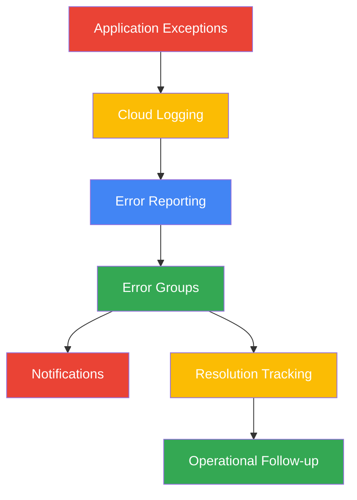

## 4.2 Explanation

Error Reporting groups application errors by fingerprint so operators can focus on error classes instead of individual log lines. It is especially useful for recurring uncaught exceptions, crash loops, and framework-generated stack traces.

Major benefits:

- Consolidated error groups instead of scattered exception logs.
- Faster triage of new regressions.
- Visibility into first seen, last seen, and affected service versions.
- Notification support through monitoring workflows.
- Resolution tracking for known and fixed issues.

Error Reporting works best when applications emit stack traces and structured error fields consistently.

## 4.3 `gcloud` Commands

Enable the Error Reporting API:

```bash
gcloud services enable clouderrorreporting.googleapis.com
```

Confirm the API is enabled:

```bash
gcloud services list --enabled | grep clouderrorreporting.googleapis.com
```

Read error logs that may feed Error Reporting:

```bash
gcloud logging read 'severity>=ERROR' --limit=50
```

Read uncaught exception logs from a specific service:

```bash
gcloud logging read 'resource.labels.service_name="SERVICE_NAME" AND (textPayload:"Exception" OR textPayload:"Traceback")' --limit=50
```

List monitoring notification channels that can be tied to error alerts:

```bash
gcloud alpha monitoring channels list
```

List alert policies that may include error-count conditions:

```bash
gcloud alpha monitoring policies list
```

## 4.4 Best Practices

- Emit stack traces and service context for unhandled exceptions.
- Use release identifiers so new deployments can be correlated with error spikes.
- Triage new error groups quickly; repeated exposure often means customer impact.
- Suppress or fix noisy duplicate exceptions that hide real incidents.
- Connect critical error groups to paging or ticket workflows.
- Mark resolved issues and verify no regressions appear after rollout.
- Avoid logging secrets in exception messages.
- Ensure application frameworks use supported logging formats where possible.
- Review top recurring errors weekly even if alert thresholds did not fire.
- Pair error trends with trace and log analysis during root cause investigation.

---

# 5. Alerting Policies

## 5.1 Mermaid Diagram

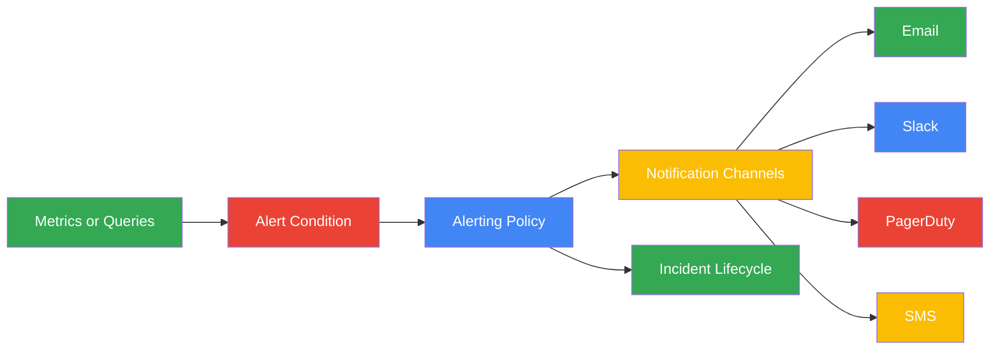

## 5.2 Explanation

Alerting Policies translate observability data into action. A policy defines one or more conditions and one or more notification channels. When a condition is met, Monitoring opens an incident and sends notifications according to the configured policy.

Common condition types:

- **Metric threshold**: trigger when a metric crosses a value.
- **Metric absence**: trigger when expected telemetry stops arriving.
- **MQL**: use Monitoring Query Language for advanced logic, joins, and transformations.
- **Forecasting or rate logic**: used for capacity or burn-rate scenarios.

Notification channels commonly include email, Slack, PagerDuty, webhooks, SMS, and mobile app notifications.

## 5.3 `gcloud` Commands

List notification channels:

```bash
gcloud alpha monitoring channels list
```

Describe a notification channel:

```bash
gcloud alpha monitoring channels describe CHANNEL_ID
```

List alert policies:

```bash
gcloud alpha monitoring policies list
```

Describe an alert policy:

```bash
gcloud alpha monitoring policies describe POLICY_ID
```

Create an alert policy from JSON:

```bash
gcloud alpha monitoring policies create --policy-from-file=policy.json
```

Update an alert policy from JSON:

```bash
gcloud alpha monitoring policies update POLICY_ID --policy-from-file=policy.json
```

Delete an alert policy:

```bash
gcloud alpha monitoring policies delete POLICY_ID
```

Create an email notification channel from JSON:

```bash
gcloud alpha monitoring channels create --channel-content-from-file=email-channel.json
```

Create a webhook or Slack-integrated channel from JSON:

```bash
gcloud alpha monitoring channels create --channel-content-from-file=slack-channel.json
```

## 5.4 Best Practices

- Alert on symptoms that matter to users, not only on low-level resource signals.
- Use severity tiers and route them to different channels.
- Prefer paging for urgent production-impacting signals only.
- Add runbook links and dashboard links in alert documentation.
- Use absence alerts for heartbeat, agent, or pipeline failures.
- Validate escalation paths during game days.
- Tune durations and thresholds to reduce noise.
- Group related conditions when they represent one incident.
- Use MQL when raw thresholds are not expressive enough.
- Review alert fatigue metrics and retire non-actionable alerts.

---

# 6. SLOs, SLIs, and SLAs

## 6.1 Mermaid Diagram

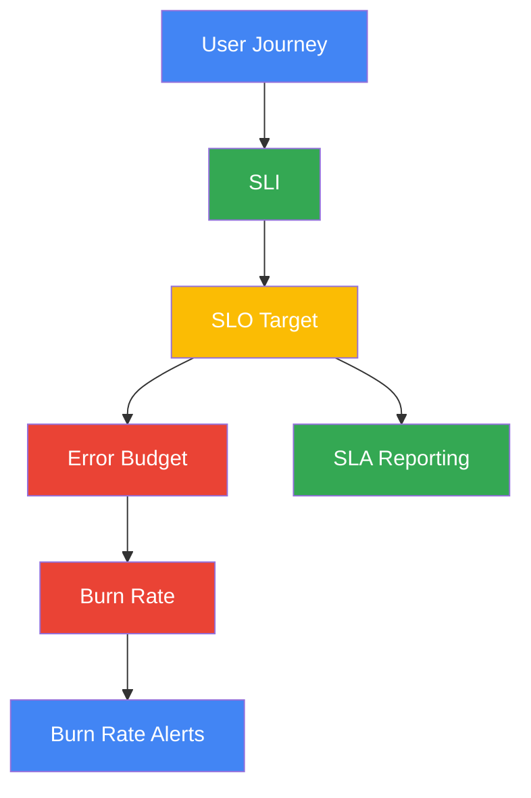

## 6.2 Explanation

Service reliability programs rely on three related concepts:

- **SLI (Service Level Indicator)**: a measurable indicator such as availability, latency, or correctness.
- **SLO (Service Level Objective)**: a target for that indicator, such as 99.9% availability over 30 days.
- **SLA (Service Level Agreement)**: a formal external commitment, often tied to contracts or credits.

An **error budget** represents the allowed unreliability for the period. If a service exceeds its error budget consumption, engineering may pause feature velocity to restore reliability. **Burn rate alerts** detect when the error budget is being consumed too quickly.

Examples of SLIs:

- Success ratio for API responses.
- P95 request latency under 300 ms.
- Batch completion success within time window.
- Queue processing age within target.

## 6.3 `gcloud` Commands

Set the project for SLO management workflows:

```bash
gcloud config set project PROJECT_ID
```

List services recognized by Service Monitoring via the API-enabled project context:

```bash
gcloud services list --enabled | egrep 'monitoring|servicemanagement|servicecontrol'
```

List alert policies that may implement burn-rate alerts:

```bash
gcloud alpha monitoring policies list
```

Describe a burn-rate alert policy:

```bash
gcloud alpha monitoring policies describe POLICY_ID
```

Create an SLO-related dashboard:

```bash
gcloud monitoring dashboards create --config-from-file=slo-dashboard.json
```

Read logs for failed requests used in availability SLIs:

```bash
gcloud logging read 'httpRequest.status>=500' --limit=50
```

Read latency logs that can support custom SLI design:

```bash
gcloud logging read 'jsonPayload.latency:*' --limit=50
```

## 6.4 Best Practices

- Define SLIs from the user perspective, not merely component health.
- Keep SLOs few, meaningful, and reviewable by leadership and engineers.
- Separate availability and latency objectives when both matter.
- Use short-window and long-window burn-rate alerts together.
- Tie release gating and change approval to error budget status.
- Align internal SLOs to exceed external SLAs.
- Document calculation logic and data sources for every SLI.
- Exclude planned maintenance windows only when policy allows it.
- Revisit SLO targets when architecture or customer expectations change.
- Ensure product, engineering, and support all understand the reliability contract.

---

# 7. Dashboards

## 7.1 Mermaid Diagram

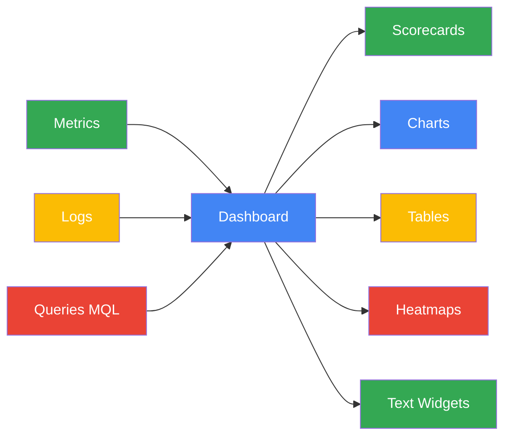

## 7.2 Explanation

Dashboards provide curated observability views for operations, leadership, product teams, and incident responders. Good dashboards compress many telemetry streams into clear answers.

Dashboard building blocks include:

- Line charts for trends over time.
- Scorecards for current values and target comparisons.
- Tables for top offenders or grouped dimensions.
- Heatmaps for latency distributions or fleet behavior.
- Text widgets for runbooks, ownership, and annotations.
- MQL-backed widgets for advanced calculations.

Monitoring Query Language (MQL) helps operators aggregate, align, group, join, and transform metric data. It is useful when a standard metric chart is too limited.

## 7.3 `gcloud` Commands

List dashboards:

```bash
gcloud monitoring dashboards list
```

Describe a dashboard:

```bash
gcloud monitoring dashboards describe DASHBOARD_ID
```

Create a dashboard from JSON:

```bash
gcloud monitoring dashboards create --config-from-file=dashboard.json
```

Update a dashboard from JSON:

```bash
gcloud monitoring dashboards update DASHBOARD_ID --config-from-file=dashboard.json
```

Delete a dashboard:

```bash
gcloud monitoring dashboards delete DASHBOARD_ID
```

Example MQL snippet for request rate by service:

```text
fetch gce_instance
| metric 'compute.googleapis.com/instance/cpu/utilization'
| group_by 1m, [value_utilization_mean: mean(value.utilization)]
| every 1m
```

Example MQL snippet for error ratio:

```text
fetch global
| metric 'logging.googleapis.com/user/error_count'
| align rate(1m)
| every 1m
```

## 7.4 Best Practices

- Create role-based dashboards: executive, service, platform, and incident views.
- Keep the most actionable widgets at the top.
- Pair symptom metrics with likely cause metrics.
- Use consistent time ranges and legends across similar dashboards.
- Add text widgets with ownership, links, and runbooks.
- Prefer a small number of high-signal widgets over clutter.
- Use templated labels or repeated structures where service fleets are large.
- Validate dashboards during real incidents, not only during design.
- Include deployment markers or release notes where possible.
- Review dashboards quarterly to remove stale widgets.

---

# 8. Ops Agent

## 8.1 Mermaid Diagram

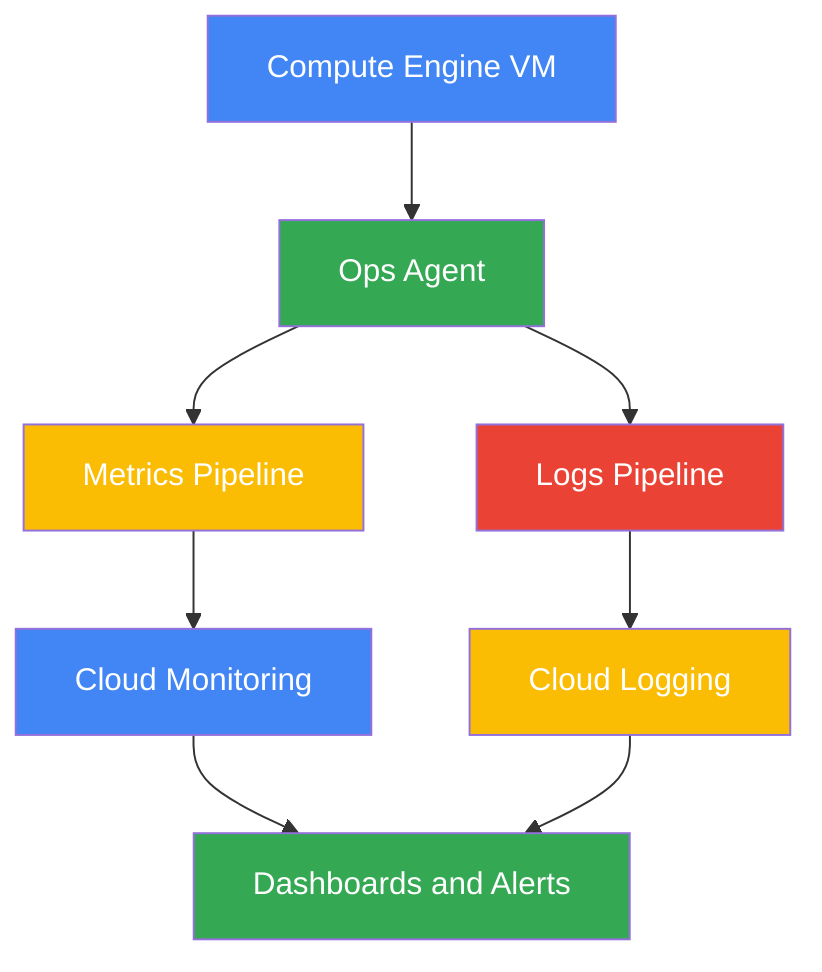

## 8.2 Explanation

The Ops Agent is Google Cloud's recommended unified agent for Compute Engine VMs. It replaces legacy monitoring and logging agents in most scenarios and collects system metrics and logs from the operating system and applications.

Typical use cases:

- VM CPU, disk, memory, process, and network metrics.
- Syslog and application log collection.
- Unified agent deployment and configuration management.
- Better integration with Monitoring and Logging.

A standard deployment includes installing the agent, validating service status, and applying YAML configuration for receivers, processors, and pipelines.

## 8.3 `gcloud` Commands

List VM instances before installation:

```bash
gcloud compute instances list
```

SSH to a VM to install the Ops Agent:

```bash
gcloud compute ssh VM_NAME --zone=ZONE
```

Copy an Ops Agent config file to a VM:

```bash
gcloud compute scp ops-agent-config.yaml VM_NAME:/etc/google-cloud-ops-agent/config.yaml --zone=ZONE
```

Restart the VM after configuration if needed:

```bash
gcloud compute instances reset VM_NAME --zone=ZONE
```

View serial port output for troubleshooting boot-time installation issues:

```bash
gcloud compute instances get-serial-port-output VM_NAME --zone=ZONE
```

Use a startup script metadata entry to automate installation:

```bash
gcloud compute instances add-metadata VM_NAME \
  --zone=ZONE \
  --metadata=startup-script='curl -sSO https://dl.google.com/cloudagents/add-google-cloud-ops-agent-repo.sh && sudo bash add-google-cloud-ops-agent-repo.sh --also-install'
```

List instance metadata to verify startup configuration:

```bash
gcloud compute instances describe VM_NAME --zone=ZONE --format='get(metadata.items)'
```

## 8.4 Best Practices

- Standardize Ops Agent rollout with instance templates or startup scripts.
- Store agent config in version control.
- Validate agents after deployment with canary VMs first.
- Use structured application logs to maximize parser accuracy.
- Monitor agent health and telemetry freshness.
- Keep agent versions current during patch cycles.
- Minimize custom parsing complexity unless operationally justified.
- Separate OS logs from application logs with clear labels.
- Restrict VM service account permissions to least privilege.
- Document recovery steps for agent failures or config regressions.

---

# 9. Profiler

## 9.1 Mermaid Diagram

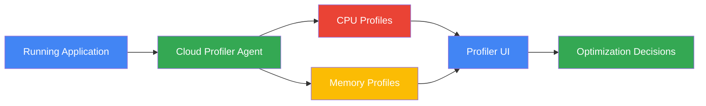

## 9.2 Explanation

Cloud Profiler continuously samples production applications to reveal where CPU time is spent and how memory is allocated. Unlike one-time local profiling, continuous profiling captures realistic production behavior with minimal overhead.

Common benefits:

- Identifies hot code paths and expensive functions.
- Shows memory allocation and usage patterns.
- Helps compare profiles before and after releases.
- Supports performance optimization without guessing.

Profiler is especially useful when latency issues persist even after scaling, suggesting inefficiency rather than raw capacity shortage.

## 9.3 `gcloud` Commands

Enable the Profiler API:

```bash
gcloud services enable cloudprofiler.googleapis.com
```

Confirm the API is enabled:

```bash
gcloud services list --enabled | grep cloudprofiler.googleapis.com
```

Set the active project for instrumented applications:

```bash
gcloud config set project PROJECT_ID
```

View service account identity used by the application runtime:

```bash
gcloud auth list
```

List enabled observability APIs relevant to profiling:

```bash
gcloud services list --enabled | egrep 'cloudprofiler|monitoring|logging|trace'
```

Read application logs around performance incidents:

```bash
gcloud logging read 'severity>=WARNING AND resource.labels.service_name="SERVICE_NAME"' --limit=50
```

## 9.4 Best Practices

- Profile production-like workloads rather than only synthetic tests.
- Compare CPU and memory trends together for optimization work.
- Use profiling before scaling decisions to avoid masking inefficient code.
- Keep profiling enabled for high-value services continuously.
- Tie profile analysis to release versions and code changes.
- Avoid over-optimizing cold paths with little user impact.
- Prioritize hot functions on critical request paths.
- Combine profiler findings with trace latency evidence.
- Re-profile after major runtime or dependency upgrades.
- Share profiler review outcomes with developers and SREs.

---

# 10. Integrated Observability Workflow

## 10.1 Mermaid Diagram

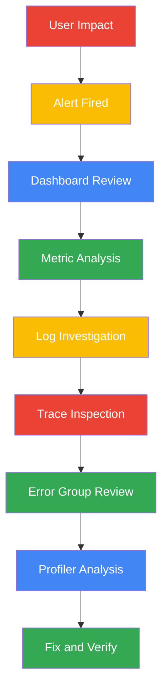

## 10.2 Explanation

A strong observability practice uses the tools together instead of in isolation.

Example workflow:

1. An alert policy triggers from a latency or error threshold.
2. Operators open a dashboard to identify impacted services, regions, or versions.
3. Metrics show whether the issue is saturation, capacity, or error related.
4. Logs reveal exact failures, request context, or infrastructure messages.
5. Traces isolate slow dependencies or sequencing delays.
6. Error Reporting identifies whether the issue maps to known exception groups.
7. Profiler shows whether code inefficiency is contributing.
8. A fix is deployed and validated against the same metrics, logs, traces, and SLOs.

## 10.3 `gcloud` Commands

List dashboards to begin incident review:

```bash
gcloud monitoring dashboards list
```

List alerting policies during active incident analysis:

```bash
gcloud alpha monitoring policies list
```

Read recent logs for a target service:

```bash
gcloud logging read 'resource.labels.service_name="SERVICE_NAME"' --limit=100
```

Read recent error logs only:

```bash
gcloud logging read 'resource.labels.service_name="SERVICE_NAME" AND severity>=ERROR' --limit=100
```

Verify key observability APIs remain enabled:

```bash
gcloud services list --enabled | egrep 'monitoring|logging|cloudtrace|cloudprofiler|clouderrorreporting'
```

## 10.4 Best Practices

- Train teams to pivot quickly from alerts to dashboards, logs, and traces.
- Maintain runbooks for common alert signatures.
- Standardize naming across services, metrics, logs, dashboards, and channels.
- Use post-incident reviews to improve telemetry quality.
- Connect observability ownership to service ownership.
- Keep instrumentation consistent across environments.
- Measure mean time to detect and mean time to recover.
- Build observability into platform templates, not as an afterthought.
- Review costs for metrics, logs, and exports as telemetry grows.
- Continuously remove blind spots exposed by incidents.

---

# 11. Quick Reference Tables

## 11.1 Signal-to-Tool Mapping

| Need | Primary GCP Tool | Typical Outcome |
|---|---|---|
| CPU, memory, request rates | Cloud Monitoring | Trend and threshold analysis |
| Raw event records | Cloud Logging | Detailed evidence and search |
| Cross-service latency | Cloud Trace | Bottleneck identification |
| Recurring exceptions | Error Reporting | Grouped error triage |
| User-facing reliability targets | SLO/SLI tooling | Objective measurement |
| Incident notifications | Alerting Policies | Fast operational response |
| VM host telemetry | Ops Agent | Guest-level metrics and logs |
| Runtime hotspots | Profiler | Performance optimization |

## 11.2 Common Design Questions

| Question | Recommended Signal |
|---|---|
| Are users failing requests? | Availability SLI, 5xx logs, error groups |
| Is the service slow? | Latency metrics, traces, profiler |
| Is the VM unhealthy? | Ops Agent metrics, system logs |
| Are alerts actionable? | Policy tuning, runbook validation |
| Are we within objective? | SLO dashboard, burn-rate alerts |
| Are logs too expensive? | Exclusions, bucket retention, sink scope |
| Can we correlate events? | Trace IDs, labels, structured logs |
| Is noise hiding incidents? | Error grouping, metric filtering, dashboard cleanup |

## 11.3 Recommended Implementation Sequence

1. Enable Monitoring, Logging, Trace, Error Reporting, and Profiler APIs.
2. Standardize labels, service names, and environment naming.
3. Install Ops Agent on all required VMs.
4. Ensure applications emit structured logs and trace context.
5. Define dashboards for platform, service, and leadership views.
6. Create alerting policies for critical symptoms.
7. Define SLIs, SLOs, and burn-rate alerts.
8. Add log sinks and retention policies for compliance and analytics.
9. Review profiler output for high-value services.
10. Run drills to validate end-to-end incident response.

## 11.4 Final Best Practices Summary

- Observability should be designed into every service from day one.
- Metrics, logs, traces, errors, and profiles are complementary, not competing tools.
- Reliability targets must be explicit and measurable.
- Alerts should be urgent, actionable, and documented.
- Dashboards must help decisions, not just visualize data.
- Logging strategy should balance detail, privacy, retention, and cost.
- Profiling and tracing should be part of performance engineering, not only incident response.
- Agent deployment and telemetry collection should be automated.
- Every service should have an owner, runbook, dashboard, and alert set.
- Continuous review is required as architectures and workloads evolve.
