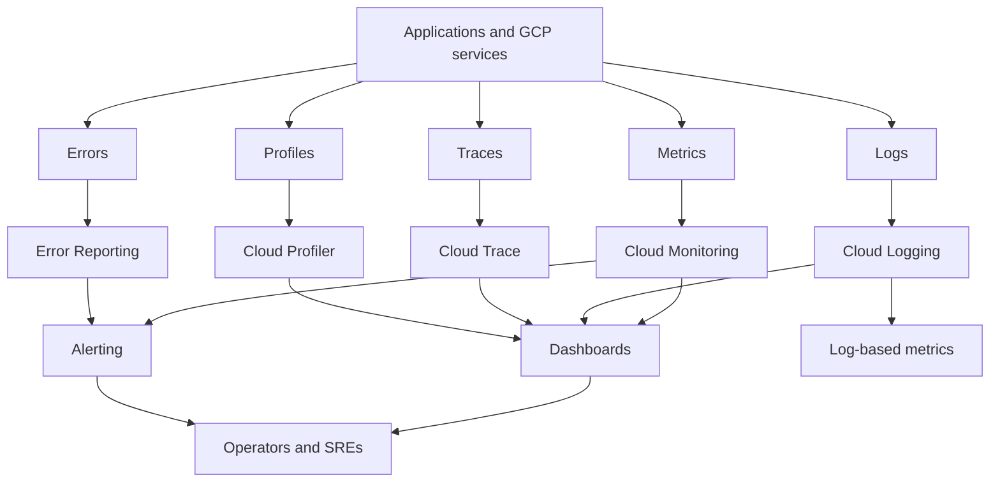
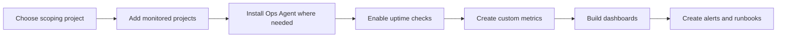
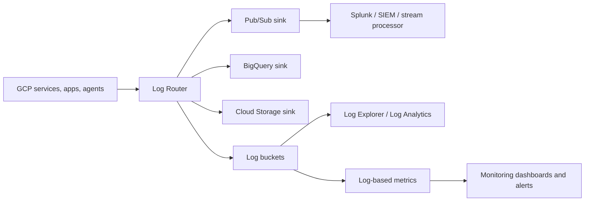
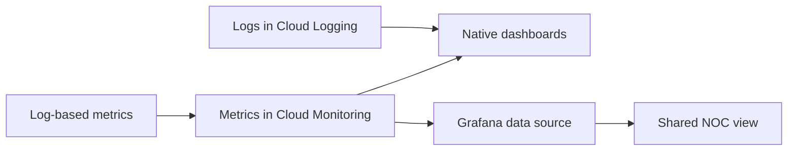
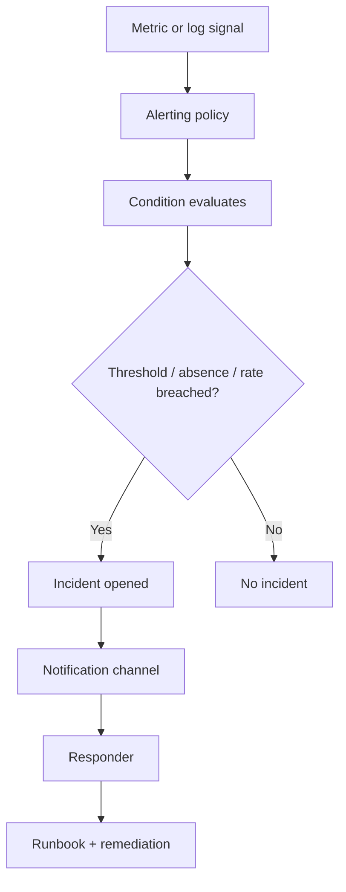
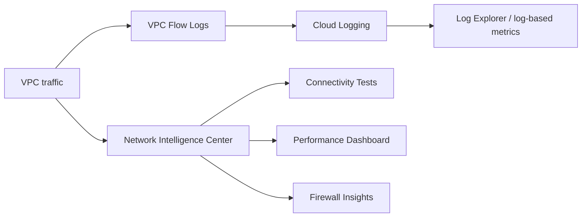
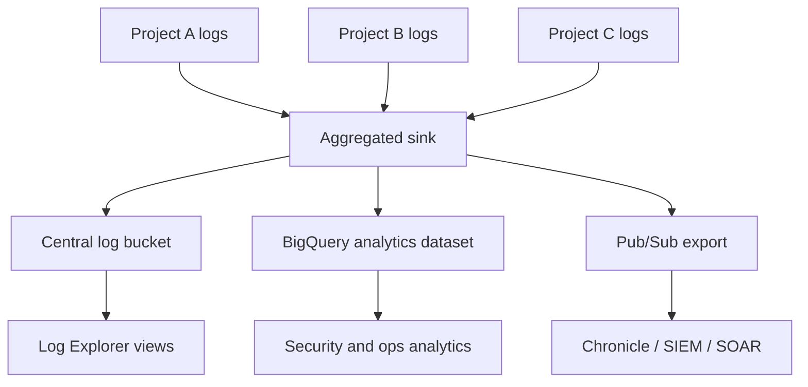

# 📈 GCP Logging, Monitoring, and Dashboard Setup

> A comprehensive guide to building observability and operational awareness on Google Cloud with Cloud Monitoring, Cloud Logging, Cloud Trace, dashboards, alerting, network visibility, and Security Command Center.

This guide is optimized for platform engineers, SREs, cloud architects, and operations teams who need repeatable patterns for logging pipelines, monitoring baselines, centralized visibility, and actionable dashboards.

## 📚 Table of Contents

1. [GCP Operations Suite Overview](#gcp-operations-suite-overview)
2. [Cloud Monitoring Setup](#cloud-monitoring-setup)
3. [Cloud Logging](#cloud-logging)
4. [Cloud Monitoring Dashboards](#cloud-monitoring-dashboards)
5. [Alerting Policies](#alerting-policies)
6. [Cloud Trace](#cloud-trace)
7. [VPC Flow Logs & Network Intelligence](#vpc-flow-logs-network-intelligence)
8. [Security Command Center](#security-command-center)
9. [Centralized Logging Architecture](#centralized-logging-architecture)
10. [Reference Queries, Dashboards, and Operational Playbooks](#reference-queries-dashboards-and-operational-playbooks)

## 1. ☁️ GCP Operations Suite Overview

Google Cloud Operations Suite combines **Cloud Monitoring**, **Cloud Logging**, **Cloud Trace**, **Cloud Profiler**, and **Error Reporting** to help teams understand what their systems are doing and when intervention is required.

### Service roles in the observability stack
- **Cloud Monitoring** collects metrics, supports dashboards, SLOs, and alerting.
- **Cloud Logging** stores and routes logs, powers Log Explorer, and feeds log-based metrics.
- **Cloud Trace** analyzes latency through distributed request traces.
- **Cloud Profiler** samples CPU or memory behavior for supported runtimes.
- **Error Reporting** groups and surfaces repeated application exceptions.

### Architecture diagram


### Why teams centralize on Operations Suite
- Managed collection for many Google Cloud services is built in, reducing agent sprawl.
- Observability can be organized around projects, folders, or organizations using metrics scopes and aggregated logging.
- Dashboards and alerts can combine platform metrics with custom application signals.
- Native integrations with BigQuery, Pub/Sub, and third-party tools simplify downstream analytics and SIEM use cases.

## 2. 🛠️ Cloud Monitoring Setup

Cloud Monitoring setup should be treated as a platform capability. Teams need metrics scopes, baseline dashboards, uptime checks, notification channels, and host agents before workload-specific tuning begins.

### Setup workflow diagram


### Metrics scoping project
- A **scoping project** hosts the Monitoring workspace view over one or more monitored projects.
- Choose a stable platform or observability project for this role.
- Add production, staging, and shared services projects intentionally so dashboards and alerts have the right scope.
- Document who owns the scoping project because alerting and dashboard changes there affect many teams.

```bash
# Example placeholder commands; some workspace actions are typically done via console/API.
gcloud config set project OBSERVABILITY_PROJECT_ID

gcloud monitoring channels list
```

### Uptime checks
- Create uptime checks for public HTTPS endpoints, internal endpoints exposed through approved testing paths, and business-critical APIs.
- Monitor both HTTP status and latency where possible.
- Use content matching to validate that the response body contains expected markers during synthetic checks.
- Route uptime failures to the same team that owns customer availability, not only the platform team.

### Custom metrics
Custom metrics are essential when business or application semantics are not visible in built-in platform metrics.

```python
from google.cloud import monitoring_v3
from google.api import metric_pb2, monitored_resource_pb2
import time

client = monitoring_v3.MetricServiceClient()
project_name = f"projects/my-project"
series = monitoring_v3.TimeSeries()
series.metric.type = "custom.googleapis.com/orders/checkout_latency_ms"
series.resource.type = "global"
series.resource.labels["project_id"] = "my-project"
point = series.points.add()
point.value.double_value = 128.4
now = time.time()
point.interval.end_time.seconds = int(now)
client.create_time_series(name=project_name, time_series=[series])
```

### Monitoring Agent (Ops Agent) installation
```bash
curl -sSO https://dl.google.com/cloudagents/add-google-cloud-ops-agent-repo.sh
sudo bash add-google-cloud-ops-agent-repo.sh --also-install
sudo systemctl status google-cloud-ops-agent
```

### Sample Ops Agent config
```yaml
metrics:
  receivers:
    hostmetrics:
      type: hostmetrics
      collection_interval: 60s
  service:
    pipelines:
      default_pipeline:
        receivers: [hostmetrics]
logging:
  receivers:
    syslog:
      type: files
      include_paths:
      - /var/log/syslog
  service:
    pipelines:
      default_pipeline:
        receivers: [syslog]
```

### Monitoring setup checklist
- [ ] Choose a scoping project and document ownership.
- [ ] Enable required APIs in all monitored projects.
- [ ] Install the Ops Agent on supported Compute Engine workloads.
- [ ] Create uptime checks for tier-1 entry points.
- [ ] Publish at least one custom metric for app-level health or business activity.
- [ ] Define default notification channels and naming conventions.
- [ ] Create baseline dashboards before handing observability to app teams.

## 3. 📜 Cloud Logging

Cloud Logging centralizes logs from Google Cloud services, agents, custom applications, and hybrid workloads. The core data path is the **Log Router**, which receives entries, evaluates exclusion filters, and exports selected logs to destinations such as BigQuery, Cloud Storage, or Pub/Sub.

### Log Router architecture


### Logging query language essentials
- Field comparisons use `=` and `:` for exact or contains-like matching depending on field type.
- Use resource and log name filters early to reduce scan volume.
- Use timestamp filters for focused investigations and lower query cost.
- Leverage `jsonPayload`, `textPayload`, and `protoPayload` fields depending on source service.

### Log Explorer queries (25 practical examples)
### Query 1: All errors in a project

```text
severity>=ERROR
```

- **Use case:** Start investigation with this filter, then add time range and project-specific conditions.
- **Tip:** Convert recurring investigation patterns into saved queries or log-based metrics.

### Query 2: Cloud Run 5xx logs

```text
resource.type="cloud_run_revision"
httpRequest.status>=500
```

- **Use case:** Start investigation with this filter, then add time range and project-specific conditions.
- **Tip:** Convert recurring investigation patterns into saved queries or log-based metrics.

### Query 3: GKE pod crashes

```text
resource.type="k8s_container"
jsonPayload.reason="CrashLoopBackOff"
```

- **Use case:** Start investigation with this filter, then add time range and project-specific conditions.
- **Tip:** Convert recurring investigation patterns into saved queries or log-based metrics.

### Query 4: Compute Engine SSH activity

```text
resource.type="gce_instance"
protoPayload.methodName="v1.compute.instances.setMetadata"
```

- **Use case:** Start investigation with this filter, then add time range and project-specific conditions.
- **Tip:** Convert recurring investigation patterns into saved queries or log-based metrics.

### Query 5: Firewall denies

```text
logName:"compute.googleapis.com%2Ffirewall"
jsonPayload.disposition="DENIED"
```

- **Use case:** Start investigation with this filter, then add time range and project-specific conditions.
- **Tip:** Convert recurring investigation patterns into saved queries or log-based metrics.

### Query 6: Cloud SQL restarts

```text
resource.type="cloudsql_database"
textPayload:"restart"
```

- **Use case:** Start investigation with this filter, then add time range and project-specific conditions.
- **Tip:** Convert recurring investigation patterns into saved queries or log-based metrics.

### Query 7: Cloud SQL auth failures

```text
resource.type="cloudsql_database"
textPayload:("authentication failed" OR "Access denied")
```

- **Use case:** Start investigation with this filter, then add time range and project-specific conditions.
- **Tip:** Convert recurring investigation patterns into saved queries or log-based metrics.

### Query 8: Load balancer 502s

```text
resource.type="http_load_balancer"
httpRequest.status=502
```

- **Use case:** Start investigation with this filter, then add time range and project-specific conditions.
- **Tip:** Convert recurring investigation patterns into saved queries or log-based metrics.

### Query 9: Secret Manager accesses

```text
protoPayload.serviceName="secretmanager.googleapis.com"
```

- **Use case:** Start investigation with this filter, then add time range and project-specific conditions.
- **Tip:** Convert recurring investigation patterns into saved queries or log-based metrics.

### Query 10: IAM policy changes

```text
protoPayload.methodName:("SetIamPolicy" OR "google.iam.v1.IAMPolicy.SetIamPolicy")
```

- **Use case:** Start investigation with this filter, then add time range and project-specific conditions.
- **Tip:** Convert recurring investigation patterns into saved queries or log-based metrics.

### Query 11: Service account key creation

```text
protoPayload.methodName:"google.iam.admin.v1.CreateServiceAccountKey"
```

- **Use case:** Start investigation with this filter, then add time range and project-specific conditions.
- **Tip:** Convert recurring investigation patterns into saved queries or log-based metrics.

### Query 12: GCS object deletes

```text
resource.type="gcs_bucket"
protoPayload.methodName:"storage.objects.delete"
```

- **Use case:** Start investigation with this filter, then add time range and project-specific conditions.
- **Tip:** Convert recurring investigation patterns into saved queries or log-based metrics.

### Query 13: Pub/Sub subscription pull errors

```text
resource.type="pubsub_subscription"
severity>=ERROR
```

- **Use case:** Start investigation with this filter, then add time range and project-specific conditions.
- **Tip:** Convert recurring investigation patterns into saved queries or log-based metrics.

### Query 14: Cloud Functions execution errors

```text
resource.type="cloud_function"
severity>=ERROR
```

- **Use case:** Start investigation with this filter, then add time range and project-specific conditions.
- **Tip:** Convert recurring investigation patterns into saved queries or log-based metrics.

### Query 15: App Engine request latency

```text
resource.type="gae_app"
httpRequest.latency>"1s"
```

- **Use case:** Start investigation with this filter, then add time range and project-specific conditions.
- **Tip:** Convert recurring investigation patterns into saved queries or log-based metrics.

### Query 16: KMS decrypt usage

```text
protoPayload.serviceName="cloudkms.googleapis.com"
protoPayload.methodName:"Decrypt"
```

- **Use case:** Start investigation with this filter, then add time range and project-specific conditions.
- **Tip:** Convert recurring investigation patterns into saved queries or log-based metrics.

### Query 17: VPC Flow Logs for denied egress

```text
logName:"compute.googleapis.com%2Fvpc_flows"
jsonPayload.reporter="SRC"
jsonPayload.disposition="DENIED"
```

- **Use case:** Start investigation with this filter, then add time range and project-specific conditions.
- **Tip:** Convert recurring investigation patterns into saved queries or log-based metrics.

### Query 18: Cloud NAT port exhaustion hints

```text
textPayload:("port allocation" OR "no available ports")
```

- **Use case:** Start investigation with this filter, then add time range and project-specific conditions.
- **Tip:** Convert recurring investigation patterns into saved queries or log-based metrics.

### Query 19: Cloud Build failures

```text
resource.type="build"
severity>=ERROR
```

- **Use case:** Start investigation with this filter, then add time range and project-specific conditions.
- **Tip:** Convert recurring investigation patterns into saved queries or log-based metrics.

### Query 20: Artifact Registry pulls

```text
protoPayload.serviceName="artifactregistry.googleapis.com"
```

- **Use case:** Start investigation with this filter, then add time range and project-specific conditions.
- **Tip:** Convert recurring investigation patterns into saved queries or log-based metrics.

### Query 21: GKE ingress errors

```text
resource.type="k8s_container"
textPayload:("ingress" AND "error")
```

- **Use case:** Start investigation with this filter, then add time range and project-specific conditions.
- **Tip:** Convert recurring investigation patterns into saved queries or log-based metrics.

### Query 22: Cloud Scheduler failures

```text
resource.type="cloud_scheduler_job"
severity>=ERROR
```

- **Use case:** Start investigation with this filter, then add time range and project-specific conditions.
- **Tip:** Convert recurring investigation patterns into saved queries or log-based metrics.

### Query 23: Identity-Aware Proxy denials

```text
protoPayload.serviceName="iap.googleapis.com"
severity>=WARNING
```

- **Use case:** Start investigation with this filter, then add time range and project-specific conditions.
- **Tip:** Convert recurring investigation patterns into saved queries or log-based metrics.

### Query 24: BigQuery job failures

```text
protoPayload.serviceName="bigquery.googleapis.com"
severity>=ERROR
```

- **Use case:** Start investigation with this filter, then add time range and project-specific conditions.
- **Tip:** Convert recurring investigation patterns into saved queries or log-based metrics.

### Query 25: Organization policy changes

```text
protoPayload.serviceName="orgpolicy.googleapis.com"
```

- **Use case:** Start investigation with this filter, then add time range and project-specific conditions.
- **Tip:** Convert recurring investigation patterns into saved queries or log-based metrics.

### Log sinks
| Sink target | Best use cases | Operational notes |
|---|---|---|
| BigQuery | Long-term analytics, audit analysis, joins with business data | Control dataset location, partitioning, and cost. |
| Cloud Storage | Archive, cold retention, offline access | Use lifecycle rules and object versioning as needed. |
| Pub/Sub | Streaming to SIEMs, processors, or custom pipelines | Consumers must handle retry and backpressure. |
| Splunk / third-party SIEM | Security operations and enterprise SOC workflows | Often implemented through Pub/Sub forwarders or vendor connectors. |

### Terraform example for a BigQuery sink
```hcl
resource "google_logging_project_sink" "to_bigquery" {
  name        = "audit-to-bigquery"
  destination = "bigquery.googleapis.com/projects/my-project/datasets/logs_analytics"
  filter      = "logName:cloudaudit.googleapis.com"

  bigquery_options {
    use_partitioned_tables = true
  }
}
```

### Log-based metrics
- Create counter metrics for error volume, deny events, or specific application states.
- Use distribution metrics for latency values extracted from structured logs.
- Keep labels minimal to avoid high-cardinality cost and dashboard complexity.

```bash
gcloud logging metrics create cloudrun_5xx_count   --description="Count of Cloud Run 5xx responses"   --log-filter='resource.type="cloud_run_revision" AND httpRequest.status>=500'
```

### Retention and storage
- Use log buckets to control retention and regional placement.
- Shorter retention may be appropriate for noisy application logs; longer retention is common for audit and security logs.
- Archived sinks to Cloud Storage or BigQuery help satisfy long-term analytics and evidence requirements.

### Log exclusion filters
```text
resource.type="k8s_container"
severity<ERROR
labels."k8s-pod/app"="load-test-runner"
```

Use exclusions carefully. Start with sampled noisy logs instead of deleting potentially valuable diagnostics.

### Access control for logs
- Grant viewers only the log access they require; logs can contain sensitive request or security context.
- Separate operational viewers from security analysts when possible.
- Use bucket-level IAM and views to narrow log visibility in centralized environments.
- Review Data Access log enablement and cost implications before turning it on broadly.

## 4. 📊 Cloud Monitoring Dashboards

Dashboards turn metrics, logs, and traces into a shared operational view. Good dashboards show **current health**, **trends**, **capacity**, and **signals needed for first response**.

### Creating dashboards
#### Console
1. Open Cloud Monitoring → Dashboards.
2. Create a new dashboard or clone an existing baseline template.
3. Add widgets for metrics, logs, and text runbooks.
4. Use variables and filters to keep the dashboard reusable across environments.
5. Review refresh rate and alignment period for the audience using the board.

#### `gcloud`
```bash
gcloud monitoring dashboards create --config-from-file=dashboard.json
```

#### Terraform
```hcl
resource "google_monitoring_dashboard" "compute_overview" {
  dashboard_json = jsonencode({
    displayName = "Compute Overview"
    gridLayout = {
      widgets = [
        {
          title = "CPU Utilization"
          xyChart = {
            dataSets = [{
              timeSeriesQuery = {
                timeSeriesFilter = {
                  filter = "metric.type="compute.googleapis.com/instance/cpu/utilization" resource.type="gce_instance""
                }
              }
            }]
          }
        }
      ]
    }
  })
}
```

### Widget types
| Widget | Best use | Notes |
|---|---|---|
| Line chart | Trend over time for latency, CPU, throughput | Most common default widget. |
| Heatmap | Distribution-heavy metrics such as latency buckets | Useful for spotting tail latency. |
| Scorecard | Single KPI values such as current error rate or replica lag | Great for executive and NOC views. |
| Table | Top-N entities or grouped breakdowns | Use carefully to avoid noisy cardinality. |
| Logs panel | Recent incident-relevant logs on the same board | Excellent for triage dashboards. |
| Text / Markdown | Runbook links, ownership, escalation hints | Add short operational guidance directly to the board. |

### Dashboard templates
### Compute Engine Dashboard

- CPU utilization by instance
- Memory usage from Ops Agent
- Disk read/write ops
- Instance uptime and reboot events
- Guest agent or app error log panel
- **Audience:** Use for service owners, SREs, and on-call responders.

### Cloud SQL Dashboard

- CPU, memory, storage utilization
- Connections and active sessions
- Query latency / Query Insights
- Replica lag
- Cloud SQL error log panel
- **Audience:** Use for service owners, SREs, and on-call responders.

### GKE Dashboard

- Pod restarts
- Node CPU and memory
- Container request latency
- Workload error rate
- Cluster autoscaler activity
- **Audience:** Use for service owners, SREs, and on-call responders.

### Network Dashboard

- Load balancer request count
- Backend latency
- Firewall denies
- VPC Flow Logs deny count
- VPN tunnel state
- **Audience:** Use for service owners, SREs, and on-call responders.

### Cloud Run Dashboard

- Request count
- Request latency percentiles
- Container startup latency
- Error rate
- Recent 5xx logs
- **Audience:** Use for service owners, SREs, and on-call responders.

### Custom dashboards with MQL
Although PromQL is increasingly important, MQL still appears in many existing environments. Use it carefully and document queries alongside the dashboards that depend on them.

```text
fetch gce_instance
| metric 'compute.googleapis.com/instance/cpu/utilization'
| group_by 5m, [value_utilization_mean: mean(value.utilization)]
| every 5m
```

```text
fetch cloud_run_revision
| metric 'run.googleapis.com/request_count'
| group_by [resource.service_name], [value_request_count_aggregate: aggregate(value.request_count)]
```

### Grafana integration with Cloud Monitoring
- Use Grafana when teams prefer a common multi-cloud observability portal.
- Add Cloud Monitoring as a data source with workload identity, service account credentials, or approved auth methods.
- Be explicit about dashboard ownership when both Grafana and native Monitoring dashboards exist.
- Prefer native dashboards for GCP-first operations and alerting workflows, then mirror only high-value boards into Grafana.




## 5. 🚨 Alerting Policies

Alerting is where observability becomes operationally useful. Alerts should be meaningful, actionable, and tied to runbooks and service ownership.

### Alert workflow diagram


### Metric-based alerts
- Use threshold, rate-of-change, percentile, or absence conditions for core service health metrics.
- Align evaluation windows with the signal behavior; too short creates noise, too long delays detection.
- Define severity and owner labels so incident routing is predictable.

### Log-based alerts
- Convert error or security-relevant log patterns into alertable counters.
- Ideal for conditions such as repeated auth failures, firewall denies, or application panic signatures.
- Prefer structured logs so filters remain stable across code releases.

### Notification channels
- **Email:** Use based on urgency, escalation workflow, and team tooling.
- **SMS:** Use based on urgency, escalation workflow, and team tooling.
- **PagerDuty:** Use based on urgency, escalation workflow, and team tooling.
- **Slack:** Use based on urgency, escalation workflow, and team tooling.
- **Webhook:** Use based on urgency, escalation workflow, and team tooling.
- **Mobile app push:** Use based on urgency, escalation workflow, and team tooling.
- **Pub/Sub integration:** Use based on urgency, escalation workflow, and team tooling.

### Terraform example for an alert policy
```hcl
resource "google_monitoring_notification_channel" "email" {
  display_name = "platform-oncall-email"
  type         = "email"
  labels = {
    email_address = "platform-oncall@example.com"
  }
}

resource "google_monitoring_alert_policy" "cloudrun_5xx" {
  display_name = "Cloud Run 5xx rate high"
  combiner     = "OR"
  conditions {
    display_name = "5xx count > 10"
    condition_threshold {
      filter          = "metric.type="logging.googleapis.com/user/cloudrun_5xx_count""
      duration        = "300s"
      comparison      = "COMPARISON_GT"
      threshold_value = 10
      aggregations {
        alignment_period   = "300s"
        per_series_aligner = "ALIGN_SUM"
      }
    }
  }
  notification_channels = [google_monitoring_notification_channel.email.name]
}
```

### Alert design guidance
- Alert on symptoms first: latency, availability, saturation, and error rate.
- Use lower-priority notifications for noisy but useful early warnings.
- Deduplicate where possible by alerting on service-level impact rather than every individual resource.
- Attach dashboard links and runbooks directly to the alert documentation.

## 6. 🧵 Cloud Trace

Cloud Trace reveals how latency is distributed across services and components. It is especially valuable for microservices, serverless APIs, and event-driven platforms where request paths are not obvious from metrics alone.

### Distributed tracing setup
- Use OpenTelemetry or Google-supported instrumentation in application services.
- Propagate trace headers across HTTP, gRPC, queue, and background job boundaries.
- Annotate spans with service version, region, customer tier, or workflow step only when label cardinality remains manageable.

```bash
# Example dependency install in a Node.js app
npm install @opentelemetry/sdk-node @opentelemetry/auto-instrumentations-node
```

### Integration with Cloud Run, GKE, and App Engine
- Cloud Run and App Engine provide strong foundations for request context propagation through managed ingress.
- GKE usually requires more explicit sidecar, SDK, or collector design decisions.
- Trace visualization becomes far more useful when service names, versions, and deployment markers are consistent.

### OpenTelemetry integration
```yaml
receivers:
  otlp:
    protocols:
      grpc:
      http:
exporters:
  googlecloud:
service:
  pipelines:
    traces:
      receivers: [otlp]
      exporters: [googlecloud]
```

### Trace analysis tips
- Look for p95/p99 latency concentration in a single downstream dependency.
- Compare successful and failed traces to see where retries or timeouts diverge.
- Correlate trace IDs into logs so one click from an alert can reach the detailed execution path.

## 7. 🌐 VPC Flow Logs & Network Intelligence

Network visibility is essential for private service troubleshooting, perimeter validation, and capacity planning. VPC Flow Logs and Network Intelligence Center together provide both evidence and analysis tools.

### Network monitoring flow diagram


### Enabling VPC Flow Logs
```bash
gcloud compute networks subnets update app-subnet   --region=us-central1   --enable-flow-logs   --logging-aggregation-interval=interval-5-sec   --logging-flow-sampling=0.5   --logging-metadata=include-all
```

### Analyzing with Cloud Logging
- Start with source and destination IP, disposition, and reporter fields.
- Create log-based metrics for denied traffic or unexpected east-west paths.
- Correlate flow logs with firewall rule changes, DNS logs, and load balancer metrics.

### Network Intelligence Center
- Use **Connectivity Tests** to validate the intended path between sources and destinations before deployment or during incidents.
- Use **Performance Dashboard** for latency/loss visibility when available across relevant paths.
- Use **Topology** views to explain how routes, VPN, Interconnect, and firewalls shape connectivity.

### Firewall Insights
- Identify overly permissive or unused firewall rules.
- Review deny spikes after policy changes.
- Use insights to clean up stale rules that clutter incident response.

## 8. 🛡️ Security Command Center

Security Command Center (SCC) gives cloud security teams a centralized view of findings, posture, and misconfiguration risks across Google Cloud resources.

### SCC setup and findings
- Enable SCC at the organization or folder level when possible for broad visibility.
- Route findings to the teams that can remediate them; visibility without ownership does not improve security.
- Use labels, categories, and severity to integrate SCC signals into ticketing and SIEM workflows.

### Security Health Analytics
- Detect risky IAM settings, exposed services, weak firewall patterns, and other cloud hygiene issues.
- Review suppressions carefully so real issues are not permanently hidden.
- Pair findings with infrastructure-as-code remediation whenever possible.

### Web Security Scanner
- Use it for approved app surfaces to identify common web vulnerabilities.
- Coordinate scans with application owners to avoid disrupting low-capacity environments.
- Feed validated findings into application backlog and incident review processes.

### Compliance monitoring
- Map SCC findings and audit logs to your compliance control framework.
- Use dashboards and exports to show remediation timelines and repeated control failures.
- Separate detection, triage, and evidence retention responsibilities clearly.

## 9. 🏛️ Centralized Logging Architecture

Centralized logging helps large organizations standardize retention, analytics, and security operations. The typical pattern is to route logs from many projects into shared buckets, BigQuery datasets, or Pub/Sub-driven SIEM pipelines.

### Centralized architecture diagram


### Organization-level logging
- Create aggregated sinks at the folder or organization level for broad coverage.
- Use inclusion filters to prioritize security, audit, and platform operations logs.
- Separate high-volume application logs from security-sensitive logs when different retention or access control is required.

### Aggregated sinks
```bash
gcloud logging sinks create org-audit-bigquery   bigquery.googleapis.com/projects/sec-project/datasets/org_audit_logs   --organization=123456789012   --include-children   --log-filter='logName:"cloudaudit.googleapis.com"'
```

### Log analytics with BigQuery
- Use partitioned tables and clustered columns to manage cost.
- Create scheduled queries for repeated security or platform reports.
- Join logs with CMDB, asset inventory, or cost datasets for richer investigations.

### SIEM integration (Chronicle)
- Forward relevant logs through Pub/Sub or native connectors depending on the SIEM.
- Normalize schemas early so detection engineering scales cleanly.
- Document which alerts are handled in Monitoring vs SIEM to avoid duplicate paging.

### Access control patterns
| Consumer | Recommended access model |
|---|---|
| Platform team | Log bucket viewer and dashboard editor on shared observability project. |
| Security team | Broad access to audit/security buckets and SIEM pipelines. |
| Application team | Project-specific log views and dashboard edit rights for owned services only. |
| Executives / service managers | Read-only dashboards and curated BigQuery reports rather than raw logs. |
| Compliance / audit | Long-retention exports with controlled evidence access. |

## 10. 📎 Reference Queries, Dashboards, and Operational Playbooks

The reference material below is designed to accelerate real implementations and incident response.

### Dashboard review checklist
- [ ] Every tier-1 service has an owner, dashboard, and alert set.
- [ ] Dashboards show error rate, latency, throughput, and saturation.
- [ ] At least one logs panel exists for each critical service dashboard.
- [ ] Runbook links are embedded in dashboard text widgets.
- [ ] Dashboards are tested during incidents or game days, not only after deployment.

### Alert scenario cards
### Alert card 1: Cloud Run 5xx surge

- **Signal:** Alert on log-based 5xx count and request error ratio.
- **First action:** Link to dashboard, recent deploy logs, and rollback runbook.
- **Escalation:** Page the owning team if customer impact or security risk is confirmed.

### Alert card 2: Cloud SQL connection saturation

- **Signal:** Alert on connection count and failed connection logs.
- **First action:** Throttle app pool size or autoscaling while investigating.
- **Escalation:** Page the owning team if customer impact or security risk is confirmed.

### Alert card 3: GKE pod restart storm

- **Signal:** Alert on restart count grouped by namespace and deployment.
- **First action:** Correlate with recent image or config changes.
- **Escalation:** Page the owning team if customer impact or security risk is confirmed.

### Alert card 4: VPN tunnel down

- **Signal:** Alert on tunnel status metric.
- **First action:** Test failover tunnel and notify network team.
- **Escalation:** Page the owning team if customer impact or security risk is confirmed.

### Alert card 5: Firewall deny spike

- **Signal:** Alert on flow-log-derived deny count.
- **First action:** Check recent policy changes and top denied tuples.
- **Escalation:** Page the owning team if customer impact or security risk is confirmed.

### Alert card 6: Pub/Sub backlog growth

- **Signal:** Alert on unacked messages and oldest unacked age.
- **First action:** Investigate subscriber errors and processing latency.
- **Escalation:** Page the owning team if customer impact or security risk is confirmed.

### Alert card 7: Secret access anomaly

- **Signal:** Alert on unusual Secret Manager access patterns.
- **First action:** Cross-check with deploy windows and identity changes.
- **Escalation:** Page the owning team if customer impact or security risk is confirmed.

### Alert card 8: BigQuery job failure trend

- **Signal:** Alert on repeated failed scheduled queries or jobs.
- **First action:** Review recent schema changes and quota issues.
- **Escalation:** Page the owning team if customer impact or security risk is confirmed.

### Alert card 9: High 99th percentile latency

- **Signal:** Alert on p99 exceeding SLO threshold.
- **First action:** Use Trace to identify downstream contributors.
- **Escalation:** Page the owning team if customer impact or security risk is confirmed.

### Alert card 10: SCC high-severity finding

- **Signal:** Alert or ticket on critical finding categories.
- **First action:** Route to cloud security owners immediately.
- **Escalation:** Page the owning team if customer impact or security risk is confirmed.

### Operational playbooks
### Playbook 1: No data in dashboards

- **Runbook summary:** Check metrics scope, API enablement, Ops Agent health, and IAM access.
- **Evidence:** Save query, screenshot, timeline, and change references for postmortem use.
- **Prevention:** Convert the root cause into automation, dashboard improvement, or policy change.

### Playbook 2: Logs missing after deployment

- **Runbook summary:** Check exclusion filters, sink destinations, agent config, and service account permissions.
- **Evidence:** Save query, screenshot, timeline, and change references for postmortem use.
- **Prevention:** Convert the root cause into automation, dashboard improvement, or policy change.

### Playbook 3: Alert fired but dashboard looks healthy

- **Runbook summary:** Validate alignment period, aggregation, and stale incident behavior.
- **Evidence:** Save query, screenshot, timeline, and change references for postmortem use.
- **Prevention:** Convert the root cause into automation, dashboard improvement, or policy change.

### Playbook 4: Central sink permission error

- **Runbook summary:** Ensure sink writer identity has destination permissions.
- **Evidence:** Save query, screenshot, timeline, and change references for postmortem use.
- **Prevention:** Convert the root cause into automation, dashboard improvement, or policy change.

### Playbook 5: Trace gaps in one service

- **Runbook summary:** Confirm trace header propagation and collector/exporter configuration.
- **Evidence:** Save query, screenshot, timeline, and change references for postmortem use.
- **Prevention:** Convert the root cause into automation, dashboard improvement, or policy change.

### Playbook 6: VPC Flow Logs too expensive

- **Runbook summary:** Reduce sampling or metadata level after confirming required fidelity.
- **Evidence:** Save query, screenshot, timeline, and change references for postmortem use.
- **Prevention:** Convert the root cause into automation, dashboard improvement, or policy change.

### Playbook 7: Chronicle ingestion lag

- **Runbook summary:** Inspect Pub/Sub subscription backlog and parser health.
- **Evidence:** Save query, screenshot, timeline, and change references for postmortem use.
- **Prevention:** Convert the root cause into automation, dashboard improvement, or policy change.

### Playbook 8: SCC finding flood

- **Runbook summary:** Tune suppression rules carefully and remediate repeated root causes.
- **Evidence:** Save query, screenshot, timeline, and change references for postmortem use.
- **Prevention:** Convert the root cause into automation, dashboard improvement, or policy change.

### Playbook 9: Dashboard clutter

- **Runbook summary:** Split executive, NOC, and deep-dive engineering dashboards by audience.
- **Evidence:** Save query, screenshot, timeline, and change references for postmortem use.
- **Prevention:** Convert the root cause into automation, dashboard improvement, or policy change.

### Playbook 10: Noisy log-based metrics

- **Runbook summary:** Tighten filters and remove unstable labels from extraction rules.
- **Evidence:** Save query, screenshot, timeline, and change references for postmortem use.
- **Prevention:** Convert the root cause into automation, dashboard improvement, or policy change.

### Reference metric ideas by platform
### Compute Engine

- CPU utilization
- memory usage from Ops Agent
- disk throughput
- instance uptime

### Cloud SQL

- connection count
- CPU utilization
- storage usage
- replica lag

### GKE

- pod restarts
- container CPU throttling
- API request latency
- node pressure

### Cloud Run

- request count
- error count
- latency percentiles
- instance count

### Network

- LB response count
- backend latency
- VPN tunnel state
- firewall deny count

### Reference note 1: Saved query practice

- **Guidance:** Store frequently used Log Explorer queries with clear names and incident tags.
- **Action:** Confirm this practice in platform reviews, service onboarding, and incident retrospectives.
- **Artifacts:** Dashboard links, alert policy IDs, saved queries, sink definitions, and ownership records.
- **Outcome:** Better signal quality, lower mean time to detect, and lower mean time to resolve.

### Reference note 2: Dashboard governance

- **Guidance:** Review stale dashboards quarterly and retire boards with no audience.
- **Action:** Confirm this practice in platform reviews, service onboarding, and incident retrospectives.
- **Artifacts:** Dashboard links, alert policy IDs, saved queries, sink definitions, and ownership records.
- **Outcome:** Better signal quality, lower mean time to detect, and lower mean time to resolve.

### Reference note 3: Alert hygiene

- **Guidance:** Measure alert fatigue and remove or tune low-value pages.
- **Action:** Confirm this practice in platform reviews, service onboarding, and incident retrospectives.
- **Artifacts:** Dashboard links, alert policy IDs, saved queries, sink definitions, and ownership records.
- **Outcome:** Better signal quality, lower mean time to detect, and lower mean time to resolve.

### Reference note 4: Retention governance

- **Guidance:** Match retention to operational, legal, and security requirements rather than keeping everything forever.
- **Action:** Confirm this practice in platform reviews, service onboarding, and incident retrospectives.
- **Artifacts:** Dashboard links, alert policy IDs, saved queries, sink definitions, and ownership records.
- **Outcome:** Better signal quality, lower mean time to detect, and lower mean time to resolve.

### Reference note 5: Label discipline

- **Guidance:** Use low-cardinality labels so dashboards and metrics stay usable at scale.
- **Action:** Confirm this practice in platform reviews, service onboarding, and incident retrospectives.
- **Artifacts:** Dashboard links, alert policy IDs, saved queries, sink definitions, and ownership records.
- **Outcome:** Better signal quality, lower mean time to detect, and lower mean time to resolve.

### Reference note 6: SLO alignment

- **Guidance:** Dashboards and alerts should reflect the same service level objectives used in reviews.
- **Action:** Confirm this practice in platform reviews, service onboarding, and incident retrospectives.
- **Artifacts:** Dashboard links, alert policy IDs, saved queries, sink definitions, and ownership records.
- **Outcome:** Better signal quality, lower mean time to detect, and lower mean time to resolve.

### Reference note 7: Cross-team visibility

- **Guidance:** Separate team-specific detail from shared executive or NOC summary views.
- **Action:** Confirm this practice in platform reviews, service onboarding, and incident retrospectives.
- **Artifacts:** Dashboard links, alert policy IDs, saved queries, sink definitions, and ownership records.
- **Outcome:** Better signal quality, lower mean time to detect, and lower mean time to resolve.

### Reference note 8: Postmortem feedback

- **Guidance:** Convert postmortem action items into dashboard, alert, or query improvements.
- **Action:** Confirm this practice in platform reviews, service onboarding, and incident retrospectives.
- **Artifacts:** Dashboard links, alert policy IDs, saved queries, sink definitions, and ownership records.
- **Outcome:** Better signal quality, lower mean time to detect, and lower mean time to resolve.

### Reference note 9: Security evidence

- **Guidance:** Route high-value logs to durable analytics and SIEM stores with documented ownership.
- **Action:** Confirm this practice in platform reviews, service onboarding, and incident retrospectives.
- **Artifacts:** Dashboard links, alert policy IDs, saved queries, sink definitions, and ownership records.
- **Outcome:** Better signal quality, lower mean time to detect, and lower mean time to resolve.

### Reference note 10: Cost awareness

- **Guidance:** Sampling, exclusions, and retention should be reviewed with both platform and finance stakeholders.
- **Action:** Confirm this practice in platform reviews, service onboarding, and incident retrospectives.
- **Artifacts:** Dashboard links, alert policy IDs, saved queries, sink definitions, and ownership records.
- **Outcome:** Better signal quality, lower mean time to detect, and lower mean time to resolve.

### Reference note 11: Saved query practice

- **Guidance:** Store frequently used Log Explorer queries with clear names and incident tags.
- **Action:** Confirm this practice in platform reviews, service onboarding, and incident retrospectives.
- **Artifacts:** Dashboard links, alert policy IDs, saved queries, sink definitions, and ownership records.
- **Outcome:** Better signal quality, lower mean time to detect, and lower mean time to resolve.

### Reference note 12: Dashboard governance

- **Guidance:** Review stale dashboards quarterly and retire boards with no audience.
- **Action:** Confirm this practice in platform reviews, service onboarding, and incident retrospectives.
- **Artifacts:** Dashboard links, alert policy IDs, saved queries, sink definitions, and ownership records.
- **Outcome:** Better signal quality, lower mean time to detect, and lower mean time to resolve.

### Reference note 13: Alert hygiene

- **Guidance:** Measure alert fatigue and remove or tune low-value pages.
- **Action:** Confirm this practice in platform reviews, service onboarding, and incident retrospectives.
- **Artifacts:** Dashboard links, alert policy IDs, saved queries, sink definitions, and ownership records.
- **Outcome:** Better signal quality, lower mean time to detect, and lower mean time to resolve.

### Reference note 14: Retention governance

- **Guidance:** Match retention to operational, legal, and security requirements rather than keeping everything forever.
- **Action:** Confirm this practice in platform reviews, service onboarding, and incident retrospectives.
- **Artifacts:** Dashboard links, alert policy IDs, saved queries, sink definitions, and ownership records.
- **Outcome:** Better signal quality, lower mean time to detect, and lower mean time to resolve.

### Reference note 15: Label discipline

- **Guidance:** Use low-cardinality labels so dashboards and metrics stay usable at scale.
- **Action:** Confirm this practice in platform reviews, service onboarding, and incident retrospectives.
- **Artifacts:** Dashboard links, alert policy IDs, saved queries, sink definitions, and ownership records.
- **Outcome:** Better signal quality, lower mean time to detect, and lower mean time to resolve.

### Reference note 16: SLO alignment

- **Guidance:** Dashboards and alerts should reflect the same service level objectives used in reviews.
- **Action:** Confirm this practice in platform reviews, service onboarding, and incident retrospectives.
- **Artifacts:** Dashboard links, alert policy IDs, saved queries, sink definitions, and ownership records.
- **Outcome:** Better signal quality, lower mean time to detect, and lower mean time to resolve.

### Reference note 17: Cross-team visibility

- **Guidance:** Separate team-specific detail from shared executive or NOC summary views.
- **Action:** Confirm this practice in platform reviews, service onboarding, and incident retrospectives.
- **Artifacts:** Dashboard links, alert policy IDs, saved queries, sink definitions, and ownership records.
- **Outcome:** Better signal quality, lower mean time to detect, and lower mean time to resolve.

### Reference note 18: Postmortem feedback

- **Guidance:** Convert postmortem action items into dashboard, alert, or query improvements.
- **Action:** Confirm this practice in platform reviews, service onboarding, and incident retrospectives.
- **Artifacts:** Dashboard links, alert policy IDs, saved queries, sink definitions, and ownership records.
- **Outcome:** Better signal quality, lower mean time to detect, and lower mean time to resolve.

### Reference note 19: Security evidence

- **Guidance:** Route high-value logs to durable analytics and SIEM stores with documented ownership.
- **Action:** Confirm this practice in platform reviews, service onboarding, and incident retrospectives.
- **Artifacts:** Dashboard links, alert policy IDs, saved queries, sink definitions, and ownership records.
- **Outcome:** Better signal quality, lower mean time to detect, and lower mean time to resolve.

### Reference note 20: Cost awareness

- **Guidance:** Sampling, exclusions, and retention should be reviewed with both platform and finance stakeholders.
- **Action:** Confirm this practice in platform reviews, service onboarding, and incident retrospectives.
- **Artifacts:** Dashboard links, alert policy IDs, saved queries, sink definitions, and ownership records.
- **Outcome:** Better signal quality, lower mean time to detect, and lower mean time to resolve.

### Reference note 21: Saved query practice

- **Guidance:** Store frequently used Log Explorer queries with clear names and incident tags.
- **Action:** Confirm this practice in platform reviews, service onboarding, and incident retrospectives.
- **Artifacts:** Dashboard links, alert policy IDs, saved queries, sink definitions, and ownership records.
- **Outcome:** Better signal quality, lower mean time to detect, and lower mean time to resolve.

### Reference note 22: Dashboard governance

- **Guidance:** Review stale dashboards quarterly and retire boards with no audience.
- **Action:** Confirm this practice in platform reviews, service onboarding, and incident retrospectives.
- **Artifacts:** Dashboard links, alert policy IDs, saved queries, sink definitions, and ownership records.
- **Outcome:** Better signal quality, lower mean time to detect, and lower mean time to resolve.

### Reference note 23: Alert hygiene

- **Guidance:** Measure alert fatigue and remove or tune low-value pages.
- **Action:** Confirm this practice in platform reviews, service onboarding, and incident retrospectives.
- **Artifacts:** Dashboard links, alert policy IDs, saved queries, sink definitions, and ownership records.
- **Outcome:** Better signal quality, lower mean time to detect, and lower mean time to resolve.

### Reference note 24: Retention governance

- **Guidance:** Match retention to operational, legal, and security requirements rather than keeping everything forever.
- **Action:** Confirm this practice in platform reviews, service onboarding, and incident retrospectives.
- **Artifacts:** Dashboard links, alert policy IDs, saved queries, sink definitions, and ownership records.
- **Outcome:** Better signal quality, lower mean time to detect, and lower mean time to resolve.

### Reference note 25: Label discipline

- **Guidance:** Use low-cardinality labels so dashboards and metrics stay usable at scale.
- **Action:** Confirm this practice in platform reviews, service onboarding, and incident retrospectives.
- **Artifacts:** Dashboard links, alert policy IDs, saved queries, sink definitions, and ownership records.
- **Outcome:** Better signal quality, lower mean time to detect, and lower mean time to resolve.

### Reference note 26: SLO alignment

- **Guidance:** Dashboards and alerts should reflect the same service level objectives used in reviews.
- **Action:** Confirm this practice in platform reviews, service onboarding, and incident retrospectives.
- **Artifacts:** Dashboard links, alert policy IDs, saved queries, sink definitions, and ownership records.
- **Outcome:** Better signal quality, lower mean time to detect, and lower mean time to resolve.

### Reference note 27: Cross-team visibility

- **Guidance:** Separate team-specific detail from shared executive or NOC summary views.
- **Action:** Confirm this practice in platform reviews, service onboarding, and incident retrospectives.
- **Artifacts:** Dashboard links, alert policy IDs, saved queries, sink definitions, and ownership records.
- **Outcome:** Better signal quality, lower mean time to detect, and lower mean time to resolve.

### Reference note 28: Postmortem feedback

- **Guidance:** Convert postmortem action items into dashboard, alert, or query improvements.
- **Action:** Confirm this practice in platform reviews, service onboarding, and incident retrospectives.
- **Artifacts:** Dashboard links, alert policy IDs, saved queries, sink definitions, and ownership records.
- **Outcome:** Better signal quality, lower mean time to detect, and lower mean time to resolve.

### Reference note 29: Security evidence

- **Guidance:** Route high-value logs to durable analytics and SIEM stores with documented ownership.
- **Action:** Confirm this practice in platform reviews, service onboarding, and incident retrospectives.
- **Artifacts:** Dashboard links, alert policy IDs, saved queries, sink definitions, and ownership records.
- **Outcome:** Better signal quality, lower mean time to detect, and lower mean time to resolve.

### Reference note 30: Cost awareness

- **Guidance:** Sampling, exclusions, and retention should be reviewed with both platform and finance stakeholders.
- **Action:** Confirm this practice in platform reviews, service onboarding, and incident retrospectives.
- **Artifacts:** Dashboard links, alert policy IDs, saved queries, sink definitions, and ownership records.
- **Outcome:** Better signal quality, lower mean time to detect, and lower mean time to resolve.

### Reference note 31: Saved query practice

- **Guidance:** Store frequently used Log Explorer queries with clear names and incident tags.
- **Action:** Confirm this practice in platform reviews, service onboarding, and incident retrospectives.
- **Artifacts:** Dashboard links, alert policy IDs, saved queries, sink definitions, and ownership records.
- **Outcome:** Better signal quality, lower mean time to detect, and lower mean time to resolve.

### Reference note 32: Dashboard governance

- **Guidance:** Review stale dashboards quarterly and retire boards with no audience.
- **Action:** Confirm this practice in platform reviews, service onboarding, and incident retrospectives.
- **Artifacts:** Dashboard links, alert policy IDs, saved queries, sink definitions, and ownership records.
- **Outcome:** Better signal quality, lower mean time to detect, and lower mean time to resolve.

### Reference note 33: Alert hygiene

- **Guidance:** Measure alert fatigue and remove or tune low-value pages.
- **Action:** Confirm this practice in platform reviews, service onboarding, and incident retrospectives.
- **Artifacts:** Dashboard links, alert policy IDs, saved queries, sink definitions, and ownership records.
- **Outcome:** Better signal quality, lower mean time to detect, and lower mean time to resolve.

### Reference note 34: Retention governance

- **Guidance:** Match retention to operational, legal, and security requirements rather than keeping everything forever.
- **Action:** Confirm this practice in platform reviews, service onboarding, and incident retrospectives.
- **Artifacts:** Dashboard links, alert policy IDs, saved queries, sink definitions, and ownership records.
- **Outcome:** Better signal quality, lower mean time to detect, and lower mean time to resolve.

### Reference note 35: Label discipline

- **Guidance:** Use low-cardinality labels so dashboards and metrics stay usable at scale.
- **Action:** Confirm this practice in platform reviews, service onboarding, and incident retrospectives.
- **Artifacts:** Dashboard links, alert policy IDs, saved queries, sink definitions, and ownership records.
- **Outcome:** Better signal quality, lower mean time to detect, and lower mean time to resolve.

### Reference note 36: SLO alignment

- **Guidance:** Dashboards and alerts should reflect the same service level objectives used in reviews.
- **Action:** Confirm this practice in platform reviews, service onboarding, and incident retrospectives.
- **Artifacts:** Dashboard links, alert policy IDs, saved queries, sink definitions, and ownership records.
- **Outcome:** Better signal quality, lower mean time to detect, and lower mean time to resolve.

### Reference note 37: Cross-team visibility

- **Guidance:** Separate team-specific detail from shared executive or NOC summary views.
- **Action:** Confirm this practice in platform reviews, service onboarding, and incident retrospectives.
- **Artifacts:** Dashboard links, alert policy IDs, saved queries, sink definitions, and ownership records.
- **Outcome:** Better signal quality, lower mean time to detect, and lower mean time to resolve.

### Reference note 38: Postmortem feedback

- **Guidance:** Convert postmortem action items into dashboard, alert, or query improvements.
- **Action:** Confirm this practice in platform reviews, service onboarding, and incident retrospectives.
- **Artifacts:** Dashboard links, alert policy IDs, saved queries, sink definitions, and ownership records.
- **Outcome:** Better signal quality, lower mean time to detect, and lower mean time to resolve.

### Reference note 39: Security evidence

- **Guidance:** Route high-value logs to durable analytics and SIEM stores with documented ownership.
- **Action:** Confirm this practice in platform reviews, service onboarding, and incident retrospectives.
- **Artifacts:** Dashboard links, alert policy IDs, saved queries, sink definitions, and ownership records.
- **Outcome:** Better signal quality, lower mean time to detect, and lower mean time to resolve.

### Reference note 40: Cost awareness

- **Guidance:** Sampling, exclusions, and retention should be reviewed with both platform and finance stakeholders.
- **Action:** Confirm this practice in platform reviews, service onboarding, and incident retrospectives.
- **Artifacts:** Dashboard links, alert policy IDs, saved queries, sink definitions, and ownership records.
- **Outcome:** Better signal quality, lower mean time to detect, and lower mean time to resolve.

### Reference note 41: Saved query practice

- **Guidance:** Store frequently used Log Explorer queries with clear names and incident tags.
- **Action:** Confirm this practice in platform reviews, service onboarding, and incident retrospectives.
- **Artifacts:** Dashboard links, alert policy IDs, saved queries, sink definitions, and ownership records.
- **Outcome:** Better signal quality, lower mean time to detect, and lower mean time to resolve.

### Reference note 42: Dashboard governance

- **Guidance:** Review stale dashboards quarterly and retire boards with no audience.
- **Action:** Confirm this practice in platform reviews, service onboarding, and incident retrospectives.
- **Artifacts:** Dashboard links, alert policy IDs, saved queries, sink definitions, and ownership records.
- **Outcome:** Better signal quality, lower mean time to detect, and lower mean time to resolve.

### Reference note 43: Alert hygiene

- **Guidance:** Measure alert fatigue and remove or tune low-value pages.
- **Action:** Confirm this practice in platform reviews, service onboarding, and incident retrospectives.
- **Artifacts:** Dashboard links, alert policy IDs, saved queries, sink definitions, and ownership records.
- **Outcome:** Better signal quality, lower mean time to detect, and lower mean time to resolve.

### Reference note 44: Retention governance

- **Guidance:** Match retention to operational, legal, and security requirements rather than keeping everything forever.
- **Action:** Confirm this practice in platform reviews, service onboarding, and incident retrospectives.
- **Artifacts:** Dashboard links, alert policy IDs, saved queries, sink definitions, and ownership records.
- **Outcome:** Better signal quality, lower mean time to detect, and lower mean time to resolve.

### Reference note 45: Label discipline

- **Guidance:** Use low-cardinality labels so dashboards and metrics stay usable at scale.
- **Action:** Confirm this practice in platform reviews, service onboarding, and incident retrospectives.
- **Artifacts:** Dashboard links, alert policy IDs, saved queries, sink definitions, and ownership records.
- **Outcome:** Better signal quality, lower mean time to detect, and lower mean time to resolve.

### Reference note 46: SLO alignment

- **Guidance:** Dashboards and alerts should reflect the same service level objectives used in reviews.
- **Action:** Confirm this practice in platform reviews, service onboarding, and incident retrospectives.
- **Artifacts:** Dashboard links, alert policy IDs, saved queries, sink definitions, and ownership records.
- **Outcome:** Better signal quality, lower mean time to detect, and lower mean time to resolve.

### Reference note 47: Cross-team visibility

- **Guidance:** Separate team-specific detail from shared executive or NOC summary views.
- **Action:** Confirm this practice in platform reviews, service onboarding, and incident retrospectives.
- **Artifacts:** Dashboard links, alert policy IDs, saved queries, sink definitions, and ownership records.
- **Outcome:** Better signal quality, lower mean time to detect, and lower mean time to resolve.

### Reference note 48: Postmortem feedback

- **Guidance:** Convert postmortem action items into dashboard, alert, or query improvements.
- **Action:** Confirm this practice in platform reviews, service onboarding, and incident retrospectives.
- **Artifacts:** Dashboard links, alert policy IDs, saved queries, sink definitions, and ownership records.
- **Outcome:** Better signal quality, lower mean time to detect, and lower mean time to resolve.

### Reference note 49: Security evidence

- **Guidance:** Route high-value logs to durable analytics and SIEM stores with documented ownership.
- **Action:** Confirm this practice in platform reviews, service onboarding, and incident retrospectives.
- **Artifacts:** Dashboard links, alert policy IDs, saved queries, sink definitions, and ownership records.
- **Outcome:** Better signal quality, lower mean time to detect, and lower mean time to resolve.

### Reference note 50: Cost awareness

- **Guidance:** Sampling, exclusions, and retention should be reviewed with both platform and finance stakeholders.
- **Action:** Confirm this practice in platform reviews, service onboarding, and incident retrospectives.
- **Artifacts:** Dashboard links, alert policy IDs, saved queries, sink definitions, and ownership records.
- **Outcome:** Better signal quality, lower mean time to detect, and lower mean time to resolve.

### Reference note 51: Saved query practice

- **Guidance:** Store frequently used Log Explorer queries with clear names and incident tags.
- **Action:** Confirm this practice in platform reviews, service onboarding, and incident retrospectives.
- **Artifacts:** Dashboard links, alert policy IDs, saved queries, sink definitions, and ownership records.
- **Outcome:** Better signal quality, lower mean time to detect, and lower mean time to resolve.

### Reference note 52: Dashboard governance

- **Guidance:** Review stale dashboards quarterly and retire boards with no audience.
- **Action:** Confirm this practice in platform reviews, service onboarding, and incident retrospectives.
- **Artifacts:** Dashboard links, alert policy IDs, saved queries, sink definitions, and ownership records.
- **Outcome:** Better signal quality, lower mean time to detect, and lower mean time to resolve.

### Reference note 53: Alert hygiene

- **Guidance:** Measure alert fatigue and remove or tune low-value pages.
- **Action:** Confirm this practice in platform reviews, service onboarding, and incident retrospectives.
- **Artifacts:** Dashboard links, alert policy IDs, saved queries, sink definitions, and ownership records.
- **Outcome:** Better signal quality, lower mean time to detect, and lower mean time to resolve.

### Reference note 54: Retention governance

- **Guidance:** Match retention to operational, legal, and security requirements rather than keeping everything forever.
- **Action:** Confirm this practice in platform reviews, service onboarding, and incident retrospectives.
- **Artifacts:** Dashboard links, alert policy IDs, saved queries, sink definitions, and ownership records.
- **Outcome:** Better signal quality, lower mean time to detect, and lower mean time to resolve.

### Reference note 55: Label discipline

- **Guidance:** Use low-cardinality labels so dashboards and metrics stay usable at scale.
- **Action:** Confirm this practice in platform reviews, service onboarding, and incident retrospectives.
- **Artifacts:** Dashboard links, alert policy IDs, saved queries, sink definitions, and ownership records.
- **Outcome:** Better signal quality, lower mean time to detect, and lower mean time to resolve.

### Reference note 56: SLO alignment

- **Guidance:** Dashboards and alerts should reflect the same service level objectives used in reviews.
- **Action:** Confirm this practice in platform reviews, service onboarding, and incident retrospectives.
- **Artifacts:** Dashboard links, alert policy IDs, saved queries, sink definitions, and ownership records.
- **Outcome:** Better signal quality, lower mean time to detect, and lower mean time to resolve.

### Reference note 57: Cross-team visibility

- **Guidance:** Separate team-specific detail from shared executive or NOC summary views.
- **Action:** Confirm this practice in platform reviews, service onboarding, and incident retrospectives.
- **Artifacts:** Dashboard links, alert policy IDs, saved queries, sink definitions, and ownership records.
- **Outcome:** Better signal quality, lower mean time to detect, and lower mean time to resolve.

### Reference note 58: Postmortem feedback

- **Guidance:** Convert postmortem action items into dashboard, alert, or query improvements.
- **Action:** Confirm this practice in platform reviews, service onboarding, and incident retrospectives.
- **Artifacts:** Dashboard links, alert policy IDs, saved queries, sink definitions, and ownership records.
- **Outcome:** Better signal quality, lower mean time to detect, and lower mean time to resolve.

### Reference note 59: Security evidence

- **Guidance:** Route high-value logs to durable analytics and SIEM stores with documented ownership.
- **Action:** Confirm this practice in platform reviews, service onboarding, and incident retrospectives.
- **Artifacts:** Dashboard links, alert policy IDs, saved queries, sink definitions, and ownership records.
- **Outcome:** Better signal quality, lower mean time to detect, and lower mean time to resolve.

### Reference note 60: Cost awareness

- **Guidance:** Sampling, exclusions, and retention should be reviewed with both platform and finance stakeholders.
- **Action:** Confirm this practice in platform reviews, service onboarding, and incident retrospectives.
- **Artifacts:** Dashboard links, alert policy IDs, saved queries, sink definitions, and ownership records.
- **Outcome:** Better signal quality, lower mean time to detect, and lower mean time to resolve.

### Reference note 61: Saved query practice

- **Guidance:** Store frequently used Log Explorer queries with clear names and incident tags.
- **Action:** Confirm this practice in platform reviews, service onboarding, and incident retrospectives.
- **Artifacts:** Dashboard links, alert policy IDs, saved queries, sink definitions, and ownership records.
- **Outcome:** Better signal quality, lower mean time to detect, and lower mean time to resolve.

### Reference note 62: Dashboard governance

- **Guidance:** Review stale dashboards quarterly and retire boards with no audience.
- **Action:** Confirm this practice in platform reviews, service onboarding, and incident retrospectives.
- **Artifacts:** Dashboard links, alert policy IDs, saved queries, sink definitions, and ownership records.
- **Outcome:** Better signal quality, lower mean time to detect, and lower mean time to resolve.

### Reference note 63: Alert hygiene

- **Guidance:** Measure alert fatigue and remove or tune low-value pages.
- **Action:** Confirm this practice in platform reviews, service onboarding, and incident retrospectives.
- **Artifacts:** Dashboard links, alert policy IDs, saved queries, sink definitions, and ownership records.
- **Outcome:** Better signal quality, lower mean time to detect, and lower mean time to resolve.

### Reference note 64: Retention governance

- **Guidance:** Match retention to operational, legal, and security requirements rather than keeping everything forever.
- **Action:** Confirm this practice in platform reviews, service onboarding, and incident retrospectives.
- **Artifacts:** Dashboard links, alert policy IDs, saved queries, sink definitions, and ownership records.
- **Outcome:** Better signal quality, lower mean time to detect, and lower mean time to resolve.

### Reference note 65: Label discipline

- **Guidance:** Use low-cardinality labels so dashboards and metrics stay usable at scale.
- **Action:** Confirm this practice in platform reviews, service onboarding, and incident retrospectives.
- **Artifacts:** Dashboard links, alert policy IDs, saved queries, sink definitions, and ownership records.
- **Outcome:** Better signal quality, lower mean time to detect, and lower mean time to resolve.

### Reference note 66: SLO alignment

- **Guidance:** Dashboards and alerts should reflect the same service level objectives used in reviews.
- **Action:** Confirm this practice in platform reviews, service onboarding, and incident retrospectives.
- **Artifacts:** Dashboard links, alert policy IDs, saved queries, sink definitions, and ownership records.
- **Outcome:** Better signal quality, lower mean time to detect, and lower mean time to resolve.

### Reference note 67: Cross-team visibility

- **Guidance:** Separate team-specific detail from shared executive or NOC summary views.
- **Action:** Confirm this practice in platform reviews, service onboarding, and incident retrospectives.
- **Artifacts:** Dashboard links, alert policy IDs, saved queries, sink definitions, and ownership records.
- **Outcome:** Better signal quality, lower mean time to detect, and lower mean time to resolve.

### Reference note 68: Postmortem feedback

- **Guidance:** Convert postmortem action items into dashboard, alert, or query improvements.
- **Action:** Confirm this practice in platform reviews, service onboarding, and incident retrospectives.
- **Artifacts:** Dashboard links, alert policy IDs, saved queries, sink definitions, and ownership records.
- **Outcome:** Better signal quality, lower mean time to detect, and lower mean time to resolve.

### Reference note 69: Security evidence

- **Guidance:** Route high-value logs to durable analytics and SIEM stores with documented ownership.
- **Action:** Confirm this practice in platform reviews, service onboarding, and incident retrospectives.
- **Artifacts:** Dashboard links, alert policy IDs, saved queries, sink definitions, and ownership records.
- **Outcome:** Better signal quality, lower mean time to detect, and lower mean time to resolve.

### Reference note 70: Cost awareness

- **Guidance:** Sampling, exclusions, and retention should be reviewed with both platform and finance stakeholders.
- **Action:** Confirm this practice in platform reviews, service onboarding, and incident retrospectives.
- **Artifacts:** Dashboard links, alert policy IDs, saved queries, sink definitions, and ownership records.
- **Outcome:** Better signal quality, lower mean time to detect, and lower mean time to resolve.

### Reference note 71: Saved query practice

- **Guidance:** Store frequently used Log Explorer queries with clear names and incident tags.
- **Action:** Confirm this practice in platform reviews, service onboarding, and incident retrospectives.
- **Artifacts:** Dashboard links, alert policy IDs, saved queries, sink definitions, and ownership records.
- **Outcome:** Better signal quality, lower mean time to detect, and lower mean time to resolve.

### Reference note 72: Dashboard governance

- **Guidance:** Review stale dashboards quarterly and retire boards with no audience.
- **Action:** Confirm this practice in platform reviews, service onboarding, and incident retrospectives.
- **Artifacts:** Dashboard links, alert policy IDs, saved queries, sink definitions, and ownership records.
- **Outcome:** Better signal quality, lower mean time to detect, and lower mean time to resolve.

### Reference note 73: Alert hygiene

- **Guidance:** Measure alert fatigue and remove or tune low-value pages.
- **Action:** Confirm this practice in platform reviews, service onboarding, and incident retrospectives.
- **Artifacts:** Dashboard links, alert policy IDs, saved queries, sink definitions, and ownership records.
- **Outcome:** Better signal quality, lower mean time to detect, and lower mean time to resolve.

### Reference note 74: Retention governance

- **Guidance:** Match retention to operational, legal, and security requirements rather than keeping everything forever.
- **Action:** Confirm this practice in platform reviews, service onboarding, and incident retrospectives.
- **Artifacts:** Dashboard links, alert policy IDs, saved queries, sink definitions, and ownership records.
- **Outcome:** Better signal quality, lower mean time to detect, and lower mean time to resolve.

### Reference note 75: Label discipline

- **Guidance:** Use low-cardinality labels so dashboards and metrics stay usable at scale.
- **Action:** Confirm this practice in platform reviews, service onboarding, and incident retrospectives.
- **Artifacts:** Dashboard links, alert policy IDs, saved queries, sink definitions, and ownership records.
- **Outcome:** Better signal quality, lower mean time to detect, and lower mean time to resolve.

### Reference note 76: SLO alignment

- **Guidance:** Dashboards and alerts should reflect the same service level objectives used in reviews.
- **Action:** Confirm this practice in platform reviews, service onboarding, and incident retrospectives.
- **Artifacts:** Dashboard links, alert policy IDs, saved queries, sink definitions, and ownership records.
- **Outcome:** Better signal quality, lower mean time to detect, and lower mean time to resolve.

### Reference note 77: Cross-team visibility

- **Guidance:** Separate team-specific detail from shared executive or NOC summary views.
- **Action:** Confirm this practice in platform reviews, service onboarding, and incident retrospectives.
- **Artifacts:** Dashboard links, alert policy IDs, saved queries, sink definitions, and ownership records.
- **Outcome:** Better signal quality, lower mean time to detect, and lower mean time to resolve.

### Reference note 78: Postmortem feedback

- **Guidance:** Convert postmortem action items into dashboard, alert, or query improvements.
- **Action:** Confirm this practice in platform reviews, service onboarding, and incident retrospectives.
- **Artifacts:** Dashboard links, alert policy IDs, saved queries, sink definitions, and ownership records.
- **Outcome:** Better signal quality, lower mean time to detect, and lower mean time to resolve.

### Reference note 79: Security evidence

- **Guidance:** Route high-value logs to durable analytics and SIEM stores with documented ownership.
- **Action:** Confirm this practice in platform reviews, service onboarding, and incident retrospectives.
- **Artifacts:** Dashboard links, alert policy IDs, saved queries, sink definitions, and ownership records.
- **Outcome:** Better signal quality, lower mean time to detect, and lower mean time to resolve.

### Reference note 80: Cost awareness

- **Guidance:** Sampling, exclusions, and retention should be reviewed with both platform and finance stakeholders.
- **Action:** Confirm this practice in platform reviews, service onboarding, and incident retrospectives.
- **Artifacts:** Dashboard links, alert policy IDs, saved queries, sink definitions, and ownership records.
- **Outcome:** Better signal quality, lower mean time to detect, and lower mean time to resolve.

### Reference note 81: Saved query practice

- **Guidance:** Store frequently used Log Explorer queries with clear names and incident tags.
- **Action:** Confirm this practice in platform reviews, service onboarding, and incident retrospectives.
- **Artifacts:** Dashboard links, alert policy IDs, saved queries, sink definitions, and ownership records.
- **Outcome:** Better signal quality, lower mean time to detect, and lower mean time to resolve.

### Reference note 82: Dashboard governance

- **Guidance:** Review stale dashboards quarterly and retire boards with no audience.
- **Action:** Confirm this practice in platform reviews, service onboarding, and incident retrospectives.
- **Artifacts:** Dashboard links, alert policy IDs, saved queries, sink definitions, and ownership records.
- **Outcome:** Better signal quality, lower mean time to detect, and lower mean time to resolve.

### Reference note 83: Alert hygiene

- **Guidance:** Measure alert fatigue and remove or tune low-value pages.
- **Action:** Confirm this practice in platform reviews, service onboarding, and incident retrospectives.
- **Artifacts:** Dashboard links, alert policy IDs, saved queries, sink definitions, and ownership records.
- **Outcome:** Better signal quality, lower mean time to detect, and lower mean time to resolve.

### Reference note 84: Retention governance

- **Guidance:** Match retention to operational, legal, and security requirements rather than keeping everything forever.
- **Action:** Confirm this practice in platform reviews, service onboarding, and incident retrospectives.
- **Artifacts:** Dashboard links, alert policy IDs, saved queries, sink definitions, and ownership records.
- **Outcome:** Better signal quality, lower mean time to detect, and lower mean time to resolve.

### Reference note 85: Label discipline

- **Guidance:** Use low-cardinality labels so dashboards and metrics stay usable at scale.
- **Action:** Confirm this practice in platform reviews, service onboarding, and incident retrospectives.
- **Artifacts:** Dashboard links, alert policy IDs, saved queries, sink definitions, and ownership records.
- **Outcome:** Better signal quality, lower mean time to detect, and lower mean time to resolve.

### Reference note 86: SLO alignment

- **Guidance:** Dashboards and alerts should reflect the same service level objectives used in reviews.
- **Action:** Confirm this practice in platform reviews, service onboarding, and incident retrospectives.
- **Artifacts:** Dashboard links, alert policy IDs, saved queries, sink definitions, and ownership records.
- **Outcome:** Better signal quality, lower mean time to detect, and lower mean time to resolve.

### Reference note 87: Cross-team visibility

- **Guidance:** Separate team-specific detail from shared executive or NOC summary views.
- **Action:** Confirm this practice in platform reviews, service onboarding, and incident retrospectives.
- **Artifacts:** Dashboard links, alert policy IDs, saved queries, sink definitions, and ownership records.
- **Outcome:** Better signal quality, lower mean time to detect, and lower mean time to resolve.

### Reference note 88: Postmortem feedback

- **Guidance:** Convert postmortem action items into dashboard, alert, or query improvements.
- **Action:** Confirm this practice in platform reviews, service onboarding, and incident retrospectives.
- **Artifacts:** Dashboard links, alert policy IDs, saved queries, sink definitions, and ownership records.
- **Outcome:** Better signal quality, lower mean time to detect, and lower mean time to resolve.

### Reference note 89: Security evidence

- **Guidance:** Route high-value logs to durable analytics and SIEM stores with documented ownership.
- **Action:** Confirm this practice in platform reviews, service onboarding, and incident retrospectives.
- **Artifacts:** Dashboard links, alert policy IDs, saved queries, sink definitions, and ownership records.
- **Outcome:** Better signal quality, lower mean time to detect, and lower mean time to resolve.

### Reference note 90: Cost awareness

- **Guidance:** Sampling, exclusions, and retention should be reviewed with both platform and finance stakeholders.
- **Action:** Confirm this practice in platform reviews, service onboarding, and incident retrospectives.
- **Artifacts:** Dashboard links, alert policy IDs, saved queries, sink definitions, and ownership records.
- **Outcome:** Better signal quality, lower mean time to detect, and lower mean time to resolve.

### Reference note 91: Saved query practice

- **Guidance:** Store frequently used Log Explorer queries with clear names and incident tags.
- **Action:** Confirm this practice in platform reviews, service onboarding, and incident retrospectives.
- **Artifacts:** Dashboard links, alert policy IDs, saved queries, sink definitions, and ownership records.
- **Outcome:** Better signal quality, lower mean time to detect, and lower mean time to resolve.

### Reference note 92: Dashboard governance

- **Guidance:** Review stale dashboards quarterly and retire boards with no audience.
- **Action:** Confirm this practice in platform reviews, service onboarding, and incident retrospectives.
- **Artifacts:** Dashboard links, alert policy IDs, saved queries, sink definitions, and ownership records.
- **Outcome:** Better signal quality, lower mean time to detect, and lower mean time to resolve.

### Reference note 93: Alert hygiene

- **Guidance:** Measure alert fatigue and remove or tune low-value pages.
- **Action:** Confirm this practice in platform reviews, service onboarding, and incident retrospectives.
- **Artifacts:** Dashboard links, alert policy IDs, saved queries, sink definitions, and ownership records.
- **Outcome:** Better signal quality, lower mean time to detect, and lower mean time to resolve.

### Reference note 94: Retention governance

- **Guidance:** Match retention to operational, legal, and security requirements rather than keeping everything forever.
- **Action:** Confirm this practice in platform reviews, service onboarding, and incident retrospectives.
- **Artifacts:** Dashboard links, alert policy IDs, saved queries, sink definitions, and ownership records.
- **Outcome:** Better signal quality, lower mean time to detect, and lower mean time to resolve.

### Reference note 95: Label discipline

- **Guidance:** Use low-cardinality labels so dashboards and metrics stay usable at scale.
- **Action:** Confirm this practice in platform reviews, service onboarding, and incident retrospectives.
- **Artifacts:** Dashboard links, alert policy IDs, saved queries, sink definitions, and ownership records.
- **Outcome:** Better signal quality, lower mean time to detect, and lower mean time to resolve.

### Reference note 96: SLO alignment

- **Guidance:** Dashboards and alerts should reflect the same service level objectives used in reviews.
- **Action:** Confirm this practice in platform reviews, service onboarding, and incident retrospectives.
- **Artifacts:** Dashboard links, alert policy IDs, saved queries, sink definitions, and ownership records.
- **Outcome:** Better signal quality, lower mean time to detect, and lower mean time to resolve.

### Reference note 97: Cross-team visibility

- **Guidance:** Separate team-specific detail from shared executive or NOC summary views.
- **Action:** Confirm this practice in platform reviews, service onboarding, and incident retrospectives.
- **Artifacts:** Dashboard links, alert policy IDs, saved queries, sink definitions, and ownership records.
- **Outcome:** Better signal quality, lower mean time to detect, and lower mean time to resolve.

### Reference note 98: Postmortem feedback

- **Guidance:** Convert postmortem action items into dashboard, alert, or query improvements.
- **Action:** Confirm this practice in platform reviews, service onboarding, and incident retrospectives.
- **Artifacts:** Dashboard links, alert policy IDs, saved queries, sink definitions, and ownership records.
- **Outcome:** Better signal quality, lower mean time to detect, and lower mean time to resolve.

### Reference note 99: Security evidence

- **Guidance:** Route high-value logs to durable analytics and SIEM stores with documented ownership.
- **Action:** Confirm this practice in platform reviews, service onboarding, and incident retrospectives.
- **Artifacts:** Dashboard links, alert policy IDs, saved queries, sink definitions, and ownership records.
- **Outcome:** Better signal quality, lower mean time to detect, and lower mean time to resolve.

### Reference note 100: Cost awareness

- **Guidance:** Sampling, exclusions, and retention should be reviewed with both platform and finance stakeholders.
- **Action:** Confirm this practice in platform reviews, service onboarding, and incident retrospectives.
- **Artifacts:** Dashboard links, alert policy IDs, saved queries, sink definitions, and ownership records.
- **Outcome:** Better signal quality, lower mean time to detect, and lower mean time to resolve.

### Reference note 101: Saved query practice

- **Guidance:** Store frequently used Log Explorer queries with clear names and incident tags.
- **Action:** Confirm this practice in platform reviews, service onboarding, and incident retrospectives.
- **Artifacts:** Dashboard links, alert policy IDs, saved queries, sink definitions, and ownership records.
- **Outcome:** Better signal quality, lower mean time to detect, and lower mean time to resolve.

### Reference note 102: Dashboard governance

- **Guidance:** Review stale dashboards quarterly and retire boards with no audience.
- **Action:** Confirm this practice in platform reviews, service onboarding, and incident retrospectives.
- **Artifacts:** Dashboard links, alert policy IDs, saved queries, sink definitions, and ownership records.
- **Outcome:** Better signal quality, lower mean time to detect, and lower mean time to resolve.

### Reference note 103: Alert hygiene

- **Guidance:** Measure alert fatigue and remove or tune low-value pages.
- **Action:** Confirm this practice in platform reviews, service onboarding, and incident retrospectives.
- **Artifacts:** Dashboard links, alert policy IDs, saved queries, sink definitions, and ownership records.
- **Outcome:** Better signal quality, lower mean time to detect, and lower mean time to resolve.

### Reference note 104: Retention governance

- **Guidance:** Match retention to operational, legal, and security requirements rather than keeping everything forever.
- **Action:** Confirm this practice in platform reviews, service onboarding, and incident retrospectives.
- **Artifacts:** Dashboard links, alert policy IDs, saved queries, sink definitions, and ownership records.
- **Outcome:** Better signal quality, lower mean time to detect, and lower mean time to resolve.

### Reference note 105: Label discipline

- **Guidance:** Use low-cardinality labels so dashboards and metrics stay usable at scale.
- **Action:** Confirm this practice in platform reviews, service onboarding, and incident retrospectives.
- **Artifacts:** Dashboard links, alert policy IDs, saved queries, sink definitions, and ownership records.
- **Outcome:** Better signal quality, lower mean time to detect, and lower mean time to resolve.

### Reference note 106: SLO alignment

- **Guidance:** Dashboards and alerts should reflect the same service level objectives used in reviews.
- **Action:** Confirm this practice in platform reviews, service onboarding, and incident retrospectives.
- **Artifacts:** Dashboard links, alert policy IDs, saved queries, sink definitions, and ownership records.
- **Outcome:** Better signal quality, lower mean time to detect, and lower mean time to resolve.

### Reference note 107: Cross-team visibility

- **Guidance:** Separate team-specific detail from shared executive or NOC summary views.
- **Action:** Confirm this practice in platform reviews, service onboarding, and incident retrospectives.
- **Artifacts:** Dashboard links, alert policy IDs, saved queries, sink definitions, and ownership records.
- **Outcome:** Better signal quality, lower mean time to detect, and lower mean time to resolve.

### Reference note 108: Postmortem feedback

- **Guidance:** Convert postmortem action items into dashboard, alert, or query improvements.
- **Action:** Confirm this practice in platform reviews, service onboarding, and incident retrospectives.
- **Artifacts:** Dashboard links, alert policy IDs, saved queries, sink definitions, and ownership records.
- **Outcome:** Better signal quality, lower mean time to detect, and lower mean time to resolve.

### Reference note 109: Security evidence

- **Guidance:** Route high-value logs to durable analytics and SIEM stores with documented ownership.
- **Action:** Confirm this practice in platform reviews, service onboarding, and incident retrospectives.
- **Artifacts:** Dashboard links, alert policy IDs, saved queries, sink definitions, and ownership records.
- **Outcome:** Better signal quality, lower mean time to detect, and lower mean time to resolve.

### Reference note 110: Cost awareness

- **Guidance:** Sampling, exclusions, and retention should be reviewed with both platform and finance stakeholders.
- **Action:** Confirm this practice in platform reviews, service onboarding, and incident retrospectives.
- **Artifacts:** Dashboard links, alert policy IDs, saved queries, sink definitions, and ownership records.
- **Outcome:** Better signal quality, lower mean time to detect, and lower mean time to resolve.

### Reference note 111: Saved query practice

- **Guidance:** Store frequently used Log Explorer queries with clear names and incident tags.
- **Action:** Confirm this practice in platform reviews, service onboarding, and incident retrospectives.
- **Artifacts:** Dashboard links, alert policy IDs, saved queries, sink definitions, and ownership records.
- **Outcome:** Better signal quality, lower mean time to detect, and lower mean time to resolve.

### Reference note 112: Dashboard governance

- **Guidance:** Review stale dashboards quarterly and retire boards with no audience.
- **Action:** Confirm this practice in platform reviews, service onboarding, and incident retrospectives.
- **Artifacts:** Dashboard links, alert policy IDs, saved queries, sink definitions, and ownership records.
- **Outcome:** Better signal quality, lower mean time to detect, and lower mean time to resolve.

### Reference note 113: Alert hygiene

- **Guidance:** Measure alert fatigue and remove or tune low-value pages.
- **Action:** Confirm this practice in platform reviews, service onboarding, and incident retrospectives.
- **Artifacts:** Dashboard links, alert policy IDs, saved queries, sink definitions, and ownership records.
- **Outcome:** Better signal quality, lower mean time to detect, and lower mean time to resolve.

### Reference note 114: Retention governance

- **Guidance:** Match retention to operational, legal, and security requirements rather than keeping everything forever.
- **Action:** Confirm this practice in platform reviews, service onboarding, and incident retrospectives.
- **Artifacts:** Dashboard links, alert policy IDs, saved queries, sink definitions, and ownership records.
- **Outcome:** Better signal quality, lower mean time to detect, and lower mean time to resolve.

### Reference note 115: Label discipline

- **Guidance:** Use low-cardinality labels so dashboards and metrics stay usable at scale.
- **Action:** Confirm this practice in platform reviews, service onboarding, and incident retrospectives.
- **Artifacts:** Dashboard links, alert policy IDs, saved queries, sink definitions, and ownership records.
- **Outcome:** Better signal quality, lower mean time to detect, and lower mean time to resolve.

### Reference note 116: SLO alignment

- **Guidance:** Dashboards and alerts should reflect the same service level objectives used in reviews.
- **Action:** Confirm this practice in platform reviews, service onboarding, and incident retrospectives.
- **Artifacts:** Dashboard links, alert policy IDs, saved queries, sink definitions, and ownership records.
- **Outcome:** Better signal quality, lower mean time to detect, and lower mean time to resolve.

### Reference note 117: Cross-team visibility

- **Guidance:** Separate team-specific detail from shared executive or NOC summary views.
- **Action:** Confirm this practice in platform reviews, service onboarding, and incident retrospectives.
- **Artifacts:** Dashboard links, alert policy IDs, saved queries, sink definitions, and ownership records.
- **Outcome:** Better signal quality, lower mean time to detect, and lower mean time to resolve.

### Reference note 118: Postmortem feedback

- **Guidance:** Convert postmortem action items into dashboard, alert, or query improvements.
- **Action:** Confirm this practice in platform reviews, service onboarding, and incident retrospectives.
- **Artifacts:** Dashboard links, alert policy IDs, saved queries, sink definitions, and ownership records.
- **Outcome:** Better signal quality, lower mean time to detect, and lower mean time to resolve.

### Reference note 119: Security evidence

- **Guidance:** Route high-value logs to durable analytics and SIEM stores with documented ownership.
- **Action:** Confirm this practice in platform reviews, service onboarding, and incident retrospectives.
- **Artifacts:** Dashboard links, alert policy IDs, saved queries, sink definitions, and ownership records.
- **Outcome:** Better signal quality, lower mean time to detect, and lower mean time to resolve.

### Reference note 120: Cost awareness

- **Guidance:** Sampling, exclusions, and retention should be reviewed with both platform and finance stakeholders.
- **Action:** Confirm this practice in platform reviews, service onboarding, and incident retrospectives.
- **Artifacts:** Dashboard links, alert policy IDs, saved queries, sink definitions, and ownership records.
- **Outcome:** Better signal quality, lower mean time to detect, and lower mean time to resolve.

### Reference note 121: Saved query practice

- **Guidance:** Store frequently used Log Explorer queries with clear names and incident tags.
- **Action:** Confirm this practice in platform reviews, service onboarding, and incident retrospectives.
- **Artifacts:** Dashboard links, alert policy IDs, saved queries, sink definitions, and ownership records.
- **Outcome:** Better signal quality, lower mean time to detect, and lower mean time to resolve.

### Reference note 122: Dashboard governance

- **Guidance:** Review stale dashboards quarterly and retire boards with no audience.
- **Action:** Confirm this practice in platform reviews, service onboarding, and incident retrospectives.
- **Artifacts:** Dashboard links, alert policy IDs, saved queries, sink definitions, and ownership records.
- **Outcome:** Better signal quality, lower mean time to detect, and lower mean time to resolve.

### Reference note 123: Alert hygiene

- **Guidance:** Measure alert fatigue and remove or tune low-value pages.
- **Action:** Confirm this practice in platform reviews, service onboarding, and incident retrospectives.
- **Artifacts:** Dashboard links, alert policy IDs, saved queries, sink definitions, and ownership records.
- **Outcome:** Better signal quality, lower mean time to detect, and lower mean time to resolve.

### Reference note 124: Retention governance

- **Guidance:** Match retention to operational, legal, and security requirements rather than keeping everything forever.
- **Action:** Confirm this practice in platform reviews, service onboarding, and incident retrospectives.
- **Artifacts:** Dashboard links, alert policy IDs, saved queries, sink definitions, and ownership records.
- **Outcome:** Better signal quality, lower mean time to detect, and lower mean time to resolve.

### Reference note 125: Label discipline

- **Guidance:** Use low-cardinality labels so dashboards and metrics stay usable at scale.
- **Action:** Confirm this practice in platform reviews, service onboarding, and incident retrospectives.
- **Artifacts:** Dashboard links, alert policy IDs, saved queries, sink definitions, and ownership records.
- **Outcome:** Better signal quality, lower mean time to detect, and lower mean time to resolve.

### Reference note 126: SLO alignment

- **Guidance:** Dashboards and alerts should reflect the same service level objectives used in reviews.
- **Action:** Confirm this practice in platform reviews, service onboarding, and incident retrospectives.
- **Artifacts:** Dashboard links, alert policy IDs, saved queries, sink definitions, and ownership records.
- **Outcome:** Better signal quality, lower mean time to detect, and lower mean time to resolve.

### Reference note 127: Cross-team visibility

- **Guidance:** Separate team-specific detail from shared executive or NOC summary views.
- **Action:** Confirm this practice in platform reviews, service onboarding, and incident retrospectives.
- **Artifacts:** Dashboard links, alert policy IDs, saved queries, sink definitions, and ownership records.
- **Outcome:** Better signal quality, lower mean time to detect, and lower mean time to resolve.

### Reference note 128: Postmortem feedback

- **Guidance:** Convert postmortem action items into dashboard, alert, or query improvements.
- **Action:** Confirm this practice in platform reviews, service onboarding, and incident retrospectives.
- **Artifacts:** Dashboard links, alert policy IDs, saved queries, sink definitions, and ownership records.
- **Outcome:** Better signal quality, lower mean time to detect, and lower mean time to resolve.

### Reference note 129: Security evidence

- **Guidance:** Route high-value logs to durable analytics and SIEM stores with documented ownership.
- **Action:** Confirm this practice in platform reviews, service onboarding, and incident retrospectives.
- **Artifacts:** Dashboard links, alert policy IDs, saved queries, sink definitions, and ownership records.
- **Outcome:** Better signal quality, lower mean time to detect, and lower mean time to resolve.

### Reference note 130: Cost awareness

- **Guidance:** Sampling, exclusions, and retention should be reviewed with both platform and finance stakeholders.
- **Action:** Confirm this practice in platform reviews, service onboarding, and incident retrospectives.
- **Artifacts:** Dashboard links, alert policy IDs, saved queries, sink definitions, and ownership records.
- **Outcome:** Better signal quality, lower mean time to detect, and lower mean time to resolve.

### Reference note 131: Saved query practice

- **Guidance:** Store frequently used Log Explorer queries with clear names and incident tags.
- **Action:** Confirm this practice in platform reviews, service onboarding, and incident retrospectives.
- **Artifacts:** Dashboard links, alert policy IDs, saved queries, sink definitions, and ownership records.
- **Outcome:** Better signal quality, lower mean time to detect, and lower mean time to resolve.

### Reference note 132: Dashboard governance

- **Guidance:** Review stale dashboards quarterly and retire boards with no audience.
- **Action:** Confirm this practice in platform reviews, service onboarding, and incident retrospectives.
- **Artifacts:** Dashboard links, alert policy IDs, saved queries, sink definitions, and ownership records.
- **Outcome:** Better signal quality, lower mean time to detect, and lower mean time to resolve.

### Reference note 133: Alert hygiene

- **Guidance:** Measure alert fatigue and remove or tune low-value pages.
- **Action:** Confirm this practice in platform reviews, service onboarding, and incident retrospectives.
- **Artifacts:** Dashboard links, alert policy IDs, saved queries, sink definitions, and ownership records.
- **Outcome:** Better signal quality, lower mean time to detect, and lower mean time to resolve.

### Reference note 134: Retention governance

- **Guidance:** Match retention to operational, legal, and security requirements rather than keeping everything forever.
- **Action:** Confirm this practice in platform reviews, service onboarding, and incident retrospectives.
- **Artifacts:** Dashboard links, alert policy IDs, saved queries, sink definitions, and ownership records.
- **Outcome:** Better signal quality, lower mean time to detect, and lower mean time to resolve.

### Reference note 135: Label discipline

- **Guidance:** Use low-cardinality labels so dashboards and metrics stay usable at scale.
- **Action:** Confirm this practice in platform reviews, service onboarding, and incident retrospectives.
- **Artifacts:** Dashboard links, alert policy IDs, saved queries, sink definitions, and ownership records.
- **Outcome:** Better signal quality, lower mean time to detect, and lower mean time to resolve.

### Reference note 136: SLO alignment

- **Guidance:** Dashboards and alerts should reflect the same service level objectives used in reviews.
- **Action:** Confirm this practice in platform reviews, service onboarding, and incident retrospectives.
- **Artifacts:** Dashboard links, alert policy IDs, saved queries, sink definitions, and ownership records.
- **Outcome:** Better signal quality, lower mean time to detect, and lower mean time to resolve.

### Reference note 137: Cross-team visibility

- **Guidance:** Separate team-specific detail from shared executive or NOC summary views.
- **Action:** Confirm this practice in platform reviews, service onboarding, and incident retrospectives.
- **Artifacts:** Dashboard links, alert policy IDs, saved queries, sink definitions, and ownership records.
- **Outcome:** Better signal quality, lower mean time to detect, and lower mean time to resolve.

### Reference note 138: Postmortem feedback

- **Guidance:** Convert postmortem action items into dashboard, alert, or query improvements.
- **Action:** Confirm this practice in platform reviews, service onboarding, and incident retrospectives.
- **Artifacts:** Dashboard links, alert policy IDs, saved queries, sink definitions, and ownership records.
- **Outcome:** Better signal quality, lower mean time to detect, and lower mean time to resolve.

### Reference note 139: Security evidence

- **Guidance:** Route high-value logs to durable analytics and SIEM stores with documented ownership.
- **Action:** Confirm this practice in platform reviews, service onboarding, and incident retrospectives.
- **Artifacts:** Dashboard links, alert policy IDs, saved queries, sink definitions, and ownership records.
- **Outcome:** Better signal quality, lower mean time to detect, and lower mean time to resolve.

### Reference note 140: Cost awareness

- **Guidance:** Sampling, exclusions, and retention should be reviewed with both platform and finance stakeholders.
- **Action:** Confirm this practice in platform reviews, service onboarding, and incident retrospectives.
- **Artifacts:** Dashboard links, alert policy IDs, saved queries, sink definitions, and ownership records.
- **Outcome:** Better signal quality, lower mean time to detect, and lower mean time to resolve.

### Reference note 141: Saved query practice

- **Guidance:** Store frequently used Log Explorer queries with clear names and incident tags.
- **Action:** Confirm this practice in platform reviews, service onboarding, and incident retrospectives.
- **Artifacts:** Dashboard links, alert policy IDs, saved queries, sink definitions, and ownership records.
- **Outcome:** Better signal quality, lower mean time to detect, and lower mean time to resolve.

### Reference note 142: Dashboard governance

- **Guidance:** Review stale dashboards quarterly and retire boards with no audience.
- **Action:** Confirm this practice in platform reviews, service onboarding, and incident retrospectives.
- **Artifacts:** Dashboard links, alert policy IDs, saved queries, sink definitions, and ownership records.
- **Outcome:** Better signal quality, lower mean time to detect, and lower mean time to resolve.

### Reference note 143: Alert hygiene

- **Guidance:** Measure alert fatigue and remove or tune low-value pages.
- **Action:** Confirm this practice in platform reviews, service onboarding, and incident retrospectives.
- **Artifacts:** Dashboard links, alert policy IDs, saved queries, sink definitions, and ownership records.
- **Outcome:** Better signal quality, lower mean time to detect, and lower mean time to resolve.

### Reference note 144: Retention governance

- **Guidance:** Match retention to operational, legal, and security requirements rather than keeping everything forever.
- **Action:** Confirm this practice in platform reviews, service onboarding, and incident retrospectives.
- **Artifacts:** Dashboard links, alert policy IDs, saved queries, sink definitions, and ownership records.
- **Outcome:** Better signal quality, lower mean time to detect, and lower mean time to resolve.

### Reference note 145: Label discipline

- **Guidance:** Use low-cardinality labels so dashboards and metrics stay usable at scale.
- **Action:** Confirm this practice in platform reviews, service onboarding, and incident retrospectives.
- **Artifacts:** Dashboard links, alert policy IDs, saved queries, sink definitions, and ownership records.
- **Outcome:** Better signal quality, lower mean time to detect, and lower mean time to resolve.

### Reference note 146: SLO alignment

- **Guidance:** Dashboards and alerts should reflect the same service level objectives used in reviews.
- **Action:** Confirm this practice in platform reviews, service onboarding, and incident retrospectives.
- **Artifacts:** Dashboard links, alert policy IDs, saved queries, sink definitions, and ownership records.
- **Outcome:** Better signal quality, lower mean time to detect, and lower mean time to resolve.

### Reference note 147: Cross-team visibility

- **Guidance:** Separate team-specific detail from shared executive or NOC summary views.
- **Action:** Confirm this practice in platform reviews, service onboarding, and incident retrospectives.
- **Artifacts:** Dashboard links, alert policy IDs, saved queries, sink definitions, and ownership records.
- **Outcome:** Better signal quality, lower mean time to detect, and lower mean time to resolve.

### Reference note 148: Postmortem feedback

- **Guidance:** Convert postmortem action items into dashboard, alert, or query improvements.
- **Action:** Confirm this practice in platform reviews, service onboarding, and incident retrospectives.
- **Artifacts:** Dashboard links, alert policy IDs, saved queries, sink definitions, and ownership records.
- **Outcome:** Better signal quality, lower mean time to detect, and lower mean time to resolve.

### Reference note 149: Security evidence

- **Guidance:** Route high-value logs to durable analytics and SIEM stores with documented ownership.
- **Action:** Confirm this practice in platform reviews, service onboarding, and incident retrospectives.
- **Artifacts:** Dashboard links, alert policy IDs, saved queries, sink definitions, and ownership records.
- **Outcome:** Better signal quality, lower mean time to detect, and lower mean time to resolve.

### Reference note 150: Cost awareness

- **Guidance:** Sampling, exclusions, and retention should be reviewed with both platform and finance stakeholders.
- **Action:** Confirm this practice in platform reviews, service onboarding, and incident retrospectives.
- **Artifacts:** Dashboard links, alert policy IDs, saved queries, sink definitions, and ownership records.
- **Outcome:** Better signal quality, lower mean time to detect, and lower mean time to resolve.

### Reference note 151: Saved query practice

- **Guidance:** Store frequently used Log Explorer queries with clear names and incident tags.
- **Action:** Confirm this practice in platform reviews, service onboarding, and incident retrospectives.
- **Artifacts:** Dashboard links, alert policy IDs, saved queries, sink definitions, and ownership records.
- **Outcome:** Better signal quality, lower mean time to detect, and lower mean time to resolve.

### Reference note 152: Dashboard governance

- **Guidance:** Review stale dashboards quarterly and retire boards with no audience.
- **Action:** Confirm this practice in platform reviews, service onboarding, and incident retrospectives.
- **Artifacts:** Dashboard links, alert policy IDs, saved queries, sink definitions, and ownership records.
- **Outcome:** Better signal quality, lower mean time to detect, and lower mean time to resolve.

### Reference note 153: Alert hygiene

- **Guidance:** Measure alert fatigue and remove or tune low-value pages.
- **Action:** Confirm this practice in platform reviews, service onboarding, and incident retrospectives.
- **Artifacts:** Dashboard links, alert policy IDs, saved queries, sink definitions, and ownership records.
- **Outcome:** Better signal quality, lower mean time to detect, and lower mean time to resolve.

### Reference note 154: Retention governance

- **Guidance:** Match retention to operational, legal, and security requirements rather than keeping everything forever.
- **Action:** Confirm this practice in platform reviews, service onboarding, and incident retrospectives.
- **Artifacts:** Dashboard links, alert policy IDs, saved queries, sink definitions, and ownership records.
- **Outcome:** Better signal quality, lower mean time to detect, and lower mean time to resolve.

### Reference note 155: Label discipline

- **Guidance:** Use low-cardinality labels so dashboards and metrics stay usable at scale.
- **Action:** Confirm this practice in platform reviews, service onboarding, and incident retrospectives.
- **Artifacts:** Dashboard links, alert policy IDs, saved queries, sink definitions, and ownership records.
- **Outcome:** Better signal quality, lower mean time to detect, and lower mean time to resolve.

### Reference note 156: SLO alignment

- **Guidance:** Dashboards and alerts should reflect the same service level objectives used in reviews.
- **Action:** Confirm this practice in platform reviews, service onboarding, and incident retrospectives.
- **Artifacts:** Dashboard links, alert policy IDs, saved queries, sink definitions, and ownership records.
- **Outcome:** Better signal quality, lower mean time to detect, and lower mean time to resolve.

### Reference note 157: Cross-team visibility

- **Guidance:** Separate team-specific detail from shared executive or NOC summary views.
- **Action:** Confirm this practice in platform reviews, service onboarding, and incident retrospectives.
- **Artifacts:** Dashboard links, alert policy IDs, saved queries, sink definitions, and ownership records.
- **Outcome:** Better signal quality, lower mean time to detect, and lower mean time to resolve.

### Reference note 158: Postmortem feedback

- **Guidance:** Convert postmortem action items into dashboard, alert, or query improvements.
- **Action:** Confirm this practice in platform reviews, service onboarding, and incident retrospectives.
- **Artifacts:** Dashboard links, alert policy IDs, saved queries, sink definitions, and ownership records.
- **Outcome:** Better signal quality, lower mean time to detect, and lower mean time to resolve.

### Reference note 159: Security evidence

- **Guidance:** Route high-value logs to durable analytics and SIEM stores with documented ownership.
- **Action:** Confirm this practice in platform reviews, service onboarding, and incident retrospectives.
- **Artifacts:** Dashboard links, alert policy IDs, saved queries, sink definitions, and ownership records.
- **Outcome:** Better signal quality, lower mean time to detect, and lower mean time to resolve.

### Reference note 160: Cost awareness

- **Guidance:** Sampling, exclusions, and retention should be reviewed with both platform and finance stakeholders.
- **Action:** Confirm this practice in platform reviews, service onboarding, and incident retrospectives.
- **Artifacts:** Dashboard links, alert policy IDs, saved queries, sink definitions, and ownership records.
- **Outcome:** Better signal quality, lower mean time to detect, and lower mean time to resolve.

### Reference note 161: Saved query practice

- **Guidance:** Store frequently used Log Explorer queries with clear names and incident tags.
- **Action:** Confirm this practice in platform reviews, service onboarding, and incident retrospectives.
- **Artifacts:** Dashboard links, alert policy IDs, saved queries, sink definitions, and ownership records.
- **Outcome:** Better signal quality, lower mean time to detect, and lower mean time to resolve.

### Reference note 162: Dashboard governance

- **Guidance:** Review stale dashboards quarterly and retire boards with no audience.
- **Action:** Confirm this practice in platform reviews, service onboarding, and incident retrospectives.
- **Artifacts:** Dashboard links, alert policy IDs, saved queries, sink definitions, and ownership records.
- **Outcome:** Better signal quality, lower mean time to detect, and lower mean time to resolve.

### Reference note 163: Alert hygiene

- **Guidance:** Measure alert fatigue and remove or tune low-value pages.
- **Action:** Confirm this practice in platform reviews, service onboarding, and incident retrospectives.
- **Artifacts:** Dashboard links, alert policy IDs, saved queries, sink definitions, and ownership records.
- **Outcome:** Better signal quality, lower mean time to detect, and lower mean time to resolve.

### Reference note 164: Retention governance

- **Guidance:** Match retention to operational, legal, and security requirements rather than keeping everything forever.
- **Action:** Confirm this practice in platform reviews, service onboarding, and incident retrospectives.
- **Artifacts:** Dashboard links, alert policy IDs, saved queries, sink definitions, and ownership records.
- **Outcome:** Better signal quality, lower mean time to detect, and lower mean time to resolve.

### Reference note 165: Label discipline

- **Guidance:** Use low-cardinality labels so dashboards and metrics stay usable at scale.
- **Action:** Confirm this practice in platform reviews, service onboarding, and incident retrospectives.
- **Artifacts:** Dashboard links, alert policy IDs, saved queries, sink definitions, and ownership records.
- **Outcome:** Better signal quality, lower mean time to detect, and lower mean time to resolve.

### Reference note 166: SLO alignment

- **Guidance:** Dashboards and alerts should reflect the same service level objectives used in reviews.
- **Action:** Confirm this practice in platform reviews, service onboarding, and incident retrospectives.
- **Artifacts:** Dashboard links, alert policy IDs, saved queries, sink definitions, and ownership records.
- **Outcome:** Better signal quality, lower mean time to detect, and lower mean time to resolve.

### Reference note 167: Cross-team visibility

- **Guidance:** Separate team-specific detail from shared executive or NOC summary views.
- **Action:** Confirm this practice in platform reviews, service onboarding, and incident retrospectives.
- **Artifacts:** Dashboard links, alert policy IDs, saved queries, sink definitions, and ownership records.
- **Outcome:** Better signal quality, lower mean time to detect, and lower mean time to resolve.

### Reference note 168: Postmortem feedback

- **Guidance:** Convert postmortem action items into dashboard, alert, or query improvements.
- **Action:** Confirm this practice in platform reviews, service onboarding, and incident retrospectives.
- **Artifacts:** Dashboard links, alert policy IDs, saved queries, sink definitions, and ownership records.
- **Outcome:** Better signal quality, lower mean time to detect, and lower mean time to resolve.

### Reference note 169: Security evidence

- **Guidance:** Route high-value logs to durable analytics and SIEM stores with documented ownership.
- **Action:** Confirm this practice in platform reviews, service onboarding, and incident retrospectives.
- **Artifacts:** Dashboard links, alert policy IDs, saved queries, sink definitions, and ownership records.
- **Outcome:** Better signal quality, lower mean time to detect, and lower mean time to resolve.

### Reference note 170: Cost awareness

- **Guidance:** Sampling, exclusions, and retention should be reviewed with both platform and finance stakeholders.
- **Action:** Confirm this practice in platform reviews, service onboarding, and incident retrospectives.
- **Artifacts:** Dashboard links, alert policy IDs, saved queries, sink definitions, and ownership records.
- **Outcome:** Better signal quality, lower mean time to detect, and lower mean time to resolve.

### Reference note 171: Saved query practice

- **Guidance:** Store frequently used Log Explorer queries with clear names and incident tags.
- **Action:** Confirm this practice in platform reviews, service onboarding, and incident retrospectives.
- **Artifacts:** Dashboard links, alert policy IDs, saved queries, sink definitions, and ownership records.
- **Outcome:** Better signal quality, lower mean time to detect, and lower mean time to resolve.

### Reference note 172: Dashboard governance

- **Guidance:** Review stale dashboards quarterly and retire boards with no audience.
- **Action:** Confirm this practice in platform reviews, service onboarding, and incident retrospectives.
- **Artifacts:** Dashboard links, alert policy IDs, saved queries, sink definitions, and ownership records.
- **Outcome:** Better signal quality, lower mean time to detect, and lower mean time to resolve.

### Reference note 173: Alert hygiene

- **Guidance:** Measure alert fatigue and remove or tune low-value pages.
- **Action:** Confirm this practice in platform reviews, service onboarding, and incident retrospectives.
- **Artifacts:** Dashboard links, alert policy IDs, saved queries, sink definitions, and ownership records.
- **Outcome:** Better signal quality, lower mean time to detect, and lower mean time to resolve.

### Reference note 174: Retention governance

- **Guidance:** Match retention to operational, legal, and security requirements rather than keeping everything forever.
- **Action:** Confirm this practice in platform reviews, service onboarding, and incident retrospectives.
- **Artifacts:** Dashboard links, alert policy IDs, saved queries, sink definitions, and ownership records.
- **Outcome:** Better signal quality, lower mean time to detect, and lower mean time to resolve.

### Reference note 175: Label discipline

- **Guidance:** Use low-cardinality labels so dashboards and metrics stay usable at scale.
- **Action:** Confirm this practice in platform reviews, service onboarding, and incident retrospectives.
- **Artifacts:** Dashboard links, alert policy IDs, saved queries, sink definitions, and ownership records.
- **Outcome:** Better signal quality, lower mean time to detect, and lower mean time to resolve.

### Reference note 176: SLO alignment

- **Guidance:** Dashboards and alerts should reflect the same service level objectives used in reviews.
- **Action:** Confirm this practice in platform reviews, service onboarding, and incident retrospectives.
- **Artifacts:** Dashboard links, alert policy IDs, saved queries, sink definitions, and ownership records.
- **Outcome:** Better signal quality, lower mean time to detect, and lower mean time to resolve.

### Reference note 177: Cross-team visibility

- **Guidance:** Separate team-specific detail from shared executive or NOC summary views.
- **Action:** Confirm this practice in platform reviews, service onboarding, and incident retrospectives.
- **Artifacts:** Dashboard links, alert policy IDs, saved queries, sink definitions, and ownership records.
- **Outcome:** Better signal quality, lower mean time to detect, and lower mean time to resolve.

### Reference note 178: Postmortem feedback

- **Guidance:** Convert postmortem action items into dashboard, alert, or query improvements.
- **Action:** Confirm this practice in platform reviews, service onboarding, and incident retrospectives.
- **Artifacts:** Dashboard links, alert policy IDs, saved queries, sink definitions, and ownership records.
- **Outcome:** Better signal quality, lower mean time to detect, and lower mean time to resolve.

### Reference note 179: Security evidence

- **Guidance:** Route high-value logs to durable analytics and SIEM stores with documented ownership.
- **Action:** Confirm this practice in platform reviews, service onboarding, and incident retrospectives.
- **Artifacts:** Dashboard links, alert policy IDs, saved queries, sink definitions, and ownership records.
- **Outcome:** Better signal quality, lower mean time to detect, and lower mean time to resolve.

### Reference note 180: Cost awareness

- **Guidance:** Sampling, exclusions, and retention should be reviewed with both platform and finance stakeholders.
- **Action:** Confirm this practice in platform reviews, service onboarding, and incident retrospectives.
- **Artifacts:** Dashboard links, alert policy IDs, saved queries, sink definitions, and ownership records.
- **Outcome:** Better signal quality, lower mean time to detect, and lower mean time to resolve.
