# GCP Networking

> Comprehensive notes-based guide to core Google Cloud Platform (GCP) networking concepts, design patterns, and operational commands.

---

## Table of Contents

1. [Overview](#overview)
2. [VPC Architecture](#vpc-architecture)
3. [Firewall Rules](#firewall-rules)
4. [Cloud NAT](#cloud-nat)
5. [Cloud Router](#cloud-router)
6. [Interconnect](#interconnect)
7. [Cloud VPN](#cloud-vpn)
8. [Private Google Access](#private-google-access)
9. [Shared VPC](#shared-vpc)
10. [VPC Peering](#vpc-peering)
11. [Cloud DNS](#cloud-dns)
12. [Network Service Tiers](#network-service-tiers)
13. [Design Checklist](#design-checklist)
14. [Reference Commands](#reference-commands)
15. [Appendix: Short Glossary](#appendix-short-glossary)
16. [Appendix: Example Landing Zone Pattern](#appendix-example-landing-zone-pattern)
17. [Appendix: Operational Review Questions](#appendix-operational-review-questions)

---

## Overview

GCP networking is built around **Virtual Private Cloud (VPC)**, a globally scoped virtual network that lets you connect compute resources, control traffic with firewall rules, publish or consume services, and integrate on-premises environments.

A strong networking foundation in GCP typically includes:

- Well-planned VPC and subnet CIDR ranges
- Predictable firewall hierarchy and priorities
- Controlled internet egress through Cloud NAT
- Hybrid connectivity through Cloud VPN or Interconnect
- Private access to Google APIs
- Cross-project designs with Shared VPC or VPC Peering
- Centralized DNS and routing controls
- Appropriate network tier selection

### Core Building Blocks Table

| Topic | What it Solves | Key Scope | Typical Use Case |
|---|---|---|---|
| VPC | Logical network boundary | Global | Core application network |
| Subnet | Regional IP allocation | Region | VM address placement |
| Firewall rule | Traffic filtering | VPC / target resources | Allow SSH, deny risky ports |
| Cloud NAT | Outbound internet from private VMs | Regional | Patch servers without external IPs |
| Cloud Router | Dynamic route exchange | Regional | BGP with VPN or Interconnect |
| Interconnect | Dedicated or partner private connectivity | Hybrid | Data center to GCP backbone |
| VPN | Encrypted tunnel over public internet | Regional | Secure branch/on-prem connectivity |
| Private Google Access | Reach Google APIs privately | Subnet | Private VM to GCS/API access |
| Shared VPC | Centralized network sharing | Org / project | Multi-team landing zone |
| VPC Peering | Private VPC-to-VPC connectivity | Pair of VPCs | App-to-shared-services communication |
| Cloud DNS | Name resolution | Global managed service | Internal/private zone resolution |
| Service Tier | Network path quality/cost choice | Project/resource dependent | Premium vs cost-optimized traffic |

### High-Level GCP Network Picture

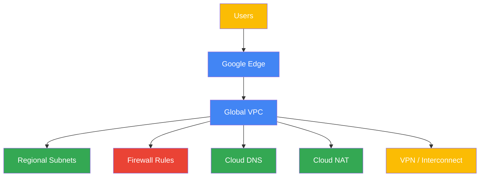

### Overview Notes

- VPC is global, but many networking components are regional.
- Security, routing, and connectivity choices should be designed together.
- Private-first architecture usually combines private subnets, Cloud NAT, PGA, and DNS.
- Hybrid architecture usually combines Cloud Router with HA VPN or Interconnect.
- Large organizations often combine Shared VPC and Cloud DNS for central governance.

---

## VPC Architecture

A **VPC network** in GCP is a **global resource**. However, **subnets are regional**. You can build isolated, scalable network layouts by designing custom VPCs, choosing IP ranges carefully, and segmenting workloads per subnet or per environment.

### VPC Concepts

- A VPC spans all regions globally.
- Subnets exist in a single region.
- VM NICs attach to subnets.
- Each subnet has a primary CIDR range.
- Secondary ranges can be added for GKE pods/services.
- Routes determine next-hop behavior.
- Firewall rules control traffic at the VPC level.
- Multiple regions can share the same VPC but use different regional subnets.

### Auto-mode vs Custom-mode VPCs

| Mode | Behavior | Pros | Cons | Best Fit |
|---|---|---|---|---|
| Auto mode | Creates one subnet per region automatically | Fast to start | Less control, pre-allocated ranges | Labs, very small environments |
| Custom mode | You define every subnet and CIDR | Precise IP planning, governance | More design work | Production, enterprise environments |

### CIDR Planning Notes

- Use non-overlapping RFC1918 ranges.
- Plan for future region growth.
- Leave room for hybrid routes and peering.
- Avoid overlapping with on-prem or partner environments.
- Reserve space for GKE secondary ranges if needed.
- Keep a subnet reservation map in source control or architecture docs.
- Plan for Shared VPC and peering early if they are likely later.

### Mermaid Diagram: VPC and Regional Subnets

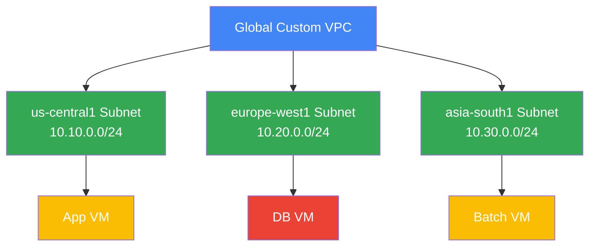

### Mermaid Diagram: Auto-mode vs Custom-mode

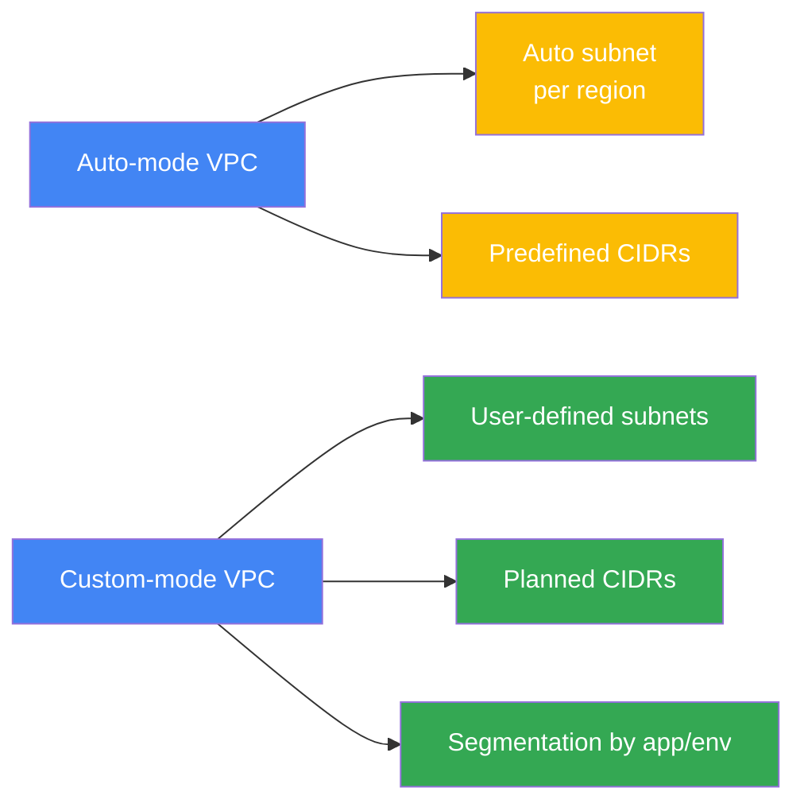

### Brief Explanation

A VPC is the foundational network boundary in GCP. Because subnets are regional, you can scale the same VPC across geographies while keeping IP allocation local to each region. Most production teams prefer custom-mode VPCs because they allow disciplined CIDR planning and clean environment segmentation.

### Quick `gcloud` Commands

```bash
# Create a custom VPC
gcloud compute networks create prod-vpc \
  --subnet-mode=custom

# Create a subnet in us-central1
gcloud compute networks subnets create prod-app-us-central1 \
  --network=prod-vpc \
  --region=us-central1 \
  --range=10.10.0.0/24

# Create a subnet in europe-west1
gcloud compute networks subnets create prod-db-europe-west1 \
  --network=prod-vpc \
  --region=europe-west1 \
  --range=10.20.0.0/24

# List VPCs
gcloud compute networks list

# Describe a VPC
gcloud compute networks describe prod-vpc

# List subnets
gcloud compute networks subnets list

# Describe a subnet
gcloud compute networks subnets describe prod-app-us-central1 \
  --region=us-central1
```

### Best Practices

- Prefer **custom-mode VPCs** for production.
- Use a documented CIDR plan before creating resources.
- Keep environments separate when governance or blast radius matters.
- Align subnet names with region and purpose.
- Avoid CIDR overlap across VPCs, on-prem, and partner networks.
- Use secondary ranges intentionally for container platforms.
- Standardize naming like `env-app-region`.
- Reserve headroom in each region for future growth.

---

## Firewall Rules

GCP firewall rules are **stateful** and evaluated based on **priority**. They can allow or deny **ingress** and **egress** traffic. Rules can target all instances, instances with specific **network tags**, or instances using certain **service accounts**.

### Important Firewall Characteristics

- Lower priority number wins.
- Deny and allow rules are both supported.
- Firewall rules are stateful.
- Return traffic for an allowed connection is automatically permitted.
- Rules apply at the VPC level.
- Targets can be narrowed using tags or service accounts.

### Implied Rules

Every VPC has implied firewall rules:

| Rule Type | Direction | Action | Notes |
|---|---|---|---|
| Implied allow egress | Egress | Allow | Allows outbound to all destinations by default |
| Implied deny ingress | Ingress | Deny | Denies inbound traffic by default |

### Firewall Evaluation Order

1. Match direction (ingress or egress).
2. Match target.
3. Match protocol and ports.
4. Evaluate based on lowest priority number.
5. First applicable rule decides.

### Tags vs Service Accounts

| Target Type | Best Use | Example |
|---|---|---|
| Network tags | Role-based VM grouping | `web`, `bastion`, `db` |
| Service accounts | Identity-based policy | `app-sa@project.iam.gserviceaccount.com` |

### Mermaid Diagram: Firewall Decision Flow

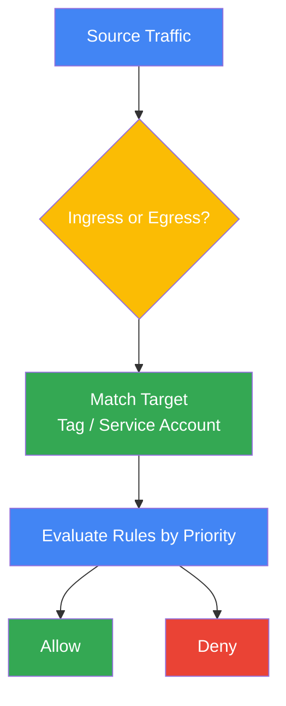

### Mermaid Diagram: Ingress Example

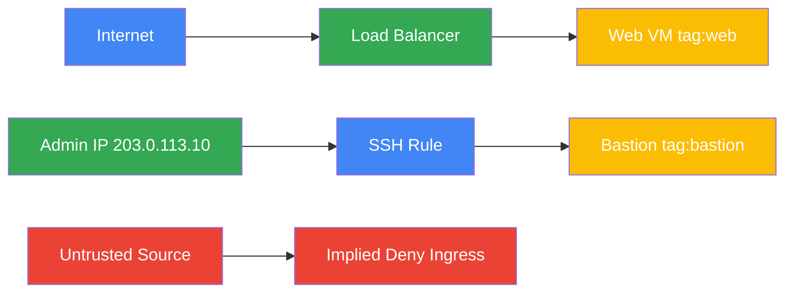

### Brief Explanation

Firewall rules let you express intent such as “web nodes can receive HTTPS” or “only bastions can receive SSH.” Because rules are priority-driven and stateful, your design should be explicit, layered, and easy to audit. Service-account-based targeting is especially useful for identity-centric application deployments.

### Quick `gcloud` Commands

```bash
# Allow SSH from a trusted CIDR
gcloud compute firewall-rules create allow-ssh-admin \
  --network=prod-vpc \
  --direction=INGRESS \
  --priority=1000 \
  --action=ALLOW \
  --rules=tcp:22 \
  --source-ranges=203.0.113.10/32 \
  --target-tags=bastion

# Allow HTTP/HTTPS to web instances
gcloud compute firewall-rules create allow-web \
  --network=prod-vpc \
  --direction=INGRESS \
  --priority=1000 \
  --action=ALLOW \
  --rules=tcp:80,tcp:443 \
  --source-ranges=0.0.0.0/0 \
  --target-tags=web

# Deny all egress to a sensitive CIDR
gcloud compute firewall-rules create deny-egress-sensitive \
  --network=prod-vpc \
  --direction=EGRESS \
  --priority=900 \
  --action=DENY \
  --rules=all \
  --destination-ranges=10.99.0.0/16

# List firewall rules
gcloud compute firewall-rules list

# Describe a firewall rule
gcloud compute firewall-rules describe allow-web

# Create a rule targeting a service account
gcloud compute firewall-rules create allow-app-to-db \
  --network=prod-vpc \
  --direction=INGRESS \
  --priority=1000 \
  --action=ALLOW \
  --rules=tcp:5432 \
  --source-tags=app \
  --target-service-accounts=db-sa@PROJECT_ID.iam.gserviceaccount.com
```

### Best Practices

- Use **least privilege** rules.
- Prefer narrow CIDRs over `0.0.0.0/0` when possible.
- Use explicit deny rules carefully and with lower priority numbers.
- Prefer service accounts for identity-centric workloads.
- Use tags for simple role-based segmentation.
- Document rule intent and ownership.
- Review high-priority deny rules to prevent accidental outages.
- Audit for unused permissive rules regularly.

---

## Cloud NAT

**Cloud NAT** provides **outbound internet access** for private instances that do **not** have external IP addresses. It works together with **Cloud Router**, but Cloud NAT itself does not require a custom route on each VM.

### How Cloud NAT Works

- VM sends outbound traffic to the internet.
- VM keeps only a private IP.
- Cloud NAT translates the source private IP to one or more external NAT IPs.
- Return traffic is mapped back to the originating VM.
- No inbound unsolicited traffic is allowed through Cloud NAT.

### When to Use It

- Patch private VMs without public exposure.
- Let private application servers pull packages or call public APIs.
- Reduce external IP consumption.
- Centralize outbound identity through NAT IPs.
- Standardize outbound internet access for regulated environments.

### Mermaid Diagram: Private VM to Internet via Cloud NAT

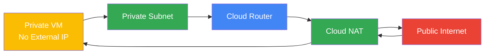

### Mermaid Diagram: NAT Translation Flow

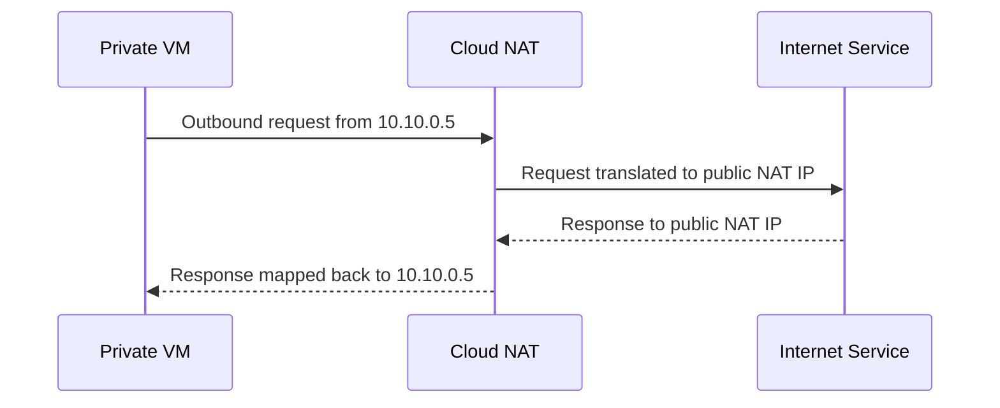

### Brief Explanation

Cloud NAT is designed for outbound-only internet connectivity from private resources. It is commonly used for package downloads, patching, external API calls, or artifact retrieval, while keeping VMs unexposed to direct inbound internet connections.

### Quick `gcloud` Commands

```bash
# Create a Cloud Router for NAT use
gcloud compute routers create nat-router-us-central1 \
  --network=prod-vpc \
  --region=us-central1

# Create Cloud NAT using auto-allocated external IPs
gcloud compute routers nats create prod-nat \
  --router=nat-router-us-central1 \
  --region=us-central1 \
  --auto-allocate-nat-external-ips \
  --nat-all-subnet-ip-ranges

# Create Cloud NAT for selected subnets only
gcloud compute routers nats create prod-nat-selected \
  --router=nat-router-us-central1 \
  --region=us-central1 \
  --nat-custom-subnet-ip-ranges=prod-app-us-central1

# List NAT configurations
gcloud compute routers nats list \
  --router=nat-router-us-central1 \
  --router-region=us-central1

# Describe NAT configuration
gcloud compute routers nats describe prod-nat \
  --router=nat-router-us-central1 \
  --region=us-central1
```

### Best Practices

- Use Cloud NAT for workloads that need outbound internet without public IPs.
- Place NAT in each region where private egress is required.
- Monitor port utilization for high-scale environments.
- Use logging selectively for troubleshooting and auditing.
- Pair Cloud NAT with restrictive egress firewall controls when needed.
- Keep private workloads off external IPs unless justified.
- Reserve static NAT IPs if outbound allowlists depend on known public IPs.

---

## Cloud Router

**Cloud Router** is a managed control-plane service for **dynamic routing** in GCP. It exchanges routes using **BGP** with supported peers such as **HA VPN** and **Cloud Interconnect**.

### Cloud Router Highlights

- Regional resource.
- Supports BGP sessions.
- Advertises subnet prefixes and learned routes.
- Works with HA VPN and Interconnect.
- Reduces static route management.
- Supports dynamic route exchange for hybrid patterns.

### Dynamic Routing Modes

| Mode | Behavior | Use Case |
|---|---|---|
| Regional | Learn and advertise routes within the same region | Simple regional isolation |
| Global | Learned routes can be used by resources in all regions | Multi-region hybrid routing |

### BGP Basics in GCP Context

- BGP peers exchange route reachability information.
- ASN values identify autonomous systems.
- Cloud Router advertises Google Cloud subnet ranges.
- On-prem routers advertise on-prem networks.
- Dynamic routing adapts to path changes more easily than static routing.

### Mermaid Diagram: Cloud Router with BGP

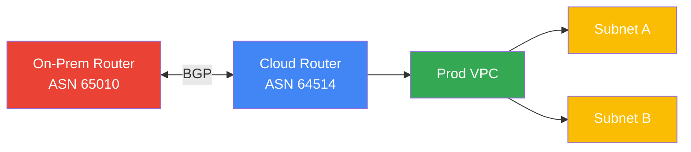

### Mermaid Diagram: Regional vs Global Routing

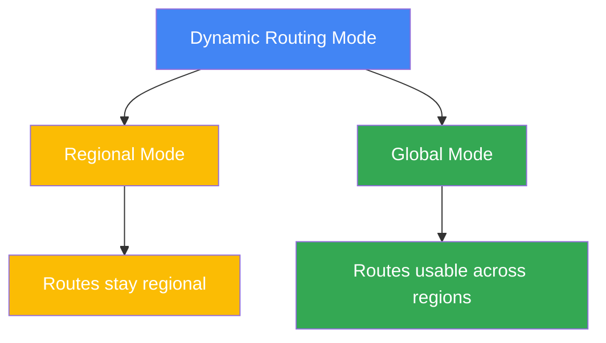

### Brief Explanation

Cloud Router is the route-exchange engine behind many hybrid topologies. Rather than manually maintaining static routes, you can let BGP advertise and learn prefixes dynamically, which improves adaptability and usually simplifies failover operations.

### Quick `gcloud` Commands

```bash
# Create a Cloud Router
gcloud compute routers create hybrid-router-us-central1 \
  --network=prod-vpc \
  --region=us-central1 \
  --asn=64514

# Describe the router
gcloud compute routers describe hybrid-router-us-central1 \
  --region=us-central1

# Update VPC dynamic routing mode to global
gcloud compute networks update prod-vpc \
  --bgp-routing-mode=global

# List routers
gcloud compute routers list

# Get router status including BGP sessions
gcloud compute routers get-status hybrid-router-us-central1 \
  --region=us-central1
```

### Best Practices

- Use dynamic routing for hybrid connectivity.
- Prefer **global routing mode** when multi-region access to learned routes is needed.
- Coordinate ASN and advertised prefix design with network teams.
- Validate route propagation during failover tests.
- Keep route advertisements as summarized as practical.
- Use monitoring on BGP session state.
- Document imported and exported route expectations.

---

## Interconnect

**Cloud Interconnect** provides private connectivity between on-premises infrastructure and Google Cloud. It is intended for high-throughput, lower-latency hybrid networking compared to internet-based VPN.

### Interconnect Types

| Type | Description | Typical Capacity | When to Use |
|---|---|---|---|
| Dedicated Interconnect | Direct physical connection into Google's network | High capacity | Large enterprises with colocation presence |
| Partner Interconnect | Connectivity through a supported service provider | Flexible | Enterprises using telecom/provider connectivity |

### VLAN Attachments

A **VLAN attachment** is the logical Layer 2 connectivity object used to connect a VPC to Interconnect. Traffic reaches Cloud Router for BGP exchange.

### Dedicated vs Partner Summary

- Dedicated Interconnect is generally chosen when you can place equipment in a supported colocation facility.
- Partner Interconnect is generally chosen when a provider handles the connectivity to Google.
- Both commonly use Cloud Router for BGP-based route exchange.
- Redundancy usually requires multiple attachments and diverse paths.

### Mermaid Diagram: Dedicated vs Partner Interconnect

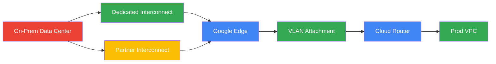

### Mermaid Diagram: Traffic Path over Interconnect

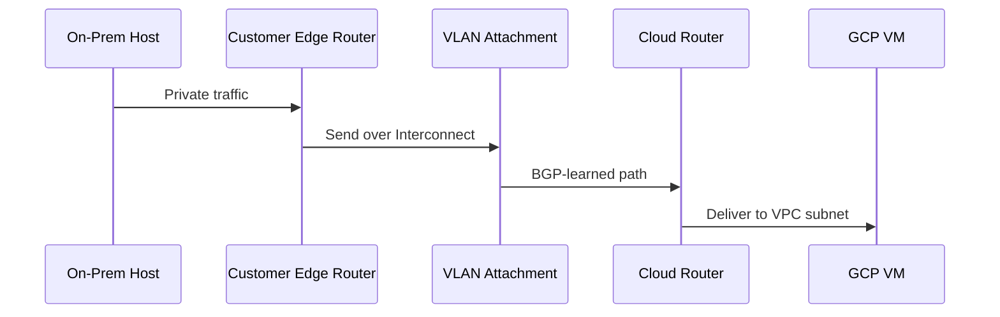

### Brief Explanation

Interconnect is the preferred choice when you need private, large-scale, and more deterministic hybrid connectivity than internet-based VPN can normally provide. It is especially valuable for high-throughput replication, enterprise backhaul, and latency-sensitive private traffic.

### Quick `gcloud` Commands

```bash
# List interconnects
gcloud compute interconnects list

# Describe a dedicated interconnect
gcloud compute interconnects describe INTERCONNECT_NAME

# List interconnect attachments (VLAN attachments)
gcloud compute interconnects attachments list

# Create a Partner Interconnect VLAN attachment
gcloud compute interconnects attachments partner create partner-attach-1 \
  --region=us-central1 \
  --router=hybrid-router-us-central1 \
  --edge-availability-domain=availability-domain-1 \
  --bandwidth=1Gbps

# Describe a VLAN attachment
gcloud compute interconnects attachments describe partner-attach-1 \
  --region=us-central1
```

### Best Practices

- Use Interconnect for high-bandwidth, predictable hybrid traffic.
- Deploy redundant VLAN attachments for availability.
- Pair with Cloud Router and BGP for dynamic failover.
- Validate provider and colocation requirements early.
- Separate production and non-production where needed.
- Monitor attachment state, BGP health, and throughput.
- Design for dual locations or diverse failure domains when possible.

---

## Cloud VPN

**Cloud VPN** provides encrypted connectivity between GCP and external peers over the public internet.

### Classic VPN vs HA VPN

| Feature | Classic VPN | HA VPN |
|---|---|---|
| Availability model | Legacy / single interface patterns | Highly available design |
| Recommended for new deployments | No | Yes |
| SLA-friendly architecture | Limited | Yes |
| Dynamic routing with Cloud Router | Limited patterns | Native and common |
| Tunnels | Traditional tunnel model | Two interfaces and redundant tunnels |

### Core Terms

- **VPN gateway**: GCP endpoint for tunnels.
- **Tunnel**: Encrypted IPsec tunnel between peers.
- **IKEv2**: Key exchange standard often used with modern VPN deployments.
- **Peer gateway**: External VPN device or peer definition.

### HA VPN Design Notes

- HA VPN is the recommended option for new production designs.
- HA VPN integrates naturally with Cloud Router and BGP.
- Multiple tunnels help preserve connectivity if one path fails.
- Classic VPN may remain only for legacy compatibility cases.

### Mermaid Diagram: HA VPN Topology

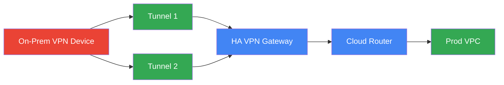

### Mermaid Diagram: VPN Tunnel Establishment

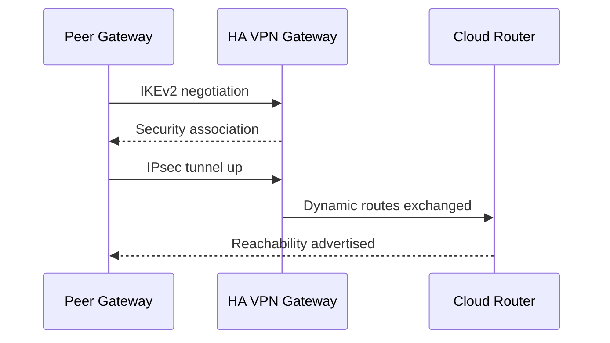

### Brief Explanation

Cloud VPN is a practical way to connect branch sites, smaller data centers, or partner networks securely over the internet. HA VPN is preferred because it improves resilience and aligns well with dynamic routing patterns built on Cloud Router.

### Quick `gcloud` Commands

```bash
# Create an HA VPN gateway
gcloud compute vpn-gateways create ha-vpn-gw \
  --network=prod-vpc \
  --region=us-central1

# Create an external VPN gateway definition
gcloud compute external-vpn-gateways create onprem-gw \
  --interfaces=0=203.0.113.2,1=203.0.113.3 \
  --redundancy-type=TWO_IPS_REDUNDANCY

# Create Cloud Router for HA VPN if not already present
gcloud compute routers create ha-vpn-router \
  --network=prod-vpc \
  --region=us-central1 \
  --asn=64514

# Create first VPN tunnel
gcloud compute vpn-tunnels create ha-tunnel-1 \
  --peer-external-gateway=onprem-gw \
  --peer-external-gateway-interface=0 \
  --region=us-central1 \
  --ike-version=2 \
  --shared-secret=REPLACE_WITH_SECRET \
  --router=ha-vpn-router \
  --vpn-gateway=ha-vpn-gw \
  --interface=0

# Create second VPN tunnel
gcloud compute vpn-tunnels create ha-tunnel-2 \
  --peer-external-gateway=onprem-gw \
  --peer-external-gateway-interface=1 \
  --region=us-central1 \
  --ike-version=2 \
  --shared-secret=REPLACE_WITH_SECRET \
  --router=ha-vpn-router \
  --vpn-gateway=ha-vpn-gw \
  --interface=1

# List VPN tunnels
gcloud compute vpn-tunnels list

# Describe a tunnel
gcloud compute vpn-tunnels describe ha-tunnel-1 \
  --region=us-central1
```

### Best Practices

- Prefer **HA VPN** for new deployments.
- Use **IKEv2** unless peer compatibility requires something else.
- Configure redundant tunnels and test failover.
- Use Cloud Router with BGP for dynamic route exchange.
- Protect shared secrets appropriately.
- Monitor tunnel uptime and BGP peer status.
- Ensure on-prem firewalls allow UDP 500, UDP 4500, and ESP as required.
- Document which prefixes are expected over each tunnel.

---

## Private Google Access

**Private Google Access (PGA)** allows VMs without external IP addresses to reach Google APIs and services using the Google network.

### Typical Uses

- Access Cloud Storage from private VMs.
- Reach Google APIs like Secret Manager, Artifact Registry, or logging endpoints.
- Keep workloads private while still consuming managed services.
- Retrieve packages and artifacts from Google-managed services.

### Important Notes

- PGA is enabled at the **subnet** level.
- The VM does not need an external IP.
- Private Google Access is different from Private Service Connect.
- DNS and routing still matter for correct resolution and connectivity.

### Mermaid Diagram: Private VM to Google APIs

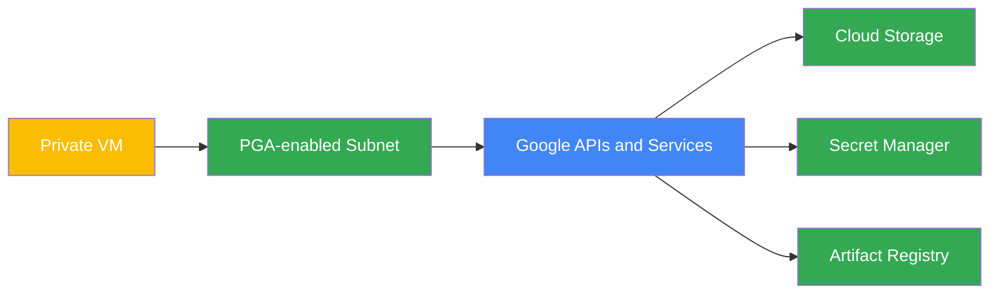

### Mermaid Diagram: Subnet Setting

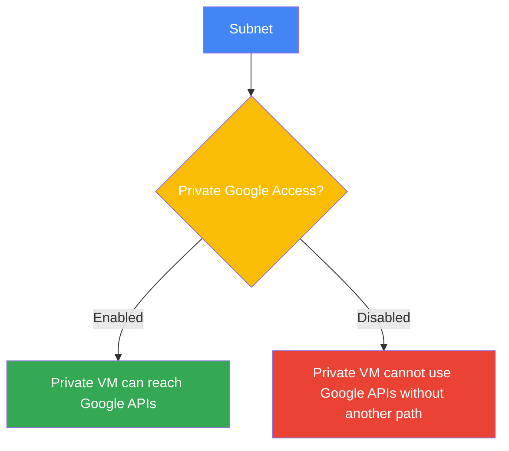

### Brief Explanation

Private Google Access is a subnet-level setting that removes the need for an external IP when private VMs must call Google APIs. It is a common companion to Cloud NAT, though the use cases differ: PGA is for Google APIs, while NAT is primarily for general outbound internet access.

### Quick `gcloud` Commands

```bash
# Enable Private Google Access on a subnet
gcloud compute networks subnets update prod-app-us-central1 \
  --region=us-central1 \
  --enable-private-ip-google-access

# Describe subnet and verify PGA setting
gcloud compute networks subnets describe prod-app-us-central1 \
  --region=us-central1

# Disable Private Google Access if needed
gcloud compute networks subnets update prod-app-us-central1 \
  --region=us-central1 \
  --no-enable-private-ip-google-access
```

### Best Practices

- Enable PGA on private subnets that need Google APIs.
- Pair PGA with private-only VM patterns for stronger security posture.
- Ensure DNS resolution aligns with intended API endpoints.
- Limit API access further with IAM and VPC Service Controls where relevant.
- Document which subnets are intended for private managed-service access.
- Test access to required APIs after enabling the setting.

---

## Shared VPC

**Shared VPC** lets an organization centralize networking in a **host project** while allowing workloads in **service projects** to use subnets from that host project.

### Why Shared VPC Matters

- Centralized network governance
- Decoupled app ownership and network ownership
- Reusable connectivity architecture
- Easier application team onboarding
- Better control of firewall rules, routes, and hybrid links
- Cleaner separation between platform and workload teams

### Key Terms

| Term | Meaning |
|---|---|
| Host project | Project that owns the Shared VPC network and subnets |
| Service project | Project that consumes subnets from the host project |
| Service project admin | Manages workloads in attached project |
| Network admin | Governs shared networking in host project |

### Mermaid Diagram: Shared VPC Model

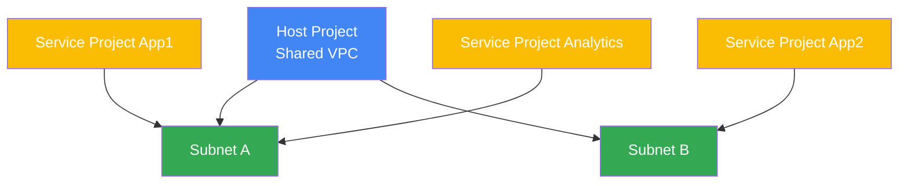

### Mermaid Diagram: Admin Separation

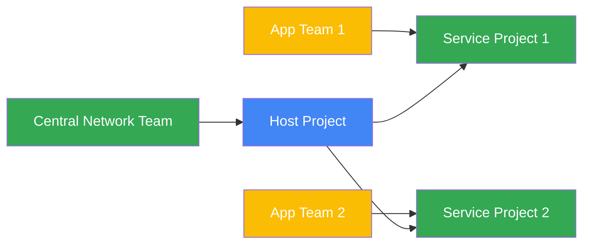

### Brief Explanation

Shared VPC is one of the most important enterprise networking patterns in GCP. It centralizes ownership of routes, firewall controls, subnets, and hybrid links while still letting application teams deploy resources into service projects with delegated IAM.

### Quick `gcloud` Commands

```bash
# Enable a project as a Shared VPC host project
gcloud compute shared-vpc enable HOST_PROJECT_ID

# Attach a service project to the host project
gcloud compute shared-vpc associated-projects add SERVICE_PROJECT_ID \
  --host-project=HOST_PROJECT_ID

# List associated service projects
gcloud compute shared-vpc associated-projects list \
  --host-project=HOST_PROJECT_ID

# Disable association if needed
gcloud compute shared-vpc associated-projects remove SERVICE_PROJECT_ID \
  --host-project=HOST_PROJECT_ID
```

### Best Practices

- Use Shared VPC for multi-project enterprise environments.
- Keep networking centralized and application deployment decentralized.
- Standardize subnet allocation and firewall ownership.
- Use folders and IAM roles carefully to separate duties.
- Document which service projects map to which environments.
- Combine Shared VPC with centralized DNS and hybrid connectivity.
- Define onboarding patterns for new service projects.

---

## VPC Peering

**VPC Peering** enables private connectivity between two VPC networks using Google's backbone. It supports cross-project and even cross-organization connectivity, as long as the networks are configured correctly.

### Key Characteristics

- Uses internal IPs between peered VPCs.
- No gateways or tunnels required.
- CIDR ranges must not overlap.
- Peering is non-transitive.
- Firewall rules do not automatically propagate between VPCs.

### Common Use Cases

- Shared services VPC consumed by application VPCs
- Cross-team networking between projects
- Acquisitions or org-to-org connectivity with private addressing
- Service migration between separate VPCs
- Simple private connectivity without hybrid transport components

### Mermaid Diagram: VPC Peering Topology

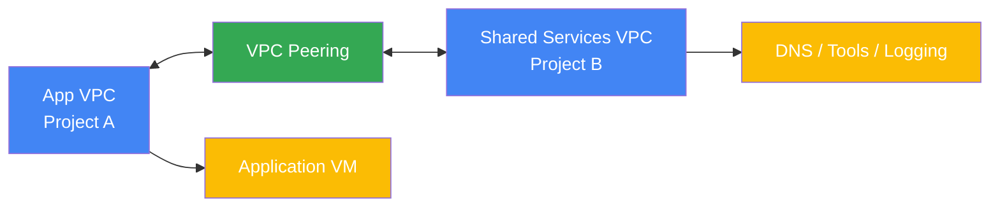

### Mermaid Diagram: Non-Transitive Warning

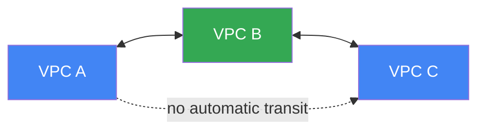

### Brief Explanation

VPC Peering is easy to adopt and works well when two VPCs simply need private IP communication. However, it is not a replacement for full hub-and-spoke transit designs because it is non-transitive. Careful route, firewall, and CIDR planning remain essential.

### Quick `gcloud` Commands

```bash
# Create peering from VPC A to VPC B
gcloud compute networks peerings create app-to-shared \
  --network=app-vpc \
  --peer-project=shared-project-id \
  --peer-network=shared-vpc

# Create reverse peering from VPC B to VPC A
gcloud compute networks peerings create shared-to-app \
  --network=shared-vpc \
  --peer-project=app-project-id \
  --peer-network=app-vpc

# List peerings
gcloud compute networks peerings list

# Describe VPC to inspect peerings
gcloud compute networks describe app-vpc

# Update peering to exchange custom routes
gcloud compute networks peerings update app-to-shared \
  --network=app-vpc \
  --export-custom-routes \
  --import-custom-routes
```

### Best Practices

- Verify CIDR non-overlap before enabling peering.
- Remember peering is **non-transitive**.
- Keep route import/export behavior explicit.
- Use Shared VPC instead of peering when central governance is the main goal.
- Review firewall rules on both sides.
- Avoid overusing peering meshes that become hard to manage.
- Track peering dependencies in architecture diagrams.

---

## Cloud DNS

**Cloud DNS** is Google Cloud's managed DNS service. It supports both **public** and **private** zones.

### Public vs Private Zones

| Zone Type | Visibility | Use Case |
|---|---|---|
| Public zone | Internet resolvable | Public websites, public APIs |
| Private zone | Visible only to linked VPCs | Internal service discovery |

### Cloud DNS Benefits

- Managed and scalable
- Integrates with VPCs
- Supports split-horizon designs
- Useful for hybrid name resolution patterns
- Reduces need for self-managed DNS infrastructure

### Mermaid Diagram: Public and Private DNS Zones

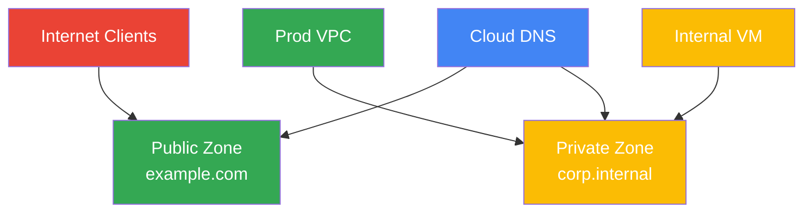

### Mermaid Diagram: Private Resolution Flow

```mermaid
sequenceDiagram
    participant VM as Internal VM
    participant DNS as Cloud DNS Private Zone
    participant APP as Internal Service

    VM->>DNS: Query api.corp.internal
    DNS-->>VM: 10.20.0.15
    VM->>APP: Connect using private IP
```

### Brief Explanation

Cloud DNS gives you fully managed authoritative DNS hosting for public and private namespaces. Private zones are especially useful for internal service discovery in Shared VPC, peered VPC, and hybrid environments.

### Quick `gcloud` Commands

```bash
# Create a public DNS managed zone
gcloud dns managed-zones create public-example-zone \
  --description="Public zone for example.com" \
  --dns-name="example.com." \
  --visibility="public"

# Create a private DNS managed zone linked to a VPC
gcloud dns managed-zones create private-corp-zone \
  --description="Private zone for corp.internal" \
  --dns-name="corp.internal." \
  --visibility="private" \
  --networks="prod-vpc"

# List managed zones
gcloud dns managed-zones list

# Start a transaction to add a record
gcloud dns record-sets transaction start \
  --zone=private-corp-zone

# Add an A record
gcloud dns record-sets transaction add 10.20.0.15 \
  --name="api.corp.internal." \
  --ttl=300 \
  --type=A \
  --zone=private-corp-zone

# Execute transaction
gcloud dns record-sets transaction execute \
  --zone=private-corp-zone
```

### Best Practices

- Use public zones only for internet-facing names.
- Use private zones for internal service discovery.
- Standardize internal naming conventions.
- Consider split-horizon design when the same name needs different answers internally vs externally.
- Document zone ownership and record lifecycle.
- Keep TTL values aligned with failover and change frequency.
- Review resolver design when extending DNS to on-premises.

---

## Network Service Tiers

Google Cloud offers **Premium Tier** and **Standard Tier** networking for supported services.

### Premium vs Standard

| Tier | Path | Characteristics | Typical Fit |
|---|---|---|---|
| Premium Tier | Uses Google's global backbone extensively | Better global reach, performance, and edge presence | Production internet-facing services |
| Standard Tier | More traffic uses public internet path near source/destination | Lower cost in some cases, more regional behavior | Cost-sensitive or region-focused use |

### Practical Interpretation

- Premium Tier often gives more consistent global performance.
- Standard Tier can be suitable for localized or budget-sensitive workloads.
- Not every product exposes tier settings the same way.
- Service tier choices should align with latency, reach, and availability goals.

### Mermaid Diagram: Premium vs Standard Path

```mermaid
graph TD
    USER[End User]
    PREM[Premium Tier]
    STD[Standard Tier]
    GB[Google Global Backbone]
    INT[Public Internet Path]
    APP[Application Service]

    USER --> PREM
    USER --> STD
    PREM --> GB
    STD --> INT
    GB --> APP
    INT --> APP

    style USER fill:#FBBC04,color:#fff
    style PREM fill:#4285F4,color:#fff
    style STD fill:#34A853,color:#fff
    style GB fill:#4285F4,color:#fff
    style INT fill:#EA4335,color:#fff
    style APP fill:#34A853,color:#fff
```

### Mermaid Diagram: Decision Lens

```mermaid
graph LR
    DECIDE[Choose Service Tier] --> LAT[Latency Requirement]
    DECIDE --> COST[Cost Requirement]
    DECIDE --> GEO[Global Reach Requirement]
    LAT --> PREM[Often Premium]
    COST --> STD[Often Standard]
    GEO --> PREM

    style DECIDE fill:#4285F4,color:#fff
    style LAT fill:#FBBC04,color:#fff
    style COST fill:#34A853,color:#fff
    style GEO fill:#FBBC04,color:#fff
    style PREM fill:#4285F4,color:#fff
    style STD fill:#34A853,color:#fff
```

### Brief Explanation

Network Service Tiers influence how traffic traverses Google and public internet infrastructure. Premium Tier typically offers stronger global consistency and reach, while Standard Tier may suit localized, budget-aware workloads with simpler requirements.

### Quick `gcloud` Commands

```bash
# Create a static external IP with Premium Tier
gcloud compute addresses create premium-ip \
  --network-tier=PREMIUM \
  --global

# Create a regional static external IP with Standard Tier
gcloud compute addresses create standard-ip \
  --network-tier=STANDARD \
  --region=us-central1

# List addresses and tiers
gcloud compute addresses list

# Describe an address to view its tier
gcloud compute addresses describe standard-ip \
  --region=us-central1
```

### Best Practices

- Use Premium Tier for customer-facing global applications by default.
- Use Standard Tier only when its trade-offs are understood.
- Validate product compatibility for tier selection.
- Match tier decisions to SLOs, geography, and budget.
- Reassess tier choices as traffic patterns change.
- Standardize tier defaults in platform templates where possible.

---

## Design Checklist

Use this checklist when reviewing a GCP networking design.

### IP Planning Checklist

- [ ] VPCs use non-overlapping RFC1918 space.
- [ ] Future regional growth is accounted for.
- [ ] GKE secondary ranges are reserved where needed.
- [ ] Hybrid and peering overlaps are checked.
- [ ] Shared VPC expansion will not collide with future service projects.

### Security Checklist

- [ ] Firewall rules follow least privilege.
- [ ] Broad ingress is limited and justified.
- [ ] Admin access is restricted to known source ranges.
- [ ] Private workloads avoid unnecessary public IPs.
- [ ] VPN secrets and sensitive configs are protected.
- [ ] DNS exposure aligns with the workload trust boundary.

### Hybrid Connectivity Checklist

- [ ] Cloud Router ASN and BGP plan are documented.
- [ ] HA VPN or Interconnect redundancy is designed.
- [ ] Dynamic routing mode is validated.
- [ ] Route advertisement policy is reviewed.
- [ ] Failover testing is part of operational readiness.

### Services Checklist

- [ ] Private Google Access is enabled where required.
- [ ] Cloud DNS private zones are linked properly.
- [ ] Shared VPC ownership is clearly assigned.
- [ ] Peering non-transitivity is understood.
- [ ] Network Service Tier choices match latency and budget goals.

---

## Reference Commands

This section provides additional quick commands for day-to-day operations.

### Inventory Commands

```bash
# VPC networks
gcloud compute networks list

# Subnets
gcloud compute networks subnets list

# Routes
gcloud compute routes list

# Firewall rules
gcloud compute firewall-rules list

# Routers
gcloud compute routers list

# NAT configs
gcloud compute routers nats list \
  --router=nat-router-us-central1 \
  --router-region=us-central1

# VPN gateways
gcloud compute vpn-gateways list

# VPN tunnels
gcloud compute vpn-tunnels list

# Interconnects
gcloud compute interconnects list

# VLAN attachments
gcloud compute interconnects attachments list

# DNS managed zones
gcloud dns managed-zones list
```

### Troubleshooting Tips

| Area | What to Check |
|---|---|
| VPC/Subnets | CIDR overlap, region, route visibility |
| Firewall | Direction, target, priority, source/destination ranges |
| NAT | Region alignment, subnet selection, port exhaustion |
| Cloud Router | BGP status, ASN mismatch, learned routes |
| VPN | Tunnel state, IKE version, shared secret, peer IPs |
| Interconnect | Attachment state, BGP sessions, provider handoff |
| Private Google Access | Subnet setting, DNS path, service endpoint resolution |
| Shared VPC | Host/service project attachment and IAM |
| Peering | Overlapping CIDRs, route import/export, firewall on both sides |
| DNS | Zone visibility, record value, linked networks, TTL |
| Service Tier | Resource tier setting and product support |

### Common Troubleshooting Commands

```bash
# Describe a route
gcloud compute routes describe ROUTE_NAME

# View router status
gcloud compute routers get-status hybrid-router-us-central1 \
  --region=us-central1

# Describe firewall rule
gcloud compute firewall-rules describe RULE_NAME

# Describe NAT
gcloud compute routers nats describe prod-nat \
  --router=nat-router-us-central1 \
  --region=us-central1

# Describe VPN tunnel
gcloud compute vpn-tunnels describe ha-tunnel-1 \
  --region=us-central1

# Describe DNS zone
gcloud dns managed-zones describe private-corp-zone
```

---

## Appendix: Short Glossary

- **ASN**: Autonomous System Number used in BGP.
- **BGP**: Border Gateway Protocol used for route exchange.
- **CIDR**: Classless Inter-Domain Routing notation for IP ranges.
- **Egress**: Outbound traffic leaving a resource or network.
- **Ingress**: Inbound traffic entering a resource or network.
- **NAT**: Network Address Translation.
- **PGA**: Private Google Access.
- **RFC1918**: Private IPv4 address space.
- **VLAN Attachment**: Logical connectivity construct for Interconnect.
- **VPC**: Virtual Private Cloud.

---

## Appendix: Example Landing Zone Pattern

### Mermaid Diagram: Sample Enterprise Pattern

```mermaid
graph LR
    ORG[Organization] --> HOST[Shared VPC Host Project]
    HOST --> HUB[Central Networking VPC]
    HOST --> DNS[Central Cloud DNS]
    HOST --> HYB[HA VPN / Interconnect]
    APP1[Service Project 1] --> HUB
    APP2[Service Project 2] --> HUB
    APP3[Service Project 3] --> HUB

    style ORG fill:#4285F4,color:#fff
    style HOST fill:#34A853,color:#fff
    style HUB fill:#4285F4,color:#fff
    style DNS fill:#34A853,color:#fff
    style HYB fill:#FBBC04,color:#fff
    style APP1 fill:#FBBC04,color:#fff
    style APP2 fill:#FBBC04,color:#fff
    style APP3 fill:#FBBC04,color:#fff
```

### Brief Explanation

A common landing zone pattern uses Shared VPC for central networking, Cloud DNS for internal resolution, and Cloud Router plus HA VPN or Interconnect for hybrid access. Application teams deploy in service projects while a platform team owns the network.

### Quick `gcloud` Commands

```bash
# View Shared VPC associations
gcloud compute shared-vpc associated-projects list \
  --host-project=HOST_PROJECT_ID

# View routers in the landing zone project
gcloud compute routers list \
  --project=HOST_PROJECT_ID

# View firewall rules in the landing zone project
gcloud compute firewall-rules list \
  --project=HOST_PROJECT_ID
```

### Best Practices

- Centralize control-plane networking in a platform-owned project.
- Keep application deployment IAM separate from network administration IAM.
- Use private subnets, Cloud NAT, and PGA for private-first application hosting.
- Standardize DNS and hybrid patterns for all teams.
- Review route scale and subnet growth regularly.

---

## Appendix: Operational Review Questions

Use the following questions during design reviews, migrations, or troubleshooting sessions.

### Architecture Questions

- Which VPC owns the workload?
- Is the subnet regional placement aligned with latency and data residency needs?
- Is the chosen CIDR range safe from future overlap?
- Does the environment require Shared VPC instead of standalone VPCs?
- Should traffic stay private through peering, VPN, or Interconnect?

### Security Questions

- Are firewall rules overly broad?
- Are there public IPs that could be removed?
- Is admin traffic restricted through bastions or approved sources?
- Are Google API calls intended to use PGA?
- Are public and private DNS names separated correctly?

### Operations Questions

- What happens if one tunnel, router, or attachment fails?
- Are NAT ports sufficient under peak load?
- Are BGP learned routes visible in the expected regions?
- Is DNS TTL aligned with failover expectations?
- Are service tier decisions still aligned with business goals?

---

## Summary

GCP networking combines a **global VPC model** with **regional subnets**, **stateful firewall controls**, and flexible connectivity choices such as **Cloud NAT**, **Cloud Router**, **Interconnect**, and **Cloud VPN**. Enterprise-scale designs often add **Private Google Access**, **Shared VPC**, **VPC Peering**, and **Cloud DNS** for stronger private connectivity and operational consistency.

If you design with clear CIDR planning, explicit security boundaries, resilient hybrid routing, and centralized governance, GCP networking becomes both scalable and predictable.

---

## Key Takeaways

- VPC is global; subnets are regional.
- Custom-mode VPCs are preferred for production.
- Firewall rules are stateful and priority-based.
- Cloud NAT gives private VMs outbound internet access.
- Cloud Router enables dynamic BGP routing.
- Interconnect is for high-throughput private hybrid connectivity.
- HA VPN is the preferred modern VPN option.
- Private Google Access enables API access from private VMs.
- Shared VPC centralizes networking across projects.
- VPC Peering connects VPCs privately but is non-transitive.
- Cloud DNS supports both public and private zones.
- Premium vs Standard Tier should match performance and cost goals.
