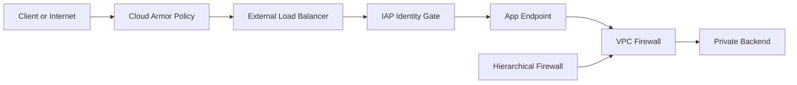
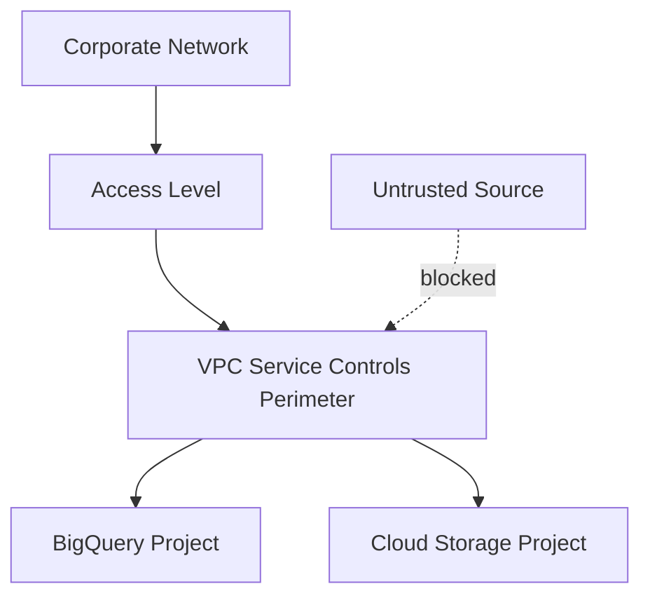

# Network Policies and Protocols in GCP

> Scope: This guide explains how to combine GCP firewalling, application edge controls, network protocol choices, GKE network policy, and data perimeter controls.

## Firewall Model Overview
- GCP VPC firewall rules are stateful and evaluated by priority, direction, target, and action.
- Hierarchical firewall policies apply at the organization or folder scope and are ideal for mandatory baseline guardrails.
- VPC firewall rules remain the right place for workload-specific rules such as health checks, application ports, or migration exceptions.
- Implied rules still exist, so operators should understand the default allow egress and deny ingress posture unless custom rules override it.
- Using both layers together gives central security teams a durable baseline while application teams retain controlled flexibility.

## Traffic Control Layers


## Firewall Priorities and Evaluation
- Lower numeric priority wins before higher numeric priority.
- A deny at a higher-precedence layer can block traffic before a VPC-level allow rule is evaluated.
- Use consistent priority bands such as 1000 for platform baseline, 2000 for approved exceptions, and 3000 plus for workload-specific rules.
- Document target tags, target service accounts, and source ranges so later audits can explain why a rule exists.
- Prefer target service accounts for more stable identity-based targeting when feasible.

## Step 1: Create a hierarchical firewall policy for organization-wide baseline
- Why this step matters: Start with baseline deny and tightly scoped required egress so every project in scope inherits a known posture.
```bash
gcloud compute firewall-policies create --organization=ORG_ID --short-name=org-net-baseline
gcloud compute firewall-policies rules create 1000 --firewall-policy=POLICY_ID --direction=INGRESS --action=deny --src-ip-ranges=0.0.0.0/0 --layer4-configs=all
gcloud compute firewall-policies rules create 1100 --firewall-policy=POLICY_ID --direction=EGRESS --action=allow --dest-ip-ranges=199.36.153.8/30 --layer4-configs=tcp:443
gcloud compute firewall-policies associations create --firewall-policy=POLICY_ID --folder=PROD_FOLDER_ID
```
- Operational note: Keep rule descriptions, ticket IDs, and owner metadata in the change record even if the command syntax does not store them directly.

## Step 2: Add workload-specific VPC rules for health checks and app traffic
- Why this step matters: Keep application rules close to the workload so they are easier to change without modifying global policy.
```bash
gcloud compute firewall-rules create allow-gfe-health-checks --project=HOST_PROJECT --network=VPC_NAME --direction=INGRESS --priority=1000 --action=ALLOW --rules=tcp:8080 --source-ranges=35.191.0.0/16,130.211.0.0/22 --target-tags=web
gcloud compute firewall-rules create allow-app-to-db --project=HOST_PROJECT --network=VPC_NAME --direction=INGRESS --priority=1200 --action=ALLOW --rules=tcp:5432 --source-tags=app --target-tags=db
```
- Operational note: Keep rule descriptions, ticket IDs, and owner metadata in the change record even if the command syntax does not store them directly.

## Step 3: Prefer target service accounts when workload identities are stable
- Why this step matters: Service-account targeting survives instance recreation better than network tags in many controlled environments.
```bash
gcloud compute firewall-rules create allow-batch-to-api --project=HOST_PROJECT --network=VPC_NAME --direction=INGRESS --priority=1300 --action=ALLOW --rules=tcp:8443 --source-service-accounts=batch-sa@PROJECT_ID.iam.gserviceaccount.com --target-service-accounts=api-sa@PROJECT_ID.iam.gserviceaccount.com
```
- Operational note: Keep rule descriptions, ticket IDs, and owner metadata in the change record even if the command syntax does not store them directly.

## Step 4: Log high-value firewall decisions
- Why this step matters: Firewall logs help incident responders verify which policy layer accepted or denied traffic.
```bash
gcloud compute firewall-rules update allow-app-to-db --project=HOST_PROJECT --enable-logging
gcloud compute firewall-policies rules update 1000 --firewall-policy=POLICY_ID --enable-logging
```
- Operational note: Keep rule descriptions, ticket IDs, and owner metadata in the change record even if the command syntax does not store them directly.

## Step 5: Review effective posture before rollout
- Why this step matters: Reviewing both layers together reduces the chance of conflicting assumptions between platform and workload owners.
```bash
gcloud compute firewall-rules list --project=HOST_PROJECT --format="table(name,direction,priority,allowed,sourceRanges,targetTags)"
gcloud compute firewall-policies rules list --firewall-policy=POLICY_ID
```
- Operational note: Keep rule descriptions, ticket IDs, and owner metadata in the change record even if the command syntax does not store them directly.

## Cloud Armor vs Firewall vs IAP
| Control | Best fit | Primary decision point | Typical example |
| --- | --- | --- | --- |
| Cloud Armor | Layer 7 edge protection and WAF policies | Inspect HTTP(S) requests before they reach the backend | Geo rules, rate limiting, preconfigured WAF, bot mitigation |
| VPC or Hierarchical Firewall | Layer 3 and Layer 4 network control | Allow or deny IP and port connectivity at network boundary | Restrict backend ports, east-west segmentation, mandatory deny |
| Identity-Aware Proxy | User-to-app identity gate | Authenticate and authorize users before app access | Admin UI or internal app without public network exposure |
| Combined pattern | Defense in depth | Use all three when app sensitivity justifies multiple control points | Public app with WAF, private backend firewall, identity-gated admin path |

## Protocol Decision Table
| Protocol or Pattern | When to use | GCP support notes | Key tradeoff |
| --- | --- | --- | --- |
| HTTP | Simple internal services or redirects only | Supported broadly, usually fronted by HTTPS externally | No transport encryption unless wrapped |
| HTTPS | Default for web and API traffic | Cloud Load Balancing, Cloud Run, GKE, and managed services support it widely | TLS management required but worth it |
| gRPC | Low-latency service-to-service APIs, streaming, contract-first interfaces | Works with HTTP/2; supported with Cloud Load Balancing and Cloud Run | Requires HTTP/2-aware clients and operational familiarity |
| HTTP/2 | Multiplexed request patterns and gRPC underlay | Useful for modern app and proxy stacks | Not every intermediary feature behaves like classic HTTP/1.1 |
| WebSocket | Bidirectional browser sessions and near-real-time apps | Supported through Google Cloud load balancers for compatible backends | Long-lived sessions affect scaling and timeout design |
| TCP | Non-HTTP custom protocols and databases | Use TCP or SSL proxy load balancing where appropriate | Less application-aware protection than L7 |
| UDP | DNS, media, telemetry, or custom datagrams | Regional external passthrough load balancers and certain service patterns support it | Connectionless design shifts more responsibility to the app |

## Protocol Selection Guidance
- Use HTTPS for user-facing applications by default because it aligns with modern browser and zero-trust expectations.
- Use gRPC when service contracts, streaming, and efficient binary transport matter more than human readability on the wire.
- Keep WebSocket for truly bidirectional interactive needs rather than as a substitute for normal request-response APIs.
- Prefer TCP only when the protocol is non-HTTP by design or when lifting and shifting an existing stack.
- Use UDP deliberately and monitor loss, ordering, and retransmission behavior at the application layer.

## GKE Network Policy
- NetworkPolicy in GKE controls pod-to-pod and pod-to-service communication at the Kubernetes layer.
- Dataplane V2 uses eBPF and Cilium-based data plane capabilities managed by Google for newer clusters.
- Calico remains familiar to many teams, but Dataplane V2 is the strategic default for many new GKE environments where its feature set fits.

## Dataplane V2 vs Calico
| Option | Strength | Consideration | Recommendation |
| --- | --- | --- | --- |
| Dataplane V2 | Managed eBPF-based dataplane with strong observability and performance characteristics | Feature compatibility should be reviewed during migration from older clusters | Preferred default for new GKE clusters when supported requirements align |
| Calico | Widely known policy model with mature ecosystem history | Operational behavior differs from Dataplane V2 and may increase consistency burden across fleets | Choose when existing platform standards depend on it and migration is not yet justified |

### Example: Default deny all ingress in a namespace
```yaml
apiVersion: networking.k8s.io/v1
kind: NetworkPolicy
metadata:
  name: default-deny-ingress
  namespace: payments
spec:
  podSelector: {}
  policyTypes:
  - Ingress
```

### Example: Allow frontend to call api on port 8443
```yaml
apiVersion: networking.k8s.io/v1
kind: NetworkPolicy
metadata:
  name: allow-frontend-to-api
  namespace: payments
spec:
  podSelector:
    matchLabels:
      app: api
  policyTypes:
  - Ingress
  ingress:
  - from:
    - podSelector:
        matchLabels:
          app: frontend
    ports:
    - protocol: TCP
      port: 8443
```

### Example: Allow egress only to DNS and internal API
```yaml
apiVersion: networking.k8s.io/v1
kind: NetworkPolicy
metadata:
  name: restrict-egress
  namespace: payments
spec:
  podSelector: {}
  policyTypes:
  - Egress
  egress:
  - to:
    - namespaceSelector:
        matchLabels:
          kubernetes.io/metadata.name: kube-system
    ports:
    - protocol: UDP
      port: 53
  - to:
    - podSelector:
        matchLabels:
          app: internal-api
    ports:
    - protocol: TCP
      port: 8443
```

## Private Google Access
- Private Google Access allows VMs and nodes without external IPs to reach Google APIs and services from private addresses.
- Enable it on subnets that host private workloads, especially GKE nodes, batch VMs, and internal service tiers.
- Combine it with Cloud NAT when workloads also need outbound access to the public internet or third-party repositories.
```bash
gcloud compute networks subnets update snet-prod-uscentral1-app --project=HOST_PROJECT --region=us-central1 --enable-private-ip-google-access
```

## Private Service Connect
- Private Service Connect exposes producer services privately to consumer VPCs without broad network peering.
- Use it for private consumption of Google APIs, managed services, or internally published services where tenancy boundaries should stay intact.
- It is especially useful when you want private connectivity without sharing full routing tables or subnet visibility.
```bash
gcloud compute forwarding-rules create psc-googleapis-uscentral1 --project=HOST_PROJECT --region=us-central1 --network=VPC_NAME --address=PSC_IP --target-google-apis-bundle=all-apis
```

## VPC Service Controls
- VPC Service Controls build service perimeters around supported Google-managed services to reduce data exfiltration risk.
- They do not replace IAM; they complement IAM by constraining where data requests can originate and where protected services can be accessed from.

### Step 1: Identify sensitive projects and supported services
- Choose projects holding regulated data and list the services such as BigQuery, Cloud Storage, or Secret Manager that need perimeter protection.
- Why this matters: VPC Service Controls step 1 is most effective when service usage, user paths, and automation identities are already inventoried.

### Step 2: Create an access policy
- An access policy becomes the container for perimeters and access levels tied to organization context.
- Why this matters: VPC Service Controls step 2 is most effective when service usage, user paths, and automation identities are already inventoried.

### Step 3: Define access levels
- Use device, identity, IP, or context-aware conditions for approved access paths where policy needs exceptions.
- Why this matters: VPC Service Controls step 3 is most effective when service usage, user paths, and automation identities are already inventoried.

### Step 4: Create a regular perimeter
- Place the sensitive projects and restricted services inside a perimeter so calls from outside are controlled.
- Why this matters: VPC Service Controls step 4 is most effective when service usage, user paths, and automation identities are already inventoried.

### Step 5: Test and monitor violations
- Review dry-run style signals, access denials, and logging before broadening enforcement to more projects.
- Why this matters: VPC Service Controls step 5 is most effective when service usage, user paths, and automation identities are already inventoried.

### Step 6: Add bridges only when justified
- Use perimeter bridges for explicitly allowed cross-project data sharing patterns instead of weakening the primary perimeter.
- Why this matters: VPC Service Controls step 6 is most effective when service usage, user paths, and automation identities are already inventoried.



## Practical Recommendations
- Use hierarchical firewall for global deny posture and VPC firewall for app-specific allow lists.
- Use Cloud Armor for public HTTP(S) edge abuse scenarios, not as a replacement for private east-west segmentation.
- Use IAP for user-to-app access where identity should be checked before reaching the app.
- Default to HTTPS and evaluate gRPC for internal service meshes or high-performance APIs.
- Enable GKE NetworkPolicy early because retrofitting least privilege later is more disruptive.
- Adopt Private Google Access and PSC together when you want private consumption of Google APIs and producer services.
- Treat VPC Service Controls as a program, not a single checkbox, because process and exception handling matter as much as the perimeter itself.

## Troubleshooting Checklist
- Check 1: Validate source, destination, protocol, policy layer, priority, route, and identity assumptions before concluding that the network platform is at fault.
- Check 2: Validate source, destination, protocol, policy layer, priority, route, and identity assumptions before concluding that the network platform is at fault.
- Check 3: Validate source, destination, protocol, policy layer, priority, route, and identity assumptions before concluding that the network platform is at fault.
- Check 4: Validate source, destination, protocol, policy layer, priority, route, and identity assumptions before concluding that the network platform is at fault.
- Check 5: Validate source, destination, protocol, policy layer, priority, route, and identity assumptions before concluding that the network platform is at fault.
- Check 6: Validate source, destination, protocol, policy layer, priority, route, and identity assumptions before concluding that the network platform is at fault.
- Check 7: Validate source, destination, protocol, policy layer, priority, route, and identity assumptions before concluding that the network platform is at fault.
- Check 8: Validate source, destination, protocol, policy layer, priority, route, and identity assumptions before concluding that the network platform is at fault.
- Check 9: Validate source, destination, protocol, policy layer, priority, route, and identity assumptions before concluding that the network platform is at fault.
- Check 10: Validate source, destination, protocol, policy layer, priority, route, and identity assumptions before concluding that the network platform is at fault.
- Check 11: Validate source, destination, protocol, policy layer, priority, route, and identity assumptions before concluding that the network platform is at fault.
- Check 12: Validate source, destination, protocol, policy layer, priority, route, and identity assumptions before concluding that the network platform is at fault.
- Check 13: Validate source, destination, protocol, policy layer, priority, route, and identity assumptions before concluding that the network platform is at fault.
- Check 14: Validate source, destination, protocol, policy layer, priority, route, and identity assumptions before concluding that the network platform is at fault.
- Check 15: Validate source, destination, protocol, policy layer, priority, route, and identity assumptions before concluding that the network platform is at fault.
- Check 16: Validate source, destination, protocol, policy layer, priority, route, and identity assumptions before concluding that the network platform is at fault.
- Check 17: Validate source, destination, protocol, policy layer, priority, route, and identity assumptions before concluding that the network platform is at fault.
- Check 18: Validate source, destination, protocol, policy layer, priority, route, and identity assumptions before concluding that the network platform is at fault.
- Check 19: Validate source, destination, protocol, policy layer, priority, route, and identity assumptions before concluding that the network platform is at fault.
- Check 20: Validate source, destination, protocol, policy layer, priority, route, and identity assumptions before concluding that the network platform is at fault.
- Check 21: Validate source, destination, protocol, policy layer, priority, route, and identity assumptions before concluding that the network platform is at fault.
- Check 22: Validate source, destination, protocol, policy layer, priority, route, and identity assumptions before concluding that the network platform is at fault.
- Check 23: Validate source, destination, protocol, policy layer, priority, route, and identity assumptions before concluding that the network platform is at fault.
- Check 24: Validate source, destination, protocol, policy layer, priority, route, and identity assumptions before concluding that the network platform is at fault.
- Check 25: Validate source, destination, protocol, policy layer, priority, route, and identity assumptions before concluding that the network platform is at fault.
- Check 26: Validate source, destination, protocol, policy layer, priority, route, and identity assumptions before concluding that the network platform is at fault.
- Check 27: Validate source, destination, protocol, policy layer, priority, route, and identity assumptions before concluding that the network platform is at fault.
- Check 28: Validate source, destination, protocol, policy layer, priority, route, and identity assumptions before concluding that the network platform is at fault.
- Check 29: Validate source, destination, protocol, policy layer, priority, route, and identity assumptions before concluding that the network platform is at fault.
- Check 30: Validate source, destination, protocol, policy layer, priority, route, and identity assumptions before concluding that the network platform is at fault.
- Check 31: Validate source, destination, protocol, policy layer, priority, route, and identity assumptions before concluding that the network platform is at fault.
- Check 32: Validate source, destination, protocol, policy layer, priority, route, and identity assumptions before concluding that the network platform is at fault.
- Check 33: Validate source, destination, protocol, policy layer, priority, route, and identity assumptions before concluding that the network platform is at fault.
- Check 34: Validate source, destination, protocol, policy layer, priority, route, and identity assumptions before concluding that the network platform is at fault.
- Check 35: Validate source, destination, protocol, policy layer, priority, route, and identity assumptions before concluding that the network platform is at fault.
- Check 36: Validate source, destination, protocol, policy layer, priority, route, and identity assumptions before concluding that the network platform is at fault.
- Check 37: Validate source, destination, protocol, policy layer, priority, route, and identity assumptions before concluding that the network platform is at fault.
- Check 38: Validate source, destination, protocol, policy layer, priority, route, and identity assumptions before concluding that the network platform is at fault.
- Check 39: Validate source, destination, protocol, policy layer, priority, route, and identity assumptions before concluding that the network platform is at fault.
- Check 40: Validate source, destination, protocol, policy layer, priority, route, and identity assumptions before concluding that the network platform is at fault.
- Check 41: Validate source, destination, protocol, policy layer, priority, route, and identity assumptions before concluding that the network platform is at fault.
- Check 42: Validate source, destination, protocol, policy layer, priority, route, and identity assumptions before concluding that the network platform is at fault.
- Check 43: Validate source, destination, protocol, policy layer, priority, route, and identity assumptions before concluding that the network platform is at fault.
- Check 44: Validate source, destination, protocol, policy layer, priority, route, and identity assumptions before concluding that the network platform is at fault.
- Check 45: Validate source, destination, protocol, policy layer, priority, route, and identity assumptions before concluding that the network platform is at fault.
- Check 46: Validate source, destination, protocol, policy layer, priority, route, and identity assumptions before concluding that the network platform is at fault.
- Check 47: Validate source, destination, protocol, policy layer, priority, route, and identity assumptions before concluding that the network platform is at fault.
- Check 48: Validate source, destination, protocol, policy layer, priority, route, and identity assumptions before concluding that the network platform is at fault.
- Check 49: Validate source, destination, protocol, policy layer, priority, route, and identity assumptions before concluding that the network platform is at fault.
- Check 50: Validate source, destination, protocol, policy layer, priority, route, and identity assumptions before concluding that the network platform is at fault.
- Check 51: Validate source, destination, protocol, policy layer, priority, route, and identity assumptions before concluding that the network platform is at fault.
- Check 52: Validate source, destination, protocol, policy layer, priority, route, and identity assumptions before concluding that the network platform is at fault.
- Check 53: Validate source, destination, protocol, policy layer, priority, route, and identity assumptions before concluding that the network platform is at fault.
- Check 54: Validate source, destination, protocol, policy layer, priority, route, and identity assumptions before concluding that the network platform is at fault.
- Check 55: Validate source, destination, protocol, policy layer, priority, route, and identity assumptions before concluding that the network platform is at fault.
- Check 56: Validate source, destination, protocol, policy layer, priority, route, and identity assumptions before concluding that the network platform is at fault.
- Check 57: Validate source, destination, protocol, policy layer, priority, route, and identity assumptions before concluding that the network platform is at fault.
- Check 58: Validate source, destination, protocol, policy layer, priority, route, and identity assumptions before concluding that the network platform is at fault.
- Check 59: Validate source, destination, protocol, policy layer, priority, route, and identity assumptions before concluding that the network platform is at fault.
- Check 60: Validate source, destination, protocol, policy layer, priority, route, and identity assumptions before concluding that the network platform is at fault.
- Check 61: Validate source, destination, protocol, policy layer, priority, route, and identity assumptions before concluding that the network platform is at fault.
- Check 62: Validate source, destination, protocol, policy layer, priority, route, and identity assumptions before concluding that the network platform is at fault.
- Check 63: Validate source, destination, protocol, policy layer, priority, route, and identity assumptions before concluding that the network platform is at fault.
- Check 64: Validate source, destination, protocol, policy layer, priority, route, and identity assumptions before concluding that the network platform is at fault.
- Check 65: Validate source, destination, protocol, policy layer, priority, route, and identity assumptions before concluding that the network platform is at fault.
- Check 66: Validate source, destination, protocol, policy layer, priority, route, and identity assumptions before concluding that the network platform is at fault.
- Check 67: Validate source, destination, protocol, policy layer, priority, route, and identity assumptions before concluding that the network platform is at fault.
- Check 68: Validate source, destination, protocol, policy layer, priority, route, and identity assumptions before concluding that the network platform is at fault.
- Check 69: Validate source, destination, protocol, policy layer, priority, route, and identity assumptions before concluding that the network platform is at fault.
- Check 70: Validate source, destination, protocol, policy layer, priority, route, and identity assumptions before concluding that the network platform is at fault.
- Check 71: Validate source, destination, protocol, policy layer, priority, route, and identity assumptions before concluding that the network platform is at fault.
- Check 72: Validate source, destination, protocol, policy layer, priority, route, and identity assumptions before concluding that the network platform is at fault.
- Check 73: Validate source, destination, protocol, policy layer, priority, route, and identity assumptions before concluding that the network platform is at fault.
- Check 74: Validate source, destination, protocol, policy layer, priority, route, and identity assumptions before concluding that the network platform is at fault.
- Check 75: Validate source, destination, protocol, policy layer, priority, route, and identity assumptions before concluding that the network platform is at fault.
- Check 76: Validate source, destination, protocol, policy layer, priority, route, and identity assumptions before concluding that the network platform is at fault.
- Check 77: Validate source, destination, protocol, policy layer, priority, route, and identity assumptions before concluding that the network platform is at fault.
- Check 78: Validate source, destination, protocol, policy layer, priority, route, and identity assumptions before concluding that the network platform is at fault.
- Check 79: Validate source, destination, protocol, policy layer, priority, route, and identity assumptions before concluding that the network platform is at fault.
- Check 80: Validate source, destination, protocol, policy layer, priority, route, and identity assumptions before concluding that the network platform is at fault.

### Practical note 1
- Intent: In this network control design scenario, prefer the smallest change that still reduce rework during later platform onboarding.
- Action: Confirm ownership, quota, and IAM assumptions before applying commands.
- Outcome: Teams can compare the planned state with the observed state and decide whether to proceed, pause, or roll back.

### Practical note 2
- Intent: In this network control design scenario, prefer the smallest change that still keep security and connectivity choices auditable.
- Action: Record the exact scope such as organization, folder, project, or VPC before rollout.
- Outcome: Teams can compare the planned state with the observed state and decide whether to proceed, pause, or roll back.

### Practical note 3
- Intent: In this network control design scenario, prefer the smallest change that still make automation inputs obvious to project teams.
- Action: Sequence changes so logging and monitoring are enabled before restrictive controls.
- Outcome: Teams can compare the planned state with the observed state and decide whether to proceed, pause, or roll back.

### Practical note 4
- Intent: In this network control design scenario, prefer the smallest change that still improve rollback options during change windows.
- Action: Prefer automation accounts over human identities for repeatable production changes.
- Outcome: Teams can compare the planned state with the observed state and decide whether to proceed, pause, or roll back.

### Practical note 5
- Intent: In this network control design scenario, prefer the smallest change that still separate platform ownership from application ownership.
- Action: Use tags, labels, and naming standards so downstream policy remains simple.
- Outcome: Teams can compare the planned state with the observed state and decide whether to proceed, pause, or roll back.

### Practical note 6
- Intent: In this network control design scenario, prefer the smallest change that still document approvals before enforcing policies at scale.
- Action: Review rollback steps and blast radius in the same change ticket as the implementation.
- Outcome: Teams can compare the planned state with the observed state and decide whether to proceed, pause, or roll back.

### Practical note 7
- Intent: In this network control design scenario, prefer the smallest change that still keep network and identity dependencies explicit.
- Action: Capture dependencies on DNS, routes, service identities, and firewall behavior.
- Outcome: Teams can compare the planned state with the observed state and decide whether to proceed, pause, or roll back.

### Practical note 8
- Intent: In this network control design scenario, prefer the smallest change that still lower the chance of cost surprises after rollout.
- Action: Retest from the expected source network instead of assuming central connectivity.
- Outcome: Teams can compare the planned state with the observed state and decide whether to proceed, pause, or roll back.

### Practical note 9
- Intent: In this network control design scenario, prefer the smallest change that still reduce rework during later platform onboarding.
- Action: Confirm ownership, quota, and IAM assumptions before applying commands.
- Outcome: Teams can compare the planned state with the observed state and decide whether to proceed, pause, or roll back.

### Practical note 10
- Intent: In this network control design scenario, prefer the smallest change that still keep security and connectivity choices auditable.
- Action: Record the exact scope such as organization, folder, project, or VPC before rollout.
- Outcome: Teams can compare the planned state with the observed state and decide whether to proceed, pause, or roll back.

### Practical note 11
- Intent: In this network control design scenario, prefer the smallest change that still make automation inputs obvious to project teams.
- Action: Sequence changes so logging and monitoring are enabled before restrictive controls.
- Outcome: Teams can compare the planned state with the observed state and decide whether to proceed, pause, or roll back.

### Practical note 12
- Intent: In this network control design scenario, prefer the smallest change that still improve rollback options during change windows.
- Action: Prefer automation accounts over human identities for repeatable production changes.
- Outcome: Teams can compare the planned state with the observed state and decide whether to proceed, pause, or roll back.

### Practical note 13
- Intent: In this network control design scenario, prefer the smallest change that still separate platform ownership from application ownership.
- Action: Use tags, labels, and naming standards so downstream policy remains simple.
- Outcome: Teams can compare the planned state with the observed state and decide whether to proceed, pause, or roll back.

### Practical note 14
- Intent: In this network control design scenario, prefer the smallest change that still document approvals before enforcing policies at scale.
- Action: Review rollback steps and blast radius in the same change ticket as the implementation.
- Outcome: Teams can compare the planned state with the observed state and decide whether to proceed, pause, or roll back.

### Practical note 15
- Intent: In this network control design scenario, prefer the smallest change that still keep network and identity dependencies explicit.
- Action: Capture dependencies on DNS, routes, service identities, and firewall behavior.
- Outcome: Teams can compare the planned state with the observed state and decide whether to proceed, pause, or roll back.

### Practical note 16
- Intent: In this network control design scenario, prefer the smallest change that still lower the chance of cost surprises after rollout.
- Action: Retest from the expected source network instead of assuming central connectivity.
- Outcome: Teams can compare the planned state with the observed state and decide whether to proceed, pause, or roll back.

### Practical note 17
- Intent: In this network control design scenario, prefer the smallest change that still reduce rework during later platform onboarding.
- Action: Confirm ownership, quota, and IAM assumptions before applying commands.
- Outcome: Teams can compare the planned state with the observed state and decide whether to proceed, pause, or roll back.

### Practical note 18
- Intent: In this network control design scenario, prefer the smallest change that still keep security and connectivity choices auditable.
- Action: Record the exact scope such as organization, folder, project, or VPC before rollout.
- Outcome: Teams can compare the planned state with the observed state and decide whether to proceed, pause, or roll back.

### Practical note 19
- Intent: In this network control design scenario, prefer the smallest change that still make automation inputs obvious to project teams.
- Action: Sequence changes so logging and monitoring are enabled before restrictive controls.
- Outcome: Teams can compare the planned state with the observed state and decide whether to proceed, pause, or roll back.

### Practical note 20
- Intent: In this network control design scenario, prefer the smallest change that still improve rollback options during change windows.
- Action: Prefer automation accounts over human identities for repeatable production changes.
- Outcome: Teams can compare the planned state with the observed state and decide whether to proceed, pause, or roll back.

### Practical note 21
- Intent: In this network control design scenario, prefer the smallest change that still separate platform ownership from application ownership.
- Action: Use tags, labels, and naming standards so downstream policy remains simple.
- Outcome: Teams can compare the planned state with the observed state and decide whether to proceed, pause, or roll back.

### Practical note 22
- Intent: In this network control design scenario, prefer the smallest change that still document approvals before enforcing policies at scale.
- Action: Review rollback steps and blast radius in the same change ticket as the implementation.
- Outcome: Teams can compare the planned state with the observed state and decide whether to proceed, pause, or roll back.

### Practical note 23
- Intent: In this network control design scenario, prefer the smallest change that still keep network and identity dependencies explicit.
- Action: Capture dependencies on DNS, routes, service identities, and firewall behavior.
- Outcome: Teams can compare the planned state with the observed state and decide whether to proceed, pause, or roll back.

### Practical note 24
- Intent: In this network control design scenario, prefer the smallest change that still lower the chance of cost surprises after rollout.
- Action: Retest from the expected source network instead of assuming central connectivity.
- Outcome: Teams can compare the planned state with the observed state and decide whether to proceed, pause, or roll back.

### Practical note 25
- Intent: In this network control design scenario, prefer the smallest change that still reduce rework during later platform onboarding.
- Action: Confirm ownership, quota, and IAM assumptions before applying commands.
- Outcome: Teams can compare the planned state with the observed state and decide whether to proceed, pause, or roll back.

### Practical note 26
- Intent: In this network control design scenario, prefer the smallest change that still keep security and connectivity choices auditable.
- Action: Record the exact scope such as organization, folder, project, or VPC before rollout.
- Outcome: Teams can compare the planned state with the observed state and decide whether to proceed, pause, or roll back.

### Practical note 27
- Intent: In this network control design scenario, prefer the smallest change that still make automation inputs obvious to project teams.
- Action: Sequence changes so logging and monitoring are enabled before restrictive controls.
- Outcome: Teams can compare the planned state with the observed state and decide whether to proceed, pause, or roll back.

### Practical note 28
- Intent: In this network control design scenario, prefer the smallest change that still improve rollback options during change windows.
- Action: Prefer automation accounts over human identities for repeatable production changes.
- Outcome: Teams can compare the planned state with the observed state and decide whether to proceed, pause, or roll back.

### Practical note 29
- Intent: In this network control design scenario, prefer the smallest change that still separate platform ownership from application ownership.
- Action: Use tags, labels, and naming standards so downstream policy remains simple.
- Outcome: Teams can compare the planned state with the observed state and decide whether to proceed, pause, or roll back.

### Practical note 30
- Intent: In this network control design scenario, prefer the smallest change that still document approvals before enforcing policies at scale.
- Action: Review rollback steps and blast radius in the same change ticket as the implementation.
- Outcome: Teams can compare the planned state with the observed state and decide whether to proceed, pause, or roll back.

### Practical note 31
- Intent: In this network control design scenario, prefer the smallest change that still keep network and identity dependencies explicit.
- Action: Capture dependencies on DNS, routes, service identities, and firewall behavior.
- Outcome: Teams can compare the planned state with the observed state and decide whether to proceed, pause, or roll back.

### Practical note 32
- Intent: In this network control design scenario, prefer the smallest change that still lower the chance of cost surprises after rollout.
- Action: Retest from the expected source network instead of assuming central connectivity.
- Outcome: Teams can compare the planned state with the observed state and decide whether to proceed, pause, or roll back.

### Practical note 33
- Intent: In this network control design scenario, prefer the smallest change that still reduce rework during later platform onboarding.
- Action: Confirm ownership, quota, and IAM assumptions before applying commands.
- Outcome: Teams can compare the planned state with the observed state and decide whether to proceed, pause, or roll back.

### Practical note 34
- Intent: In this network control design scenario, prefer the smallest change that still keep security and connectivity choices auditable.
- Action: Record the exact scope such as organization, folder, project, or VPC before rollout.
- Outcome: Teams can compare the planned state with the observed state and decide whether to proceed, pause, or roll back.

### Practical note 35
- Intent: In this network control design scenario, prefer the smallest change that still make automation inputs obvious to project teams.
- Action: Sequence changes so logging and monitoring are enabled before restrictive controls.
- Outcome: Teams can compare the planned state with the observed state and decide whether to proceed, pause, or roll back.

### Practical note 36
- Intent: In this network control design scenario, prefer the smallest change that still improve rollback options during change windows.
- Action: Prefer automation accounts over human identities for repeatable production changes.
- Outcome: Teams can compare the planned state with the observed state and decide whether to proceed, pause, or roll back.

### Practical note 37
- Intent: In this network control design scenario, prefer the smallest change that still separate platform ownership from application ownership.
- Action: Use tags, labels, and naming standards so downstream policy remains simple.
- Outcome: Teams can compare the planned state with the observed state and decide whether to proceed, pause, or roll back.

### Practical note 38
- Intent: In this network control design scenario, prefer the smallest change that still document approvals before enforcing policies at scale.
- Action: Review rollback steps and blast radius in the same change ticket as the implementation.
- Outcome: Teams can compare the planned state with the observed state and decide whether to proceed, pause, or roll back.

### Practical note 39
- Intent: In this network control design scenario, prefer the smallest change that still keep network and identity dependencies explicit.
- Action: Capture dependencies on DNS, routes, service identities, and firewall behavior.
- Outcome: Teams can compare the planned state with the observed state and decide whether to proceed, pause, or roll back.

### Practical note 40
- Intent: In this network control design scenario, prefer the smallest change that still lower the chance of cost surprises after rollout.
- Action: Retest from the expected source network instead of assuming central connectivity.
- Outcome: Teams can compare the planned state with the observed state and decide whether to proceed, pause, or roll back.

### Practical note 41
- Intent: In this network control design scenario, prefer the smallest change that still reduce rework during later platform onboarding.
- Action: Confirm ownership, quota, and IAM assumptions before applying commands.
- Outcome: Teams can compare the planned state with the observed state and decide whether to proceed, pause, or roll back.

### Practical note 42
- Intent: In this network control design scenario, prefer the smallest change that still keep security and connectivity choices auditable.
- Action: Record the exact scope such as organization, folder, project, or VPC before rollout.
- Outcome: Teams can compare the planned state with the observed state and decide whether to proceed, pause, or roll back.

### Practical note 43
- Intent: In this network control design scenario, prefer the smallest change that still make automation inputs obvious to project teams.
- Action: Sequence changes so logging and monitoring are enabled before restrictive controls.
- Outcome: Teams can compare the planned state with the observed state and decide whether to proceed, pause, or roll back.

### Practical note 44
- Intent: In this network control design scenario, prefer the smallest change that still improve rollback options during change windows.
- Action: Prefer automation accounts over human identities for repeatable production changes.
- Outcome: Teams can compare the planned state with the observed state and decide whether to proceed, pause, or roll back.

### Practical note 45
- Intent: In this network control design scenario, prefer the smallest change that still separate platform ownership from application ownership.
- Action: Use tags, labels, and naming standards so downstream policy remains simple.
- Outcome: Teams can compare the planned state with the observed state and decide whether to proceed, pause, or roll back.

### Practical note 46
- Intent: In this network control design scenario, prefer the smallest change that still document approvals before enforcing policies at scale.
- Action: Review rollback steps and blast radius in the same change ticket as the implementation.
- Outcome: Teams can compare the planned state with the observed state and decide whether to proceed, pause, or roll back.

### Practical note 47
- Intent: In this network control design scenario, prefer the smallest change that still keep network and identity dependencies explicit.
- Action: Capture dependencies on DNS, routes, service identities, and firewall behavior.
- Outcome: Teams can compare the planned state with the observed state and decide whether to proceed, pause, or roll back.

### Practical note 48
- Intent: In this network control design scenario, prefer the smallest change that still lower the chance of cost surprises after rollout.
- Action: Retest from the expected source network instead of assuming central connectivity.
- Outcome: Teams can compare the planned state with the observed state and decide whether to proceed, pause, or roll back.

### Practical note 49
- Intent: In this network control design scenario, prefer the smallest change that still reduce rework during later platform onboarding.
- Action: Confirm ownership, quota, and IAM assumptions before applying commands.
- Outcome: Teams can compare the planned state with the observed state and decide whether to proceed, pause, or roll back.

### Practical note 50
- Intent: In this network control design scenario, prefer the smallest change that still keep security and connectivity choices auditable.
- Action: Record the exact scope such as organization, folder, project, or VPC before rollout.
- Outcome: Teams can compare the planned state with the observed state and decide whether to proceed, pause, or roll back.

### Practical note 51
- Intent: In this network control design scenario, prefer the smallest change that still make automation inputs obvious to project teams.
- Action: Sequence changes so logging and monitoring are enabled before restrictive controls.
- Outcome: Teams can compare the planned state with the observed state and decide whether to proceed, pause, or roll back.

### Practical note 52
- Intent: In this network control design scenario, prefer the smallest change that still improve rollback options during change windows.
- Action: Prefer automation accounts over human identities for repeatable production changes.
- Outcome: Teams can compare the planned state with the observed state and decide whether to proceed, pause, or roll back.

### Practical note 53
- Intent: In this network control design scenario, prefer the smallest change that still separate platform ownership from application ownership.
- Action: Use tags, labels, and naming standards so downstream policy remains simple.
- Outcome: Teams can compare the planned state with the observed state and decide whether to proceed, pause, or roll back.

### Practical note 54
- Intent: In this network control design scenario, prefer the smallest change that still document approvals before enforcing policies at scale.
- Action: Review rollback steps and blast radius in the same change ticket as the implementation.
- Outcome: Teams can compare the planned state with the observed state and decide whether to proceed, pause, or roll back.

### Practical note 55
- Intent: In this network control design scenario, prefer the smallest change that still keep network and identity dependencies explicit.
- Action: Capture dependencies on DNS, routes, service identities, and firewall behavior.
- Outcome: Teams can compare the planned state with the observed state and decide whether to proceed, pause, or roll back.

### Practical note 56
- Intent: In this network control design scenario, prefer the smallest change that still lower the chance of cost surprises after rollout.
- Action: Retest from the expected source network instead of assuming central connectivity.
- Outcome: Teams can compare the planned state with the observed state and decide whether to proceed, pause, or roll back.

### Practical note 57
- Intent: In this network control design scenario, prefer the smallest change that still reduce rework during later platform onboarding.
- Action: Confirm ownership, quota, and IAM assumptions before applying commands.
- Outcome: Teams can compare the planned state with the observed state and decide whether to proceed, pause, or roll back.

### Practical note 58
- Intent: In this network control design scenario, prefer the smallest change that still keep security and connectivity choices auditable.
- Action: Record the exact scope such as organization, folder, project, or VPC before rollout.
- Outcome: Teams can compare the planned state with the observed state and decide whether to proceed, pause, or roll back.

### Practical note 59
- Intent: In this network control design scenario, prefer the smallest change that still make automation inputs obvious to project teams.
- Action: Sequence changes so logging and monitoring are enabled before restrictive controls.
- Outcome: Teams can compare the planned state with the observed state and decide whether to proceed, pause, or roll back.

### Practical note 60
- Intent: In this network control design scenario, prefer the smallest change that still improve rollback options during change windows.
- Action: Prefer automation accounts over human identities for repeatable production changes.
- Outcome: Teams can compare the planned state with the observed state and decide whether to proceed, pause, or roll back.

### Practical note 61
- Intent: In this network control design scenario, prefer the smallest change that still separate platform ownership from application ownership.
- Action: Use tags, labels, and naming standards so downstream policy remains simple.
- Outcome: Teams can compare the planned state with the observed state and decide whether to proceed, pause, or roll back.

### Practical note 62
- Intent: In this network control design scenario, prefer the smallest change that still document approvals before enforcing policies at scale.
- Action: Review rollback steps and blast radius in the same change ticket as the implementation.
- Outcome: Teams can compare the planned state with the observed state and decide whether to proceed, pause, or roll back.

### Practical note 63
- Intent: In this network control design scenario, prefer the smallest change that still keep network and identity dependencies explicit.
- Action: Capture dependencies on DNS, routes, service identities, and firewall behavior.
- Outcome: Teams can compare the planned state with the observed state and decide whether to proceed, pause, or roll back.

### Practical note 64
- Intent: In this network control design scenario, prefer the smallest change that still lower the chance of cost surprises after rollout.
- Action: Retest from the expected source network instead of assuming central connectivity.
- Outcome: Teams can compare the planned state with the observed state and decide whether to proceed, pause, or roll back.

### Practical note 65
- Intent: In this network control design scenario, prefer the smallest change that still reduce rework during later platform onboarding.
- Action: Confirm ownership, quota, and IAM assumptions before applying commands.
- Outcome: Teams can compare the planned state with the observed state and decide whether to proceed, pause, or roll back.

### Practical note 66
- Intent: In this network control design scenario, prefer the smallest change that still keep security and connectivity choices auditable.
- Action: Record the exact scope such as organization, folder, project, or VPC before rollout.
- Outcome: Teams can compare the planned state with the observed state and decide whether to proceed, pause, or roll back.

### Practical note 67
- Intent: In this network control design scenario, prefer the smallest change that still make automation inputs obvious to project teams.
- Action: Sequence changes so logging and monitoring are enabled before restrictive controls.
- Outcome: Teams can compare the planned state with the observed state and decide whether to proceed, pause, or roll back.

### Practical note 68
- Intent: In this network control design scenario, prefer the smallest change that still improve rollback options during change windows.
- Action: Prefer automation accounts over human identities for repeatable production changes.
- Outcome: Teams can compare the planned state with the observed state and decide whether to proceed, pause, or roll back.

### Practical note 69
- Intent: In this network control design scenario, prefer the smallest change that still separate platform ownership from application ownership.
- Action: Use tags, labels, and naming standards so downstream policy remains simple.
- Outcome: Teams can compare the planned state with the observed state and decide whether to proceed, pause, or roll back.

### Practical note 70
- Intent: In this network control design scenario, prefer the smallest change that still document approvals before enforcing policies at scale.
- Action: Review rollback steps and blast radius in the same change ticket as the implementation.
- Outcome: Teams can compare the planned state with the observed state and decide whether to proceed, pause, or roll back.

### Practical note 71
- Intent: In this network control design scenario, prefer the smallest change that still keep network and identity dependencies explicit.
- Action: Capture dependencies on DNS, routes, service identities, and firewall behavior.
- Outcome: Teams can compare the planned state with the observed state and decide whether to proceed, pause, or roll back.

### Practical note 72
- Intent: In this network control design scenario, prefer the smallest change that still lower the chance of cost surprises after rollout.
- Action: Retest from the expected source network instead of assuming central connectivity.
- Outcome: Teams can compare the planned state with the observed state and decide whether to proceed, pause, or roll back.

### Practical note 73
- Intent: In this network control design scenario, prefer the smallest change that still reduce rework during later platform onboarding.
- Action: Confirm ownership, quota, and IAM assumptions before applying commands.
- Outcome: Teams can compare the planned state with the observed state and decide whether to proceed, pause, or roll back.

### Practical note 74
- Intent: In this network control design scenario, prefer the smallest change that still keep security and connectivity choices auditable.
- Action: Record the exact scope such as organization, folder, project, or VPC before rollout.
- Outcome: Teams can compare the planned state with the observed state and decide whether to proceed, pause, or roll back.

### Practical note 75
- Intent: In this network control design scenario, prefer the smallest change that still make automation inputs obvious to project teams.
- Action: Sequence changes so logging and monitoring are enabled before restrictive controls.
- Outcome: Teams can compare the planned state with the observed state and decide whether to proceed, pause, or roll back.

### Practical note 76
- Intent: In this network control design scenario, prefer the smallest change that still improve rollback options during change windows.
- Action: Prefer automation accounts over human identities for repeatable production changes.
- Outcome: Teams can compare the planned state with the observed state and decide whether to proceed, pause, or roll back.

### Practical note 77
- Intent: In this network control design scenario, prefer the smallest change that still separate platform ownership from application ownership.
- Action: Use tags, labels, and naming standards so downstream policy remains simple.
- Outcome: Teams can compare the planned state with the observed state and decide whether to proceed, pause, or roll back.

### Practical note 78
- Intent: In this network control design scenario, prefer the smallest change that still document approvals before enforcing policies at scale.
- Action: Review rollback steps and blast radius in the same change ticket as the implementation.
- Outcome: Teams can compare the planned state with the observed state and decide whether to proceed, pause, or roll back.

### Practical note 79
- Intent: In this network control design scenario, prefer the smallest change that still keep network and identity dependencies explicit.
- Action: Capture dependencies on DNS, routes, service identities, and firewall behavior.
- Outcome: Teams can compare the planned state with the observed state and decide whether to proceed, pause, or roll back.

### Practical note 80
- Intent: In this network control design scenario, prefer the smallest change that still lower the chance of cost surprises after rollout.
- Action: Retest from the expected source network instead of assuming central connectivity.
- Outcome: Teams can compare the planned state with the observed state and decide whether to proceed, pause, or roll back.

### Practical note 81
- Intent: In this network control design scenario, prefer the smallest change that still reduce rework during later platform onboarding.
- Action: Confirm ownership, quota, and IAM assumptions before applying commands.
- Outcome: Teams can compare the planned state with the observed state and decide whether to proceed, pause, or roll back.

### Practical note 82
- Intent: In this network control design scenario, prefer the smallest change that still keep security and connectivity choices auditable.
- Action: Record the exact scope such as organization, folder, project, or VPC before rollout.
- Outcome: Teams can compare the planned state with the observed state and decide whether to proceed, pause, or roll back.

### Practical note 83
- Intent: In this network control design scenario, prefer the smallest change that still make automation inputs obvious to project teams.
- Action: Sequence changes so logging and monitoring are enabled before restrictive controls.
- Outcome: Teams can compare the planned state with the observed state and decide whether to proceed, pause, or roll back.

### Practical note 84
- Intent: In this network control design scenario, prefer the smallest change that still improve rollback options during change windows.
- Action: Prefer automation accounts over human identities for repeatable production changes.
- Outcome: Teams can compare the planned state with the observed state and decide whether to proceed, pause, or roll back.

### Practical note 85
- Intent: In this network control design scenario, prefer the smallest change that still separate platform ownership from application ownership.
- Action: Use tags, labels, and naming standards so downstream policy remains simple.
- Outcome: Teams can compare the planned state with the observed state and decide whether to proceed, pause, or roll back.

### Practical note 86
- Intent: In this network control design scenario, prefer the smallest change that still document approvals before enforcing policies at scale.
- Action: Review rollback steps and blast radius in the same change ticket as the implementation.
- Outcome: Teams can compare the planned state with the observed state and decide whether to proceed, pause, or roll back.

### Practical note 87
- Intent: In this network control design scenario, prefer the smallest change that still keep network and identity dependencies explicit.
- Action: Capture dependencies on DNS, routes, service identities, and firewall behavior.
- Outcome: Teams can compare the planned state with the observed state and decide whether to proceed, pause, or roll back.

### Practical note 88
- Intent: In this network control design scenario, prefer the smallest change that still lower the chance of cost surprises after rollout.
- Action: Retest from the expected source network instead of assuming central connectivity.
- Outcome: Teams can compare the planned state with the observed state and decide whether to proceed, pause, or roll back.

### Practical note 89
- Intent: In this network control design scenario, prefer the smallest change that still reduce rework during later platform onboarding.
- Action: Confirm ownership, quota, and IAM assumptions before applying commands.
- Outcome: Teams can compare the planned state with the observed state and decide whether to proceed, pause, or roll back.

### Practical note 90
- Intent: In this network control design scenario, prefer the smallest change that still keep security and connectivity choices auditable.
- Action: Record the exact scope such as organization, folder, project, or VPC before rollout.
- Outcome: Teams can compare the planned state with the observed state and decide whether to proceed, pause, or roll back.

### Practical note 91
- Intent: In this network control design scenario, prefer the smallest change that still make automation inputs obvious to project teams.
- Action: Sequence changes so logging and monitoring are enabled before restrictive controls.
- Outcome: Teams can compare the planned state with the observed state and decide whether to proceed, pause, or roll back.

### Practical note 92
- Intent: In this network control design scenario, prefer the smallest change that still improve rollback options during change windows.
- Action: Prefer automation accounts over human identities for repeatable production changes.
- Outcome: Teams can compare the planned state with the observed state and decide whether to proceed, pause, or roll back.

### Practical note 93
- Intent: In this network control design scenario, prefer the smallest change that still separate platform ownership from application ownership.
- Action: Use tags, labels, and naming standards so downstream policy remains simple.
- Outcome: Teams can compare the planned state with the observed state and decide whether to proceed, pause, or roll back.

### Practical note 94
- Intent: In this network control design scenario, prefer the smallest change that still document approvals before enforcing policies at scale.
- Action: Review rollback steps and blast radius in the same change ticket as the implementation.
- Outcome: Teams can compare the planned state with the observed state and decide whether to proceed, pause, or roll back.

### Practical note 95
- Intent: In this network control design scenario, prefer the smallest change that still keep network and identity dependencies explicit.
- Action: Capture dependencies on DNS, routes, service identities, and firewall behavior.
- Outcome: Teams can compare the planned state with the observed state and decide whether to proceed, pause, or roll back.

### Practical note 96
- Intent: In this network control design scenario, prefer the smallest change that still lower the chance of cost surprises after rollout.
- Action: Retest from the expected source network instead of assuming central connectivity.
- Outcome: Teams can compare the planned state with the observed state and decide whether to proceed, pause, or roll back.

### Practical note 97
- Intent: In this network control design scenario, prefer the smallest change that still reduce rework during later platform onboarding.
- Action: Confirm ownership, quota, and IAM assumptions before applying commands.
- Outcome: Teams can compare the planned state with the observed state and decide whether to proceed, pause, or roll back.

### Practical note 98
- Intent: In this network control design scenario, prefer the smallest change that still keep security and connectivity choices auditable.
- Action: Record the exact scope such as organization, folder, project, or VPC before rollout.
- Outcome: Teams can compare the planned state with the observed state and decide whether to proceed, pause, or roll back.

### Practical note 99
- Intent: In this network control design scenario, prefer the smallest change that still make automation inputs obvious to project teams.
- Action: Sequence changes so logging and monitoring are enabled before restrictive controls.
- Outcome: Teams can compare the planned state with the observed state and decide whether to proceed, pause, or roll back.

### Practical note 100
- Intent: In this network control design scenario, prefer the smallest change that still improve rollback options during change windows.
- Action: Prefer automation accounts over human identities for repeatable production changes.
- Outcome: Teams can compare the planned state with the observed state and decide whether to proceed, pause, or roll back.

### Practical note 101
- Intent: In this network control design scenario, prefer the smallest change that still separate platform ownership from application ownership.
- Action: Use tags, labels, and naming standards so downstream policy remains simple.
- Outcome: Teams can compare the planned state with the observed state and decide whether to proceed, pause, or roll back.

### Practical note 102
- Intent: In this network control design scenario, prefer the smallest change that still document approvals before enforcing policies at scale.
- Action: Review rollback steps and blast radius in the same change ticket as the implementation.
- Outcome: Teams can compare the planned state with the observed state and decide whether to proceed, pause, or roll back.

### Practical note 103
- Intent: In this network control design scenario, prefer the smallest change that still keep network and identity dependencies explicit.
- Action: Capture dependencies on DNS, routes, service identities, and firewall behavior.
- Outcome: Teams can compare the planned state with the observed state and decide whether to proceed, pause, or roll back.
