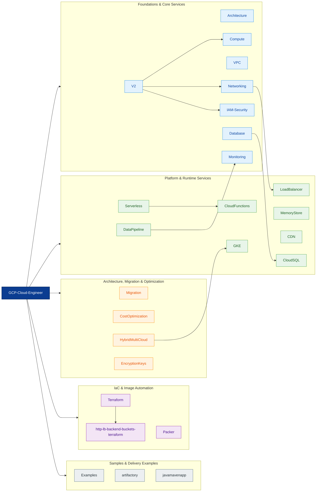
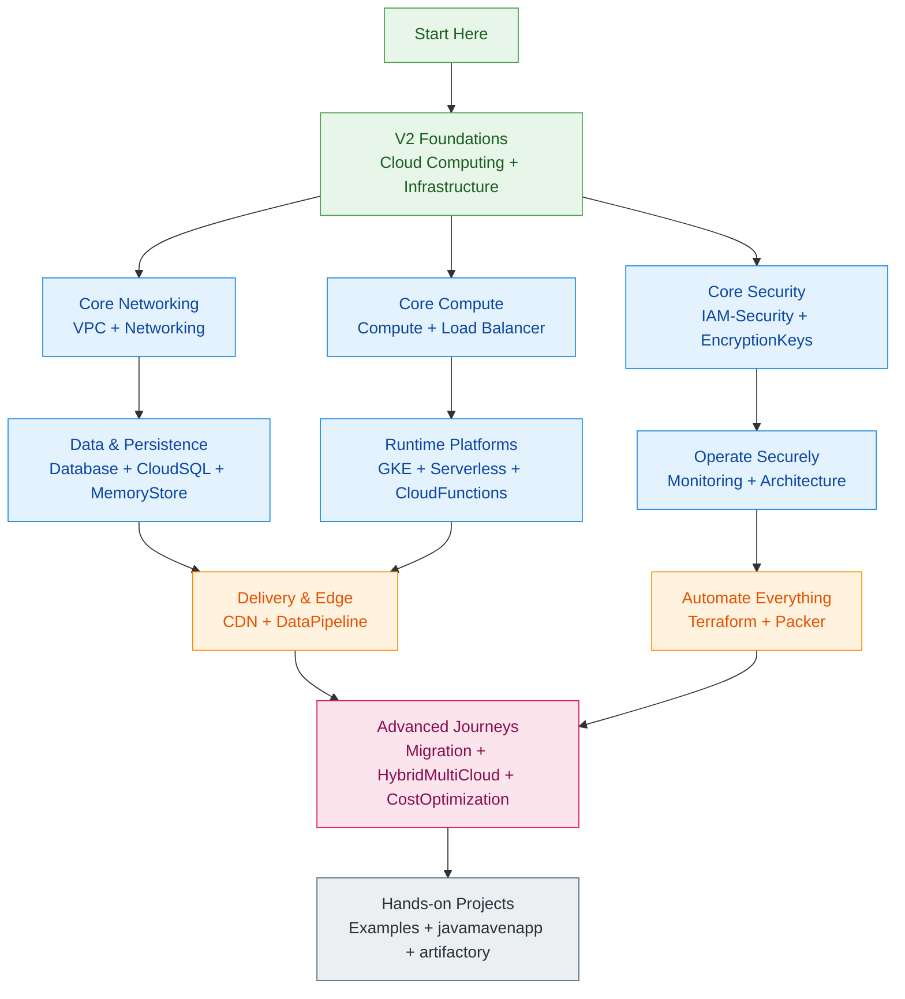

<div align="center">
<pre>
┌──────────────────────────────────────────────────────────────────────────────┐
│                                                                              │
│    ____   ____ ____          ____ _                 _                        │
│   / ___| / ___|  _ \        / ___| | ___  _   _  __| |                       │
│  | |  _ | |   | |_) |_____ | |   | |/ _ \| | | |/ _` |                       │
│  | |_| || |___|  __/|_____|| |___| | (_) | |_| | (_| |                       │
│   \____| \____|_|            \____|_|\___/ \__,_|\__,_|                       │
│                                                                              │
├──────────────────────────────────────────────────────────────────────────────┤
│  Workspace : GCP-Cloud-Engineer        Track   : Basic → Advanced            │
│  Provider  : Google Cloud Platform     Scope   : Compute, VPC, SQL, GKE...   │
│                                                                              │
│  admin@gcp-cloud:~$ gcloud config list                                       │
│  Welcome to the GCP Cloud Engineer Guide!                                    │
└──────────────────────────────────────────────────────────────────────────────┘
</pre>
</div>

# Google Cloud Platform — Reference & Lab Notes

A curated collection of GCP command references, scripts, and step-by-step lab guides covering core GCP services. Organized by topic — use this as a quick reference while working on GCP projects.

---

## 📊 Content Stats

| Metric | Value |
|--------|------:|
| Top-level modules | 26 |
| Topic directories with README guides | 23 |
| Workflow diagrams added in this refresh | 19 |
| Top-level reference files | 8 |
| Structured `V2/` learning tracks | 12+ |
| Coverage level | Basic to Advanced |

---

## 🗺️ Animated Module Map



---

## 📁 Enhanced Directory Structure

| Domain | Directory | Description |
|--------|-----------|-------------|
| Core learning track | [`V2/`](./V2/) | **Latest & recommended** — structured guides for GCE, VPC, IAM, GCS, Cloud SQL, firewalls, instance groups, instance templates, and infrastructure fundamentals |
| Visual reference | [`Architecture/`](./Architecture/) | 🔷 **Visual diagrams** — Mermaid flow diagrams for major GCP services, migration paths, networking, storage, IAM, and architecture decisions |
| Edge delivery | [`CDN/`](./CDN/) | Cloud CDN setup scripts, HTTP load balancer integration, cache testing, and performance validation steps |
| Serverless compute | [`CloudFunctions/`](./CloudFunctions/) | Cloud Functions (Gen2) — HTTP, Pub/Sub, and GCS-triggered patterns with Python, Node.js, and Go |
| Relational databases | [`CloudSQL/`](./CloudSQL/) | Cloud SQL — MySQL/PostgreSQL/SQL Server with HA, replicas, backups, private connectivity, and connection methods |
| Virtual machines | [`Compute/`](./Compute/) | Persistent disk operations for Compute Engine: create, attach, resize, format, mount, and lifecycle reference |
| Security keys | [`EncryptionKeys/`](./EncryptionKeys/) | CSEK (Customer-Supplied Encryption Key) examples and Cloud Storage encryption references |
| App samples | [`Examples/`](./Examples/) | Sample applications and runnable examples, including Node.js hello-world references |
| Containers & Kubernetes | [`GKE/`](./GKE/) | Google Kubernetes Engine — cluster architecture, node pools, deployments, autoscaling, networking, and operations |
| Traffic distribution | [`LoadBalancer/`](./LoadBalancer/) | Network LB and HTTP(S) LB setup scripts, startup assets, and multi-version load-balancing examples |
| In-memory caching | [`MemoryStore/`](./MemoryStore/) | Redis on GCP (Memorystore) setup guide, CLI references, and quick-start cache workflows |
| Migration | [`Migration/`](./Migration/) | 🔷 **Cloud Migration** — On-Prem, AWS, and Azure to GCP migration guides with phased commands and cutover workflows |
| Image automation | [`Packer/`](./Packer/) | Packer templates and notes for building custom GCP machine images |
| Infrastructure as Code | [`Terraform/`](./Terraform/) | Terraform examples for VPCs, subnets, firewall rules, and foundational GCP network provisioning |
| Network foundations | [`VPC/`](./VPC/) | VPC, subnets, firewall rules, NAT, VPC peering, and Shared VPC scripts |
| Network deep dive | [`Networking/`](./Networking/) | 🔷 **GCP Networking** — VPC, Firewall, Cloud NAT, Router, Interconnect, VPN, Shared VPC, and DNS design notes |
| Identity & guardrails | [`IAM-Security/`](./IAM-Security/) | 🔷 **IAM & Security** — resource hierarchy, roles, service accounts, KMS, Secret Manager, SCC, and VPC Service Controls |
| Observability | [`Monitoring/`](./Monitoring/) | 🔷 **Monitoring & Observability** — Cloud Monitoring, Logging, Trace, Error Reporting, Alerting, Dashboards, and SLOs |
| Data engineering | [`DataPipeline/`](./DataPipeline/) | 🔷 **Data Pipelines** — Dataflow, Pub/Sub, BigQuery, Cloud Composer, Dataproc, and batch vs. streaming patterns |
| Cost governance | [`CostOptimization/`](./CostOptimization/) | 🔷 **Cost Optimization** — CUDs, SUDs, Spot VMs, right-sizing, billing exports, FinOps controls, and spend governance |
| Hybrid platform | [`HybridMultiCloud/`](./HybridMultiCloud/) | 🔷 **Hybrid & Multi-Cloud** — Anthos, GKE on-prem, Service Mesh, Config Management, distributed operations, and fleet management |
| Serverless patterns | [`Serverless/`](./Serverless/) | 🔷 **Serverless Patterns** — Cloud Run vs Functions vs App Engine, Eventarc, Workflows, API Gateway, and integration patterns |
| Database decisioning | [`Database/`](./Database/) | 🔷 **Database Services** — Cloud SQL, AlloyDB, Spanner, Firestore, Bigtable, Memorystore, DMS, and service selection guidance |
| Deployment example | [`artifactory/`](./artifactory/) | Java Hello World application with Docker + Kubernetes deployment guide |
| Terraform LB examples | [`http-lb-backend-buckets-terraform/`](./http-lb-backend-buckets-terraform/) | HTTP load balancer with backend buckets — Terraform examples for MIG + NAT and multi-MIG layouts |
| CI/CD app example | [`javamavenapp/`](./javamavenapp/) | Java Maven application with Cloud Build CI/CD pipeline examples |

---

## 📖 Top-Level Reference Files

| File | Description |
|------|-------------|
| [`GCS.md`](./GCS.md) | `gsutil` command reference for Cloud Storage buckets |
| [`allCommands.md`](./allCommands.md) | Quick-reference `gcloud` commands across IAM, VPC, GCE, GCS, Cloud SQL, App Engine, and Cloud Run |
| [`cloudrun.md`](./cloudrun.md) | Cloud Run deployment and traffic management |
| [`cloud_spanner.md`](./cloud_spanner.md) | Cloud Spanner instance, database, and table operations |
| [`database_migration.md`](./database_migration.md) | Step-by-step GCP Database Migration Service (DMS) lab guide |
| [`gcloud_commands.sh`](./gcloud_commands.sh) | General `gcloud` configuration and common commands |
| [`vpn_2_accounts_infra.md`](./vpn_2_accounts_infra.md) | Cloud VPN between two GCP accounts |
| [`vpn_dynamic_ha.md`](./vpn_dynamic_ha.md) | HA VPN (dynamic routing with BGP) setup |

---

## 🧭 Learning Path Diagram



---

## 🔗 Quick Links

| Resource | Link |
|----------|------|
| GCP Console | [console.cloud.google.com](https://console.cloud.google.com/) |
| Google Cloud SDK install | [cloud.google.com/sdk/docs/install](https://cloud.google.com/sdk/docs/install) |
| `gcloud` CLI reference | [cloud.google.com/sdk/gcloud/reference](https://cloud.google.com/sdk/gcloud/reference) |
| Pricing Calculator | [cloud.google.com/products/calculator](https://cloud.google.com/products/calculator) |
| Google Cloud Status | [status.cloud.google.com](https://status.cloud.google.com/) |
| Architecture Center | [cloud.google.com/architecture](https://cloud.google.com/architecture) |
| Well-Architected Framework | [cloud.google.com/architecture/framework](https://cloud.google.com/architecture/framework) |
| Cloud Skills Boost | [cloudskillsboost.google](https://www.cloudskillsboost.google/) |
| IAM overview | [cloud.google.com/iam/docs/overview](https://cloud.google.com/iam/docs/overview) |
| Cloud Monitoring docs | [cloud.google.com/monitoring/docs](https://cloud.google.com/monitoring/docs) |

---

## 🚀 Quick Start

### Prerequisites

- [Google Cloud SDK](https://cloud.google.com/sdk/docs/install) installed and authenticated
- A GCP project set as the active project:
  ```bash
  gcloud auth login
  gcloud config set project YOUR_PROJECT_ID
  ```

### Recommended Reading Order

1. Start with [`V2/1-CloudComputing/cloud-computing.md`](./V2/1-CloudComputing/cloud-computing.md) for fundamentals
2. Follow [`V2/2-Infrastructure/infra.md`](./V2/2-Infrastructure/infra.md) for infrastructure overview
3. Explore [`V2/Google_Compute_Engine/`](./V2/Google_Compute_Engine/) for hands-on VM management
4. Use the topic directories (CDN, VPC, Terraform, etc.) for specific service guides

---

## 🏷️ Topics Covered

`Compute Engine` · `VPC` · `Firewall` · `IAM` · `GCS` · `Cloud SQL` · `Cloud Run` · `Cloud Spanner` · `Cloud CDN` · `Cloud Functions` · `GKE (Kubernetes)` · `MemoryStore (Redis)` · `Terraform` · `Packer` · `VPN` · `Load Balancing` · `Instance Groups` · `Database Migration Service` · `Networking` · `Security & KMS` · `Monitoring & Logging` · `Dataflow & Pub/Sub` · `BigQuery` · `Cost Optimization` · `Anthos & Hybrid Cloud` · `Serverless Workflows` · `Data Pipelines`

---

## 🔷 Visual Diagrams

This repo includes **Mermaid flow diagrams** that render directly on GitHub — no images needed. See [`Architecture/`](./Architecture/) for:

- GCP global infrastructure (regions, zones, submarine cables, edge network)
- VM lifecycle state diagram
- VPC network architecture with NAT
- HTTP(S) Load Balancer request flow
- GCS storage class lifecycle
- GKE cluster architecture
- Cloud Run auto-scaling sequence
- Cloud SQL HA failover flow
- IAM resource hierarchy
- Database Migration Service flow
- HA VPN between two projects
- GCP services decision tree
- **On-Premises → GCP migration** (VM, DB, data transfer flows)
- **AWS → GCP migration** (EC2, RDS, S3, EKS migration paths)
- **Azure → GCP migration** (VMs, Azure SQL, Blob, AKS migration paths)

### Deep-Dive Guides (with Mermaid diagrams)

- [`Networking/`](./Networking/) — VPC architecture, firewall rules, Cloud NAT, Router, Interconnect, HA VPN, Shared VPC, DNS
- [`IAM-Security/`](./IAM-Security/) — IAM hierarchy, roles & policies, service accounts, Cloud KMS, Secret Manager, VPC Service Controls
- [`Monitoring/`](./Monitoring/) — Cloud Monitoring, Logging, Trace, Error Reporting, alerting policies, SLOs/SLIs, dashboards
- [`DataPipeline/`](./DataPipeline/) — Dataflow, Pub/Sub, BigQuery, Cloud Composer, batch vs streaming, data lake architecture
- [`CostOptimization/`](./CostOptimization/) — CUDs, SUDs, Spot VMs, right-sizing, billing alerts, BigQuery cost control, FinOps
- [`HybridMultiCloud/`](./HybridMultiCloud/) — Anthos, GKE on-prem, Config Management, Service Mesh, fleet management, Distributed Cloud
- [`Serverless/`](./Serverless/) — Cloud Run vs Functions vs App Engine, Eventarc, Workflows, API Gateway, serverless patterns

---

## 📝 Notes

- Scripts in this repo use placeholder values like `YOUR_PROJECT_ID` and `<SVC_ACCOUNT_MAIL_ID>` — replace them with your actual values before running.
- The `V2/` directory contains the most up-to-date and well-documented guides.
- Scripts are for **learning and reference** purposes — review before running in production.
