# GCP Serverless Architecture Patterns

> Comprehensive reference for designing, deploying, and operating serverless workloads on Google Cloud Platform (GCP).
<!-- workflow-diagram:start -->
## Serverless Architecture Workflow
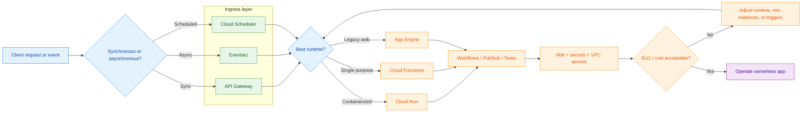
<!-- workflow-diagram:end -->


---

## Table of Contents

1. [Overview](#overview)
2. [Decision Tree: Which Serverless Platform?](#decision-tree-which-serverless-platform)
3. [Cloud Run vs Cloud Functions vs App Engine](#cloud-run-vs-cloud-functions-vs-app-engine)
4. [Event-Driven Architecture](#event-driven-architecture)
5. [Cloud Run Deep Dive](#cloud-run-deep-dive)
6. [Cloud Functions Gen2](#cloud-functions-gen2)
7. [App Engine Standard vs Flexible](#app-engine-standard-vs-flexible)
8. [Serverless Workflows](#serverless-workflows)
9. [API Gateway](#api-gateway)
10. [Serverless VPC Access](#serverless-vpc-access)
11. [Event-Driven Patterns](#event-driven-patterns)
12. [Security, Observability, and Operations](#security-observability-and-operations)
13. [Reference Deployment Commands](#reference-deployment-commands)
14. [Anti-Patterns Summary](#anti-patterns-summary)
15. [Architecture Review Checklist](#architecture-review-checklist)

---

## Overview

Google Cloud serverless services let you build APIs, event processors, schedulers, and orchestration layers without managing servers directly. The main serverless compute choices are:

- **Cloud Run** for containerized services and jobs
- **Cloud Functions Gen2** for function-first event and HTTP handlers
- **App Engine** for application hosting with platform-managed deployment patterns
- **Workflows** for orchestration
- **Eventarc**, **Pub/Sub**, **Cloud Tasks**, and **Cloud Scheduler** for events and asynchronous delivery
- **API Gateway** for front-door API management
- **Serverless VPC Access** for reaching private resources in VPC networks

### Core design principles

- Prefer loosely coupled services with explicit contracts
- Use asynchronous messaging for burst absorption and resilience
- Keep request handlers stateless
- Store durable state in managed services such as Firestore, Cloud SQL, BigQuery, Memorystore, or Spanner as appropriate
- Push long-running or retry-heavy work to background systems
- Design for idempotency because retries are normal in distributed systems

### Serverless spectrum on GCP

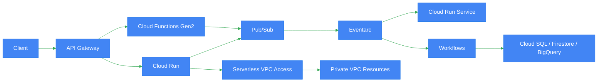

---

## Decision Tree: Which Serverless Platform?

Use this quick decision tree first, then read the deeper sections.

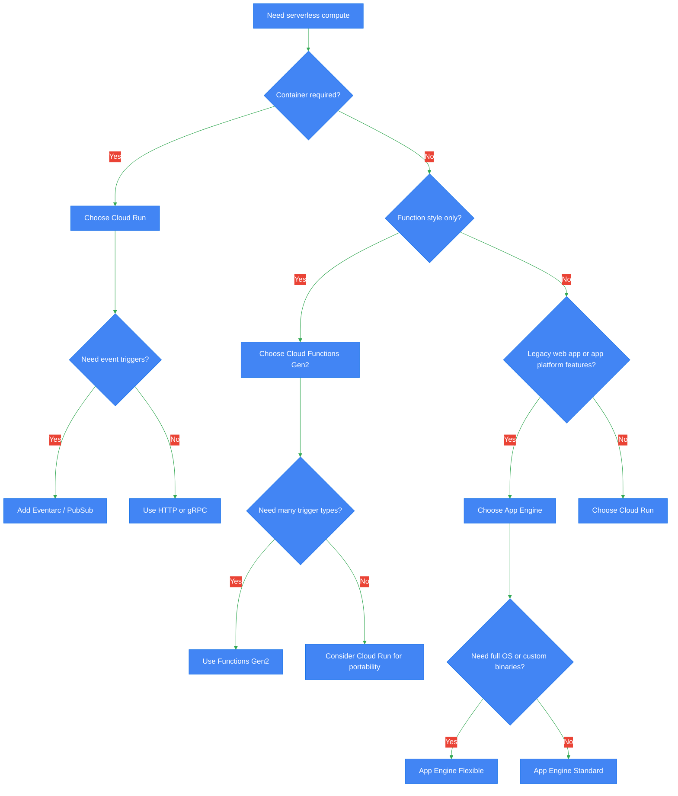

### Fast selection guidance

| Requirement | Best fit | Why |
|---|---|---|
| Bring your own container | Cloud Run | Full container portability |
| Event handler with minimal boilerplate | Cloud Functions Gen2 | Function-first deployment experience |
| Existing App Engine app or split services/versioning model | App Engine | Native app platform patterns |
| gRPC server | Cloud Run | Best support for HTTP/2 and containerized servers |
| Custom runtime dependencies | Cloud Run or App Engine Flexible | More runtime flexibility |
| Fast web app with managed platform | App Engine Standard | Simpler for supported runtimes |
| Event routing across many sources | Cloud Run + Eventarc | Flexible eventing model |

---

## Cloud Run vs Cloud Functions vs App Engine

### Detailed comparison

| Dimension | Cloud Run | Cloud Functions Gen2 | App Engine Standard | App Engine Flexible |
|---|---|---|---|---|
| Primary model | Containerized service or job | Function-first, built on Cloud Run | PaaS app service | PaaS on VMs/containers |
| Packaging | OCI container image | Source/function entry point | Source deployment | Source or container-like flexible runtime |
| Runtime flexibility | Very high | Moderate | Limited to supported runtimes | High |
| Language/runtime support | Any runtime in container | Supported runtimes/functions frameworks | Supported standard runtimes | Custom runtimes supported |
| Startup behavior | Container cold start | Function cold start on Cloud Run | Fast for standard runtimes | Slower than standard |
| Scaling to zero | Yes | Yes | Yes for some services/configurations | Typically not as cost-efficient as pure serverless |
| Concurrency | Configurable up to high concurrency | Supported in Gen2 | Instance-based, platform managed | Instance-based |
| Request timeout | Up to 60 minutes for services | Longer than Gen1; backed by Cloud Run | Limited by platform/app type | Longer-running app patterns possible |
| Protocols | HTTP/1, HTTP/2, gRPC, Webhooks | HTTP and event triggers | Primarily HTTP web apps/services | HTTP app hosting |
| Traffic splitting | Yes, by revision | Via underlying Cloud Run mechanics not primary UX | Yes, by version | Yes, by version |
| Revisions/versions | Revisions | Revisions under the hood | Versions | Versions |
| Min instances | Yes | Yes in Gen2-related config | Configurable scaling | Configurable scaling |
| VPC connectivity | Serverless VPC Access / direct integrations | Serverless VPC Access | Supported via App Engine networking model | VPC capable |
| Best for | APIs, microservices, event consumers | Event handlers, lightweight APIs | Traditional web apps | Custom app stacks needing platform deployment |
| Pricing basis | CPU, memory, requests, instance time | Invocations plus underlying resource usage | Instance class usage | VM/resource usage |
| Portability | High | Moderate | Lower | Lower than Cloud Run |
| Ops overhead | Low | Low | Low-medium | Medium |

### Focused comparison: Cloud Run vs Cloud Functions vs App Engine

| Topic | Cloud Run | Cloud Functions Gen2 | App Engine |
|---|---|---|---|
| Best abstraction | Service | Function | Application platform |
| Deployment unit | Container image | Function source | App/service version |
| Event-native | Strong with Eventarc | Native trigger model | Less event-centric |
| Multi-endpoint APIs | Excellent | Possible but less natural | Good for web apps |
| Background workers | Excellent | Good | Possible |
| Stateful app suitability | Low | Low | Moderate if app platform style |
| Local container parity | High | Medium | Lower |
| Vendor portability | Highest among these | Moderate | Lowest |

### Runtime, scaling, pricing, cold starts, concurrency, timeout

| Attribute | Cloud Run | Cloud Functions Gen2 | App Engine Standard | App Engine Flexible |
|---|---|---|---|---|
| Runtime | Any container runtime | Supported languages with Functions Framework | Predefined standard runtimes | Flexible/custom runtime |
| Scaling | Automatic, request-driven, min/max controls | Automatic, event/request-driven | Automatic/manual/basic options | Automatic/manual |
| Pricing | Per request, CPU, memory, networking | Per invocation and consumed resources | Instance-hours and quotas | VM-like resource billing |
| Cold starts | Possible; mitigated with min instances | Possible; mitigated with min instances | Usually lower for warm app instances | Can be higher |
| Concurrency | User-configurable | Supported in Gen2 | Per instance app concurrency model | Per instance app concurrency model |
| Request timeout | Up to 60m for service request | Depends on trigger/type, Gen2 improved | Platform-specific | Platform-specific |

### When to choose each

#### Choose Cloud Run when

- You want full control over container packaging
- You need multiple routes/endpoints in one service
- You need gRPC, HTTP/2, or custom runtime libraries
- You want the most future-proof option for serverless on GCP
- You need revision-based rollout and traffic splitting

#### Choose Cloud Functions Gen2 when

- You want a function-centric developer experience
- You are primarily responding to events like Pub/Sub or Cloud Storage
- You want less container concern and faster onboarding
- Your logic fits a clear single-purpose handler model

#### Choose App Engine when

- You already have an App Engine workload
- You want classic application versioning and service splitting
- You prefer app platform abstractions over containers
- You are using Standard runtimes and want simplified deployment

### Decision anti-patterns

- Using Cloud Functions for a large multi-route API that really wants a containerized web framework
- Using App Engine Flexible for workloads better served by Cloud Run unless you specifically need App Engine behaviors
- Packing unrelated business domains into one Cloud Run service just because it can host many endpoints
- Treating cold starts as the only architecture driver instead of measuring latency budgets

### Reference commands

```bash
gcloud run deploy orders-api \
  --image us-central1-docker.pkg.dev/PROJECT_ID/serverless/orders:1.0 \
  --region us-central1 \
  --allow-unauthenticated

gcloud functions deploy processOrder \
  --gen2 \
  --region us-central1 \
  --runtime python311 \
  --trigger-topic orders-topic \
  --entry-point process_order

gcloud app deploy app.yaml
```

---

## Event-Driven Architecture

Event-driven architecture on GCP typically combines **Pub/Sub**, **Eventarc**, **Cloud Tasks**, and **Cloud Scheduler**.

### Service roles

| Service | Main role | Delivery style | Best use |
|---|---|---|---|
| Eventarc | Event routing from Google sources and custom events | Push to destinations | Unified event trigger fabric |
| Pub/Sub | Durable asynchronous messaging | Push or pull | Decoupling, buffering, fan-out |
| Cloud Tasks | Managed task queue with per-task delivery control | HTTP push | Controlled retries and rate limiting |
| Cloud Scheduler | Cron-based triggering | HTTP/Pub/Sub/App Engine | Time-based invocation |

### Event flow architecture

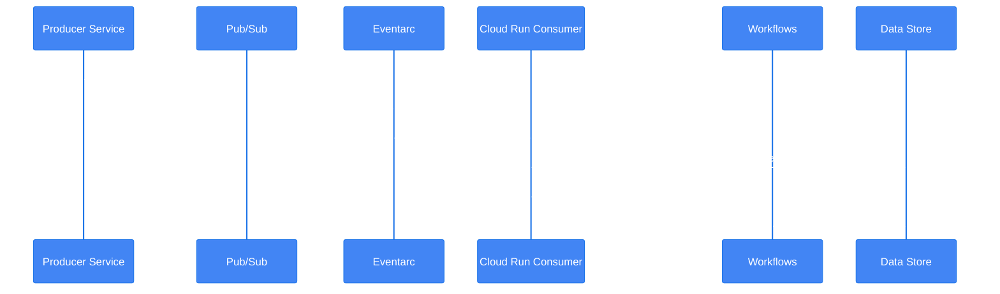

### Eventarc triggers

Eventarc can route events from Google Cloud sources such as:

- Cloud Storage object changes
- Audit log events
- Pub/Sub messages
- Firestore changes through supported integrations
- Custom events using CloudEvents conventions

### Eventarc benefits

- Standardized CloudEvents envelope
- Filter-based routing
- Destination flexibility such as Cloud Run and Workflows
- Centralized event topology for multiple producers

### Pub/Sub integration patterns

| Pattern | Description | Benefit | Watch-outs |
|---|---|---|---|
| Topic per domain event | Separate topic for major event family | Clear ownership | Topic sprawl |
| Shared topic with attributes | One topic plus event type attributes | Lower admin overhead | Consumer filtering complexity |
| Dead-letter topic | Failed messages routed after max attempts | Protects pipelines | Must monitor DLQ |
| Ordered keys | Preserve ordering for same entity | Important for ledger-like flows | Limits throughput per key |

### Cloud Tasks usage

Use Cloud Tasks when you need:

- Explicit retry control per task
- Rate limiting to protect downstream APIs
- Scheduled execution at task level
- Stronger operational model for work queues than raw Pub/Sub push

### Cloud Scheduler usage

Use Cloud Scheduler when you need:

- Cron-like triggers for jobs or endpoints
- Periodic workflow executions
- Daily reconciliations and cleanup functions
- Time-driven publishing into Pub/Sub or HTTP targets

### Sequence: scheduled processing

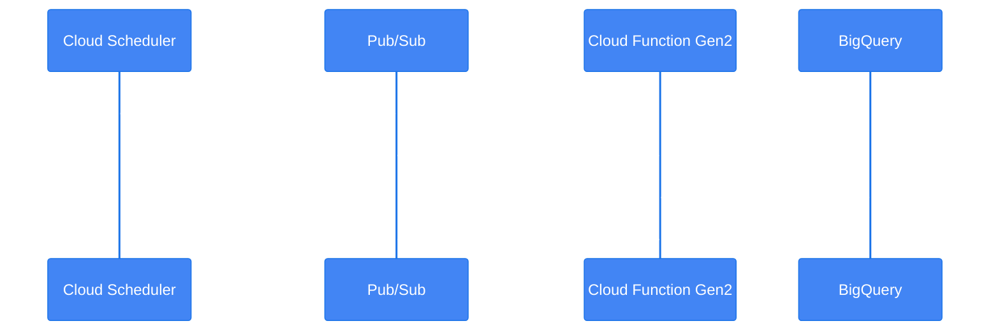

### Best practices

- Use event names that reflect business facts, not implementation steps
- Include event versioning in type or schema metadata
- Keep payloads compact and reference large objects externally when needed
- Enforce idempotency with event IDs or business keys
- Use dead-lettering and replay strategies
- Separate command messages from domain events

### Anti-patterns

- Using Pub/Sub as a database or audit record without durable storage elsewhere
- Creating synchronous chains disguised as asynchronous workflows
- Overloading one topic with unrelated schemas and no version strategy
- Ignoring duplicate delivery behavior

### Reference commands

```bash
gcloud pubsub topics create orders-topic

gcloud pubsub subscriptions create orders-sub \
  --topic orders-topic

gcloud eventarc triggers create orders-created-trigger \
  --location us-central1 \
  --destination-run-service orders-consumer \
  --destination-run-region us-central1 \
  --transport-topic projects/PROJECT_ID/topics/orders-topic \
  --event-filters="type=google.cloud.pubsub.topic.v1.messagePublished"

gcloud tasks queues create order-tasks --location us-central1

gcloud scheduler jobs create pubsub nightly-reconcile \
  --location us-central1 \
  --schedule="0 2 * * *" \
  --topic orders-topic \
  --message-body='{"job":"nightly-reconcile"}'
```

---

## Cloud Run Deep Dive

Cloud Run is the most flexible GCP serverless compute option for containerized apps.

### Core concepts

- **Service**: Long-lived HTTP/gRPC endpoint
- **Revision**: Immutable deployment snapshot
- **Traffic splitting**: Route percentages across revisions
- **Min instances**: Keep warm capacity to reduce cold starts
- **Max instances**: Cap scale-out to protect downstreams
- **Jobs**: Run-to-completion workloads

### Cloud Run lifecycle

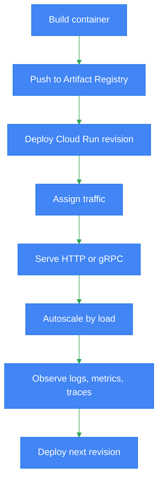

### Revisions

Each deployment creates an immutable revision. Revisions are useful for:

- Safe rollbacks
- Controlled release management
- Side-by-side validation
- Traffic canaries

### Traffic splitting

Cloud Run supports percentage-based traffic routing across revisions.

| Rollout strategy | How it works | Good for |
|---|---|---|
| 100% latest | All traffic to newest revision | Low-risk changes |
| 95/5 canary | Small share to new revision | Production validation |
| 50/50 comparison | Half to each revision | Behavioral comparison |
| Rollback to prior | Shift traffic back | Incident response |

### Min instances

Min instances reduce cold starts by keeping instances warm.

Use when:

- P99 latency is sensitive
- Traffic is sporadic but latency-critical
- Startup is expensive due to heavy frameworks or connection setup

Avoid overusing when:

- Cost sensitivity is higher than latency needs
- Service is rarely invoked and non-interactive

### Concurrency

Cloud Run supports configurable concurrency per instance.

| Concurrency choice | Effect | Good for |
|---|---|---|
| 1 | Isolation and simpler reasoning | CPU-heavy or non-thread-safe apps |
| 10-50 | Balanced throughput | Typical APIs |
| 80+ | Maximize cost efficiency | Lightweight I/O-heavy workloads |

### Request timeout

Cloud Run request processing can support long-running requests relative to typical serverless systems, but interactive request handling should still be bounded by user expectations.

### VPC connectors

Serverless VPC Access connectors enable Cloud Run to reach private IP resources.

Common targets:

- Private Cloud SQL IP
- Memorystore
- Internal HTTP services
- On-prem connectivity via VPN or Interconnect through VPC

### Cloud SQL connections

Cloud Run supports Cloud SQL connectivity using:

- Cloud SQL Auth Proxy integration style through platform mounting/configuration
- Private IP via VPC connectivity
- IAM database authentication where supported

### gRPC support

Cloud Run is a strong fit for gRPC because it supports HTTP/2 and containerized servers.

Use cases:

- Internal service-to-service APIs
- Strong schema contracts with protobuf
- Bidirectional and streaming patterns where architecture permits

### Example architecture

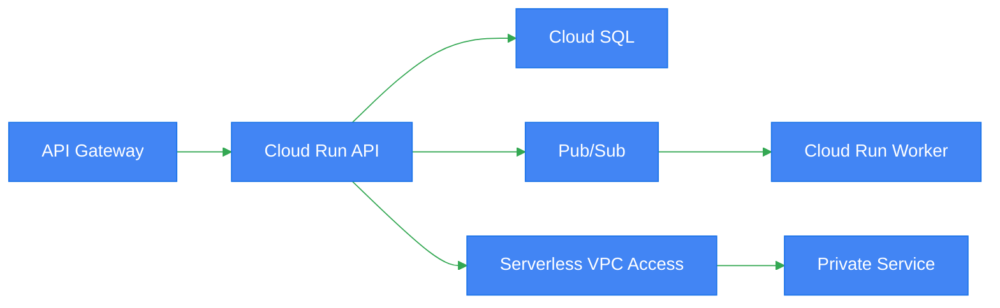

### Best practices

- Build minimal images and start quickly
- Externalize configuration with env vars and Secret Manager
- Tune concurrency based on CPU and thread model
- Use min instances only for latency-sensitive services
- Use revision tags and traffic splitting for safe rollouts
- Emit structured logs and traces
- Reuse connections carefully but initialize lazily

### Anti-patterns

- One giant “serverless monolith” service for all business capabilities
- Setting concurrency too high for CPU-bound code
- Holding in-memory state expecting sticky sessions
- Connecting directly to private systems without planning connector throughput and egress path
- Treating revisions as environments instead of immutable deploy artifacts

### Reference commands

```bash
gcloud run deploy payments-api \
  --image us-central1-docker.pkg.dev/PROJECT_ID/serverless/payments:2.1 \
  --region us-central1 \
  --concurrency 40 \
  --min-instances 1 \
  --max-instances 50 \
  --set-env-vars ENV=prod \
  --allow-unauthenticated

gcloud run services update-traffic payments-api \
  --region us-central1 \
  --to-revisions payments-api-00012-abc=95,payments-api-00013-def=5

gcloud run services update payments-api \
  --region us-central1 \
  --vpc-connector projects/PROJECT_ID/locations/us-central1/connectors/serverless-conn \
  --vpc-egress private-ranges-only

gcloud run services update payments-api \
  --region us-central1 \
  --add-cloudsql-instances PROJECT_ID:us-central1:orders-sql
```

### Sample deployment YAML

```yaml
apiVersion: serving.knative.dev/v1
kind: Service
metadata:
  name: payments-api
spec:
  template:
    metadata:
      annotations:
        autoscaling.knative.dev/minScale: "1"
        run.googleapis.com/vpc-access-connector: serverless-conn
        run.googleapis.com/cloudsql-instances: PROJECT_ID:us-central1:orders-sql
    spec:
      containerConcurrency: 40
      timeoutSeconds: 900
      containers:
        - image: us-central1-docker.pkg.dev/PROJECT_ID/serverless/payments:2.1
          ports:
            - containerPort: 8080
          env:
            - name: ENV
              value: prod
```

---

## Cloud Functions Gen2

Cloud Functions Gen2 uses Cloud Run under the hood while preserving a function-centric model.

### Why Gen2 matters

- Better scaling model than Gen1
- Improved concurrency support
- Broader eventing through Eventarc-aligned ecosystem
- Stronger parity with Cloud Run operational behavior

### Supported trigger families

| Trigger type | Typical use case |
|---|---|
| HTTP | Lightweight APIs, webhooks |
| Pub/Sub | Asynchronous message processing |
| Cloud Storage | File ingestion and object lifecycle handlers |
| Firestore | Document create/update/delete reactions |
| Eventarc-supported triggers | Broader cloud event integrations |

### Trigger sequence

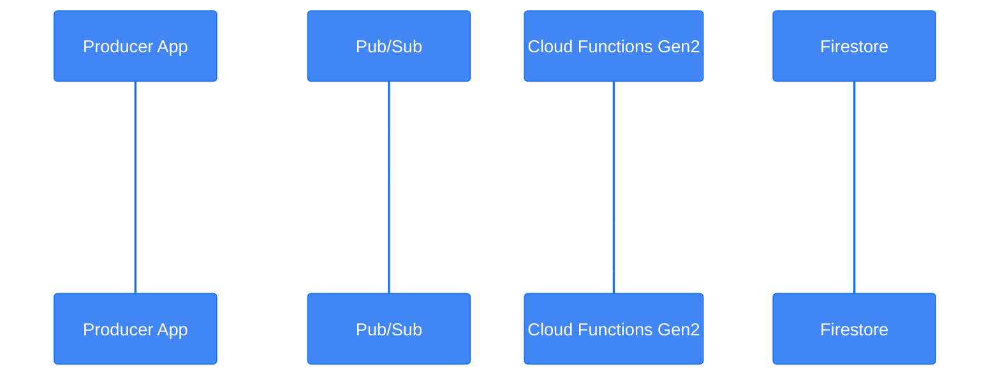

### Concurrency in Gen2

Unlike Gen1's more restrictive model, Gen2 supports concurrency aligned with Cloud Run concepts. This can improve throughput and cost efficiency for I/O-bound functions.

Use lower concurrency when:

- Your function is CPU-heavy
- Libraries are not thread-safe
- You rely on global state that is not safely shared

Use higher concurrency when:

- Work is lightweight and network-bound
- Handlers are stateless
- Downstream systems can tolerate parallel load

### Function structure example

```python
import functions_framework
from cloudevents.http import CloudEvent

@functions_framework.cloud_event
def process_order(event: CloudEvent):
    data = event.data
    order_id = data.get("message", {}).get("attributes", {}).get("orderId")
    print({"orderId": order_id, "status": "received"})
```

### HTTP function example

```python
import functions_framework

@functions_framework.http
def health(request):
    return {"status": "ok"}, 200
```

### Best practices

- Keep functions small and single-purpose
- Share libraries through common packages, not copy-paste
- Validate trigger payloads defensively
- Use idempotency keys for at-least-once delivery
- Avoid expensive global initialization unless reused effectively
- Route complex multi-step business flows to Workflows or Pub/Sub choreography

### Anti-patterns

- Building a large multi-route monolith out of many function entry points in one deployment without clear boundaries
- Doing long synchronous work inside user-facing HTTP functions when background processing is better
- Relying on exactly-once semantics without compensating logic
- Ignoring concurrency tuning in Gen2

### Reference commands

```bash
gcloud functions deploy fileIngest \
  --gen2 \
  --region us-central1 \
  --runtime nodejs20 \
  --entry-point fileIngest \
  --trigger-bucket my-ingest-bucket

gcloud functions deploy signupHandler \
  --gen2 \
  --region us-central1 \
  --runtime python311 \
  --entry-point signup_handler \
  --trigger-topic user-signups \
  --set-env-vars ENV=prod

gcloud functions deploy httpStatus \
  --gen2 \
  --region us-central1 \
  --runtime python311 \
  --entry-point health \
  --trigger-http \
  --allow-unauthenticated
```

---

## App Engine Standard vs Flexible

App Engine remains useful for platform-managed application hosting.

### Comparison table

| Dimension | App Engine Standard | App Engine Flexible |
|---|---|---|
| Runtime model | Supported standard runtimes | Customizable/flexible runtime |
| Startup time | Faster | Slower |
| Scaling | Automatic/basic/manual options | Automatic/manual |
| Underlying compute | Highly managed sandboxed model | VM-based flexible environment |
| Custom OS dependencies | Limited | Supported |
| Pricing model | Instance class/platform model | VM/resource-based |
| Best fit | Traditional web apps, APIs on supported runtimes | Apps needing custom dependencies |
| Traffic splitting | Yes | Yes |
| Deployment unit | Versioned service deployment | Versioned service deployment |

### App Engine architecture view

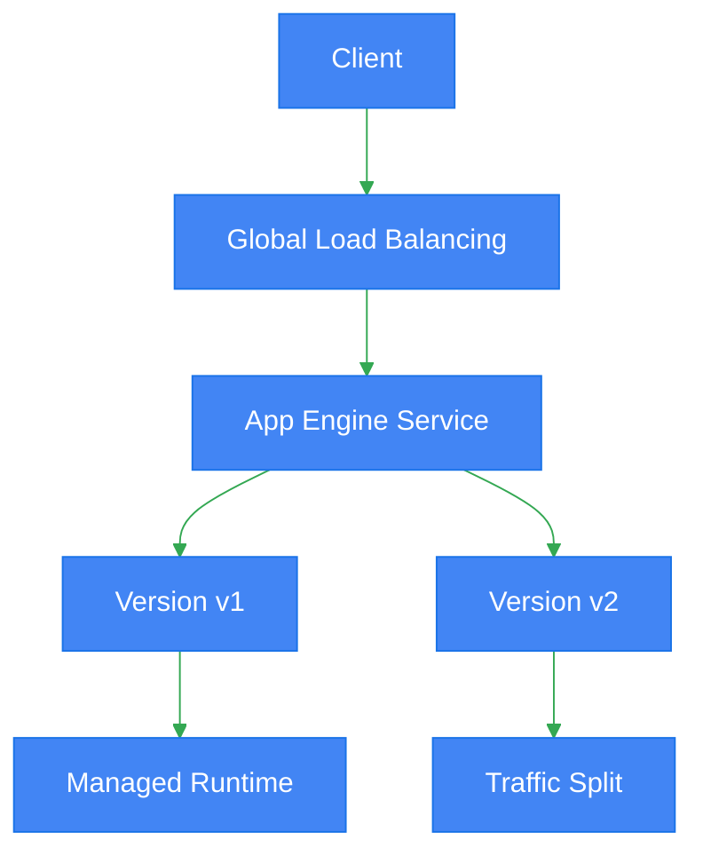

### Runtimes

App Engine Standard supports a curated set of runtimes. App Engine Flexible supports custom runtimes and more OS-level customization.

### Scaling modes

| Mode | Standard | Flexible | Notes |
|---|---|---|---|
| Automatic | Yes | Yes | Best default for variable traffic |
| Basic | Yes | No | Good for cost-aware non-continuous traffic |
| Manual | Yes | Yes | Predictable capacity |

### Deployment and traffic splitting

App Engine versioning is a major strength for staged releases.

- Deploy a new version
- Test with a version-specific URL if needed
- Split traffic gradually
- Roll back quickly if necessary

### Best practices

- Use Standard when supported runtimes satisfy the workload
- Keep services separated by domain or scaling pattern
- Use traffic splitting for canary releases
- Externalize state and session data
- Monitor version sprawl and clean up old versions

### Anti-patterns

- Using Flexible solely because it feels more powerful when Cloud Run would be simpler and cheaper
- Treating App Engine Standard as a place for heavy background compute
- Leaving many old versions deployed with no governance

### Reference commands

```bash
gcloud app deploy app.yaml service-orders.yaml

gcloud app services set-traffic default \
  --splits v1=0.9,v2=0.1

gcloud app versions list
```

### Example app.yaml

```yaml
runtime: python311
entrypoint: gunicorn -b :$PORT main:app

handlers:
  - url: /.*
    script: auto

automatic_scaling:
  min_instances: 1
  max_instances: 10
```

---

## Serverless Workflows

Google Cloud Workflows orchestrates services using declarative steps defined in YAML or JSON.

### When to use Workflows

- Multi-step orchestration across HTTP services and Google APIs
- Approval or compensation flows
- Long-running coordination without embedding orchestration logic into app code
- Human-readable execution logic for platform teams and architects

### Workflows architecture

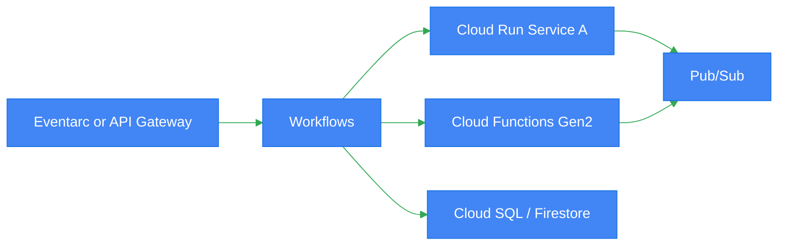

### YAML example

```yaml
main:
  params: [input]
  steps:
    - init:
        assign:
          - orderId: ${input.orderId}
          - baseUrl: https://orders-api-xyz.a.run.app
    - reserveInventory:
        call: http.post
        args:
          url: ${baseUrl + "/inventory/reserve"}
          body:
            orderId: ${orderId}
    - chargePayment:
        call: http.post
        args:
          url: ${baseUrl + "/payments/charge"}
          body:
            orderId: ${orderId}
    - publishEvent:
        call: googleapis.pubsub.v1.projects.topics.publish
        args:
          topic: ${"projects/PROJECT_ID/topics/order-events"}
          body:
            messages:
              - data: ${base64.encode(text.encode(json.encode({"orderId": orderId, "status": "processed"})))}
    - done:
        return: ${"completed"}
```

### JSON example

```json
{
  "main": {
    "params": ["input"],
    "steps": [
      {
        "callService": {
          "call": "http.get",
          "args": {
            "url": "https://status-api-xyz.a.run.app/health"
          }
        }
      },
      {
        "finish": {
          "return": "ok"
        }
      }
    ]
  }
}
```

### Sequence example

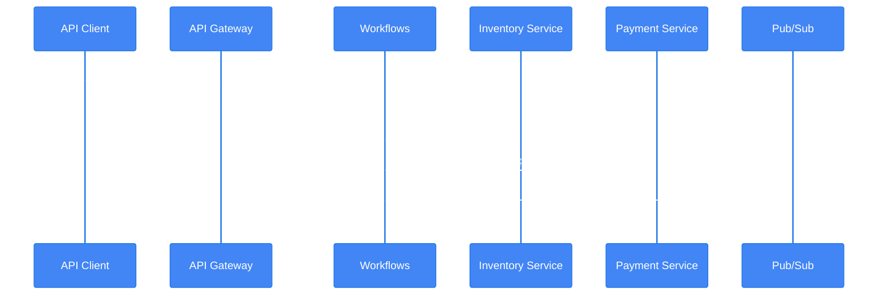

### Best practices

- Use Workflows for orchestration, not high-throughput message consumption
- Keep steps explicit and readable
- Externalize endpoint URLs and configuration
- Use retries and exception handling deliberately
- Prefer choreography for very high-scale independent events; use orchestration where central control is needed

### Anti-patterns

- Placing all business logic in one huge workflow with dozens of opaque branches
- Using Workflows to replace every application service
- Ignoring compensation steps for multi-system mutations

### Reference commands

```bash
gcloud workflows deploy order-orchestrator \
  --location us-central1 \
  --source workflow.yaml

gcloud workflows run order-orchestrator \
  --location us-central1 \
  --data='{"orderId":"12345"}'

gcloud workflows executions list order-orchestrator \
  --location us-central1
```

---

## API Gateway

API Gateway provides a managed API front door for serverless backends.

### Key capabilities

- Route external API traffic to Cloud Run, Cloud Functions, or other HTTP backends
- Enforce authentication and authorization
- Use OpenAPI specifications for API definition
- Centralize API config separate from backend implementations

### API Gateway topology

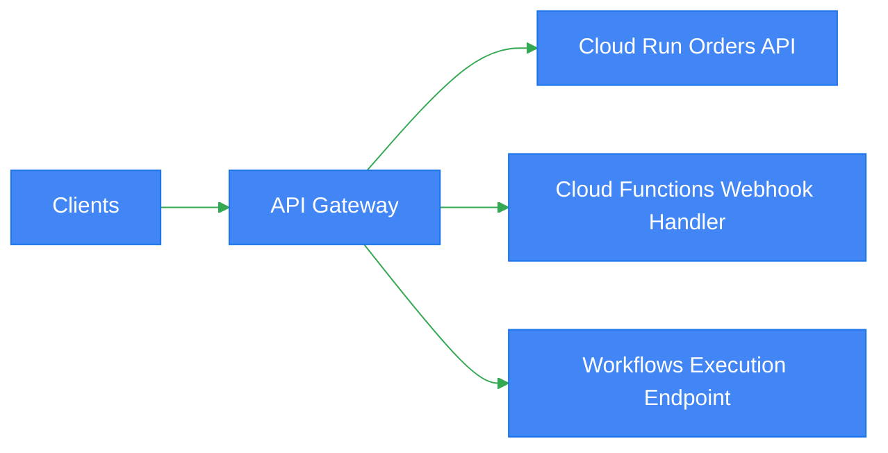

### OpenAPI example

```yaml
swagger: '2.0'
info:
  title: orders-api
  version: 1.0.0
schemes:
  - https
produces:
  - application/json
paths:
  /orders:
    post:
      operationId: createOrder
      x-google-backend:
        address: https://orders-api-xyz.a.run.app
      responses:
        '200':
          description: OK
securityDefinitions:
  google_id_token:
    authorizationUrl: ""
    flow: implicit
    type: oauth2
    x-google-issuer: https://accounts.google.com
    x-google-jwks_uri: https://www.googleapis.com/oauth2/v3/certs
    x-google-audiences: orders-api
```

### Authentication options

| Mechanism | Use case |
|---|---|
| API key | Basic consumer identification, not primary auth for sensitive systems |
| JWT / OIDC | User or service authentication |
| IAM-backed service auth | Internal service access patterns |

### Best practices

- Keep API contracts in OpenAPI and version them
- Put authentication at the gateway and backend where needed, not just one layer blindly
- Use Gateway for north-south traffic and keep east-west service auth separate
- Separate public APIs from internal admin APIs

### Anti-patterns

- Treating API Gateway as a replacement for backend authorization logic
- Publishing unstable backend contracts without versioning
- Routing high-volume internal service mesh traffic through API Gateway unnecessarily

### Reference commands

```bash
gcloud api-gateway apis create orders-api

gcloud api-gateway api-configs create orders-api-config \
  --api=orders-api \
  --openapi-spec=openapi.yaml \
  --project=PROJECT_ID

gcloud api-gateway gateways create orders-gateway \
  --api=orders-api \
  --api-config=orders-api-config \
  --location=us-central1
```

---

## Serverless VPC Access

Serverless VPC Access connects serverless services to private resources in a VPC.

### Typical use cases

- Access private Cloud SQL IP endpoints
- Call internal load balancer or internal APIs
- Reach Memorystore/Redis instances
- Access on-prem resources through hybrid connectivity

### Connectivity flow

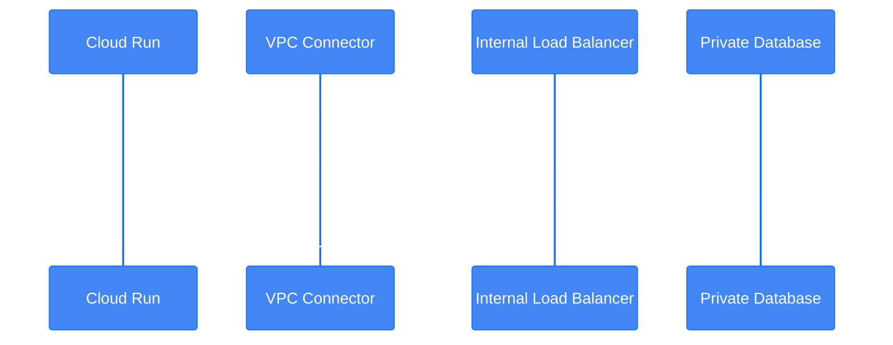

### Design notes

| Topic | Guidance |
|---|---|
| Egress mode | Prefer `private-ranges-only` unless all traffic must enter VPC |
| Connector sizing | Size based on throughput and concurrent connections |
| Firewall | Allow connector ranges to targets explicitly |
| Cost | Account for connector and egress costs |
| Security | Pair with IAM, private IP, and service account least privilege |

### Best practices

- Use private-ranges-only when internet egress should stay direct
- Validate connector subnet sizing early
- Monitor latency introduced by network hops
- Keep private services behind internal load balancing where appropriate

### Anti-patterns

- Sending all egress through VPC without a reason
- Forgetting firewall rules and diagnosing only at app layer
- Using serverless-to-database direct access without connection pooling strategy

### Reference commands

```bash
gcloud compute networks vpc-access connectors create serverless-conn \
  --region us-central1 \
  --network default \
  --range 10.8.0.0/28

gcloud run services update internal-api \
  --region us-central1 \
  --vpc-connector serverless-conn \
  --vpc-egress private-ranges-only

gcloud functions deploy privateWorker \
  --gen2 \
  --region us-central1 \
  --runtime python311 \
  --entry-point private_worker \
  --trigger-http \
  --vpc-connector serverless-conn
```

---

## Event-Driven Patterns

This section captures common distributed system patterns using GCP serverless services.

### 1. Fan-out pattern

A single event is published once and consumed by multiple independent subscribers.

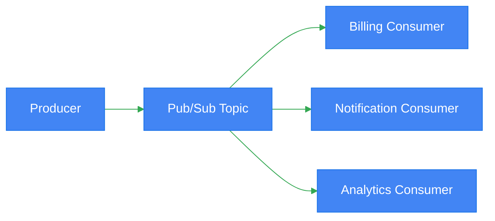

#### Best practices

- Keep subscribers independent
- Expect retries and duplicates
- Monitor lag and dead-letter queues

#### Anti-patterns

- Hidden coupling where subscribers depend on execution order
- Sharing mutable state across consumers

### 2. Choreography pattern

Services react to events rather than depending on one central orchestrator.

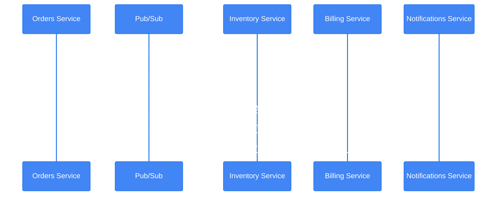

#### Best practices

- Define stable domain events
- Document event contracts clearly
- Use correlation IDs across all events

#### Anti-patterns

- Event spaghetti with undocumented event chains
- Too many implicit dependencies nobody owns

### 3. Saga pattern with serverless

Use saga when a business transaction spans multiple services and requires compensating actions instead of a distributed ACID transaction.

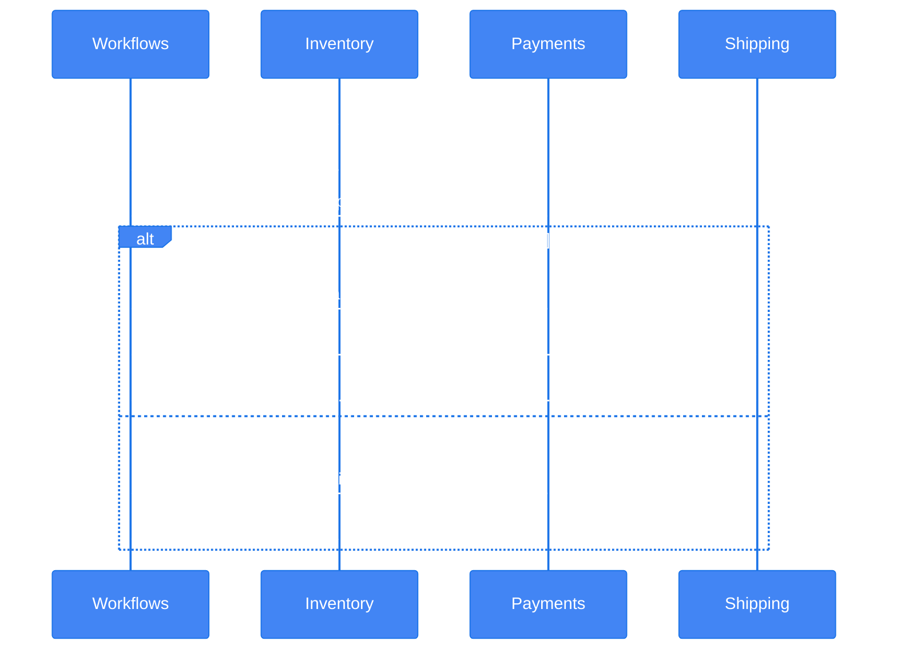

#### Saga implementation options

| Approach | Tooling | Good for |
|---|---|---|
| Orchestrated saga | Workflows + Cloud Run/Functions | Central control and compensation |
| Choreographed saga | Pub/Sub + Eventarc + services | Looser coupling, high autonomy |

#### Best practices

- Make each step idempotent
- Record saga state externally
- Define compensating transactions explicitly
- Time-bound waiting states and use deadlines

#### Anti-patterns

- Trying to emulate two-phase commit across serverless services
- No visibility into partial completion state
- Compensation logic that is not tested

### Pattern selection table

| Pattern | Use when | Avoid when |
|---|---|---|
| Fan-out | One event feeds many independent actions | Consumers require strict sequence |
| Choreography | Teams own services independently | Flow is too complex to reason about |
| Orchestration | Need explicit flow and compensation | Extreme throughput with simple independent reactions |
| Task queue | Need rate limiting/retries per work item | Broadcast to many consumers is needed |
| Scheduler trigger | Need time-based execution | Real-time event reaction is required |

### gcloud examples for patterns

```bash
gcloud pubsub topics create order-events

gcloud eventarc triggers create inventory-trigger \
  --location us-central1 \
  --destination-run-service inventory-consumer \
  --destination-run-region us-central1 \
  --transport-topic projects/PROJECT_ID/topics/order-events \
  --event-filters="type=google.cloud.pubsub.topic.v1.messagePublished"

gcloud workflows deploy order-saga \
  --location us-central1 \
  --source saga.yaml
```

---

## Security, Observability, and Operations

### Security best practices

- Use dedicated service accounts per workload
- Grant least privilege IAM roles
- Store secrets in Secret Manager, not env files committed to source
- Require authenticated invocations unless public access is intentional
- Use VPC connectivity and private IP where justified
- Validate JWTs and audiences correctly at API boundaries

### Observability best practices

- Emit structured JSON logs
- Propagate trace and correlation IDs
- Create log-based metrics for error rates and retries
- Use Cloud Monitoring dashboards for latency, instance count, CPU, memory, and queue depth
- Monitor DLQs, workflow failures, and connector health

### Reliability best practices

- Design all handlers for at-least-once delivery
- Use retries with bounded backoff
- Protect downstream systems with Cloud Tasks or max instance caps
- Use circuit breaker or fallback logic where appropriate
- Test rollback paths and revision traffic shifts regularly

### Operational anti-patterns

- No dead-letter strategy for asynchronous systems
- No cost visibility around min instances and connector usage
- Shipping unversioned event schemas
- Running incident response without revision/version labeling discipline

---

## Reference Deployment Commands

### Cloud Run build and deploy

```bash
gcloud builds submit \
  --tag us-central1-docker.pkg.dev/PROJECT_ID/serverless/orders:1.0

gcloud run deploy orders-api \
  --image us-central1-docker.pkg.dev/PROJECT_ID/serverless/orders:1.0 \
  --region us-central1 \
  --platform managed
```

### Pub/Sub publish test message

```bash
gcloud pubsub topics publish order-events \
  --message='{"orderId":"123","eventType":"order.created"}'
```

### Eventarc trigger to Workflows

```bash
gcloud eventarc triggers create order-event-workflow \
  --location us-central1 \
  --destination-workflow order-orchestrator \
  --event-filters="type=google.cloud.pubsub.topic.v1.messagePublished" \
  --transport-topic projects/PROJECT_ID/topics/order-events
```

### API Gateway introspection

```bash
gcloud api-gateway gateways list --location us-central1

gcloud api-gateway api-configs list --api orders-api
```

### App Engine diagnostics

```bash
gcloud app services list

gcloud app versions list
```

---

## Anti-Patterns Summary

| Anti-pattern | Why it is risky | Better approach |
|---|---|---|
| Serverless monolith | Hard to scale and deploy safely | Split by domain/capability |
| No idempotency | Retries cause duplicates or corruption | Use event IDs and dedupe logic |
| Forcing sync workflows | Increases latency and coupling | Use Pub/Sub, Tasks, or Workflows |
| Oversized min instances | Unnecessary cost | Tune from latency SLOs |
| One topic for all events | Schema confusion and consumer fragility | Use domain-driven topic strategy |
| Ignoring connector/network cost | Surprise spend and latency | Measure and right-size |
| Gateway-only auth | Backend trust boundary too broad | Defense in depth |
| Long user requests for background jobs | Timeouts and poor UX | Offload to async processing |

---

## Architecture Review Checklist

### Platform selection

- Is the compute choice aligned with packaging needs?
- Is Cloud Run preferred when containers or gRPC are needed?
- Is Cloud Functions Gen2 limited to truly function-oriented handlers?
- Is App Engine chosen for a clear reason, not just familiarity?

### Eventing

- Are events versioned and documented?
- Is idempotency enforced?
- Are DLQs configured where needed?
- Is ordering only enabled when truly required?

### Networking and security

- Are service accounts least-privileged?
- Is public access intentional and documented?
- Are private resources reached through appropriate VPC patterns?
- Are secrets stored in Secret Manager?

### Reliability and operations

- Are rollout and rollback procedures documented?
- Are traffic splitting and revision strategies defined?
- Are logs, metrics, traces, and alerts configured?
- Are downstream rate limits protected with tasks, queues, or max instances?

### Cost and performance

- Are min instances justified?
- Is concurrency tuned from actual workload behavior?
- Are connector and egress costs understood?
- Are cold-start mitigation techniques measured rather than assumed?

---

## Suggested Reference Architectures

### 1. Public API with async backend processing

- API Gateway fronts public endpoints
- Cloud Run handles request validation and persistence
- Pub/Sub publishes domain events
- Cloud Run or Cloud Functions Gen2 consume events
- Workflows coordinates compensation flows when needed

### 2. File ingestion pipeline

- Cloud Storage object finalize event
- Eventarc or Cloud Functions trigger
- Cloud Run parser service processes file
- Pub/Sub publishes downstream events
- BigQuery or Cloud SQL stores results

### 3. Scheduled reconciliation system

- Cloud Scheduler triggers Pub/Sub or Workflows
- Workflows coordinates read/write steps across services
- Cloud Run services execute business logic
- Notifications emitted on completion or failure

### 4. Private internal API

- Cloud Run service with authenticated access only
- Serverless VPC Access to private dependencies
- Cloud SQL private IP backend
- Internal callers use service account identity

---

## Design Heuristics Cheat Sheet

| If you need... | Prefer... |
|---|---|
| Container portability | Cloud Run |
| Single-purpose event handler | Cloud Functions Gen2 |
| Application platform versioning | App Engine |
| Central orchestration | Workflows |
| Broadcast messaging | Pub/Sub |
| Filtered event routing | Eventarc |
| Controlled retries/rate limiting | Cloud Tasks |
| Cron scheduling | Cloud Scheduler |
| Public API management | API Gateway |
| Private VPC access | Serverless VPC Access |

---

## Final Recommendations

1. Default to **Cloud Run** for new serverless services unless a function-first model is clearly better.
2. Use **Cloud Functions Gen2** for lightweight event handlers and simple HTTP functions.
3. Use **App Engine** when its application platform model is a deliberate fit, especially for existing workloads.
4. Prefer **Pub/Sub + Eventarc** for decoupled event-driven systems.
5. Use **Cloud Tasks** for controlled retries and backpressure.
6. Use **Workflows** for explicit orchestration and saga management.
7. Put **API Gateway** in front of public serverless APIs where centralized API management is required.
8. Add **Serverless VPC Access** only when private connectivity is necessary.
9. Design every asynchronous path for duplicates, retries, and observability.
10. Measure latency, cost, and scaling characteristics in production-like load tests before finalizing defaults.

---

## Appendix: Quick Command Catalog

```bash
# Cloud Run
gcloud run services list --region us-central1
gcloud run revisions list --service orders-api --region us-central1

# Functions Gen2
gcloud functions list --gen2 --regions us-central1

# App Engine
gcloud app browse

# Pub/Sub
gcloud pubsub topics list
gcloud pubsub subscriptions list

# Eventarc
gcloud eventarc triggers list --location us-central1

# Workflows
gcloud workflows list --location us-central1

# API Gateway
gcloud api-gateway apis list
gcloud api-gateway gateways list --location us-central1

# VPC Access
gcloud compute networks vpc-access connectors list --region us-central1
```

---

This document is intended as a practical architecture reference for GCP serverless design reviews, implementation planning, and platform standardization.