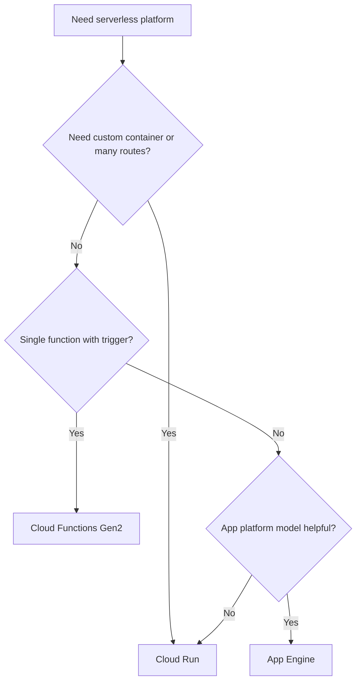
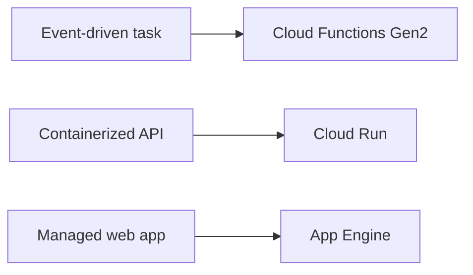

# Cloud Run vs Cloud Functions vs App Engine

> Detailed decision guide for choosing the right Google Cloud serverless runtime.

## Table of Contents

1. [Executive summary](#executive-summary)
2. [Platform definitions](#platform-definitions)
3. [Decision matrix](#decision-matrix)
4. [Detailed comparison](#detailed-comparison)
5. [Use-case decision library](#use-case-decision-library)
6. [Migration paths](#migration-paths)
7. [Performance and cost](#performance-and-cost)
8. [Operating model comparison](#operating-model-comparison)
9. [Reference commands](#reference-commands)

## Executive summary

- Default to **Cloud Run** for new container-friendly services, APIs, and background jobs.
- Choose **Cloud Functions Gen2** for single-purpose event handlers and very lightweight HTTP functions.
- Choose **App Engine** when its application-platform model is intentionally desirable or when you are evolving an existing App Engine estate.



## Platform definitions

### Cloud Run

Cloud Run packages workloads as containers and is the broadest serverless compute option on GCP for APIs, services, jobs, and event consumers.

### Cloud Functions Gen2

Cloud Functions Gen2 provides a function-first experience built on Cloud Run infrastructure. It is optimized for event handlers and minimal boilerplate.

### App Engine

App Engine remains a managed application platform with strong version-based deployment semantics and a familiar experience for many web applications.

## Decision matrix

| Requirement | Cloud Run | Cloud Functions Gen2 | App Engine |
|---|---|---|---|
| Custom container | Best fit | Limited | Flexible can work |
| Single trigger function | Good | Best fit | Usually not first choice |
| Multi-route API | Best fit | Possible but awkward | Good fit |
| Existing App Engine estate | Possible target | Rare target | Best fit |
| Strong portability | Best fit | Medium | Lower |
| gRPC | Best fit | Not typical | Not typical |
| Lowest packaging friction | Good | Best fit | Good for supported runtimes |



## Detailed comparison

| Dimension | Cloud Run | Cloud Functions Gen2 | App Engine Standard | App Engine Flexible |
|---|---|---|---|---|
| Packaging | Container image | Function source | Source deployment | App/container style |
| Runtime flexibility | High | Medium | Limited | Higher |
| Traffic splitting | Yes | Limited | Yes | Yes |
| Event focus | Strong with Eventarc | Native strength | Lower | Lower |
| Ops overhead | Low | Very low | Low to medium | Medium |
| Best fit | APIs, services, jobs | Event handlers | Managed web apps | Custom web platform needs |

### Packaging

- Cloud Run gives the clearest artifact boundary for promotion, scanning, and image governance.
- Decision question: does this factor materially change the platform choice or is it only a preference?

### Developer speed

- Cloud Functions often wins for tiny handlers where a full service would feel heavier.
- Decision question: does this factor materially change the platform choice or is it only a preference?

### Versioning

- App Engine versioning still matters to teams already aligned with that workflow.
- Decision question: does this factor materially change the platform choice or is it only a preference?

### Portability

- Cloud Run is typically the most portable among the three because the deployable unit is a standard container.
- Decision question: does this factor materially change the platform choice or is it only a preference?

### Eventing

- Cloud Functions feels natural for one trigger and one handler; Cloud Run wins as integration complexity grows.
- Decision question: does this factor materially change the platform choice or is it only a preference?

## Use-case decision library

### Public JSON API

- Recommended platform: **Cloud Run**
- Why: Multiple routes, auth middleware, container control, and revision-based rollout make it the strongest default.
- Re-evaluate when: runtime needs, event complexity, or release discipline requirements change.

### Single Pub/Sub consumer

- Recommended platform: **Cloud Functions Gen2**
- Why: Function-first packaging is fast when the logic is small and single-purpose.
- Re-evaluate when: runtime needs, event complexity, or release discipline requirements change.

### Webhook receiver

- Recommended platform: **Cloud Run or Cloud Functions**
- Why: Choose Functions for simplicity, Cloud Run for richer routing, dependencies, or shared middleware.
- Re-evaluate when: runtime needs, event complexity, or release discipline requirements change.

### Internal admin portal

- Recommended platform: **Cloud Run or App Engine**
- Why: Use Cloud Run for container control and modern release flow; keep App Engine if the existing app model already fits.
- Re-evaluate when: runtime needs, event complexity, or release discipline requirements change.

### gRPC service

- Recommended platform: **Cloud Run**
- Why: HTTP/2 and containerized runtime behavior align naturally.
- Re-evaluate when: runtime needs, event complexity, or release discipline requirements change.

### Legacy web app modernization

- Recommended platform: **App Engine or Cloud Run**
- Why: Stay on App Engine for incremental modernization or move to Cloud Run for container portability.
- Re-evaluate when: runtime needs, event complexity, or release discipline requirements change.

### Scheduled batch task

- Recommended platform: **Cloud Run jobs**
- Why: A better fit than stretching function semantics for longer finite work.
- Re-evaluate when: runtime needs, event complexity, or release discipline requirements change.

### Image thumbnail function

- Recommended platform: **Cloud Functions Gen2**
- Why: Great for compact event-driven transformations with little shared routing.
- Re-evaluate when: runtime needs, event complexity, or release discipline requirements change.

### GraphQL gateway

- Recommended platform: **Cloud Run**
- Why: GraphQL often benefits from multi-route service behavior, custom middleware, and container control.
- Re-evaluate when: runtime needs, event complexity, or release discipline requirements change.

### Small intranet tool

- Recommended platform: **App Engine or Cloud Run**
- Why: Choose based on runtime needs and whether app-platform conventions are useful.
- Re-evaluate when: runtime needs, event complexity, or release discipline requirements change.

## Migration paths

### Functions to Cloud Run

- Context: Teams migrate when a single handler grows into a service with multiple routes, richer dependencies, or stronger rollout needs.
- Common steps:

- Extract reusable logic into a standard service entrypoint
- Adopt buildpacks or a Dockerfile
- Define health checks, config, and service identity
- Roll out with canary revisions
- Success measure: the target platform is simpler without losing needed control.

### App Engine to Cloud Run

- Context: Teams migrate when they want container portability, clearer artifact promotion, or fewer runtime constraints.
- Common steps:

- Inventory app assumptions and background work
- Externalize config and state
- Containerize the workload
- Map versioning habits to revisions and traffic splits
- Success measure: the target platform is simpler without losing needed control.

### Cloud Run to Functions

- Context: Less common, but reasonable when a service is reduced to a very small event-only handler.
- Common steps:

- Isolate the single function entrypoint
- Trim service-level routing and middleware
- Align trigger model to function deployment
- Retest observability and auth flows
- Success measure: the target platform is simpler without losing needed control.

## Performance and cost

| Topic | Cloud Run | Cloud Functions Gen2 | App Engine |
|---|---|---|---|
| Cold starts | Moderate, tunable with min instances | Similar Gen2 foundation | Depends on environment |
| Concurrency control | Strong | Present but function-centric | App/platform oriented |
| Pricing shape | Requests, CPU, memory | Invocation and runtime resource usage | Instance/platform based |
| Best cost profile | Bursty APIs and services | Tiny event handlers | Steady app-platform workloads |

### Cold starts

- Measure startup behavior under production-like idle periods before choosing a platform based on assumptions.
- Benchmark prompt: what real workload shape should the team reproduce before final selection?

### Steady traffic

- At sustained load, the cost difference may depend more on runtime efficiency than on platform branding.
- Benchmark prompt: what real workload shape should the team reproduce before final selection?

### Burst traffic

- Cloud Run and Functions often shine when idle periods are long and bursty patterns are real.
- Benchmark prompt: what real workload shape should the team reproduce before final selection?

### Memory-heavy workloads

- Containerized control in Cloud Run often makes tuning easier for heavy frameworks or custom binaries.
- Benchmark prompt: what real workload shape should the team reproduce before final selection?

### Queue-based systems

- Asynchronous architectures shift cost and performance characteristics away from synchronous request time alone.
- Benchmark prompt: what real workload shape should the team reproduce before final selection?

## Operating model comparison

### Cloud Run operating model

- Container image ownership
- Revision-based rollout
- Richer service composition
- Natural fit for platform standards

### Cloud Functions operating model

- Single handler focus
- Fast event onboarding
- Minimal packaging ceremony
- Best when the workload stays small

### App Engine operating model

- Application platform workflow
- Version-based deployment habits
- Good fit for existing estates
- Less emphasis on portable containers

## Reference commands

```bash
# Cloud Run
gcloud run services list --region us-central1

# Functions Gen2
gcloud functions list --gen2 --regions us-central1

# App Engine
gcloud app services list
gcloud app versions list
```

### Appendix: Api Platform Choice

- Which workload requirement matters most here?
- Which platform handles that requirement most naturally?
- What trade-off would the team accept by choosing differently?
- What evidence should be gathered in a proof of concept?

### Appendix: Event-Only Handler Review

- Which workload requirement matters most here?
- Which platform handles that requirement most naturally?
- What trade-off would the team accept by choosing differently?
- What evidence should be gathered in a proof of concept?

### Appendix: Legacy App Migration

- Which workload requirement matters most here?
- Which platform handles that requirement most naturally?
- What trade-off would the team accept by choosing differently?
- What evidence should be gathered in a proof of concept?

### Appendix: Cost Benchmark Plan

- Which workload requirement matters most here?
- Which platform handles that requirement most naturally?
- What trade-off would the team accept by choosing differently?
- What evidence should be gathered in a proof of concept?

### Appendix: Cold Start Test

- Which workload requirement matters most here?
- Which platform handles that requirement most naturally?
- What trade-off would the team accept by choosing differently?
- What evidence should be gathered in a proof of concept?

### Appendix: Release Strategy Review

- Which workload requirement matters most here?
- Which platform handles that requirement most naturally?
- What trade-off would the team accept by choosing differently?
- What evidence should be gathered in a proof of concept?

### Appendix: Security Boundary Mapping

- Which workload requirement matters most here?
- Which platform handles that requirement most naturally?
- What trade-off would the team accept by choosing differently?
- What evidence should be gathered in a proof of concept?

### Appendix: Dependency Ownership

- Which workload requirement matters most here?
- Which platform handles that requirement most naturally?
- What trade-off would the team accept by choosing differently?
- What evidence should be gathered in a proof of concept?

### Appendix: Team Skill Alignment

- Which workload requirement matters most here?
- Which platform handles that requirement most naturally?
- What trade-off would the team accept by choosing differently?
- What evidence should be gathered in a proof of concept?

### Appendix: Long-Term Portability

- Which workload requirement matters most here?
- Which platform handles that requirement most naturally?
- What trade-off would the team accept by choosing differently?
- What evidence should be gathered in a proof of concept?

## Expanded use-case library

### Decision card 1: API backend for mobile app

- Best fit: **Cloud Run**
- Why: Multi-route APIs, custom middleware, and revision-based rollout align well.
- Re-evaluate when the workload grows in routes, dependencies, or release control needs.

### Decision card 2: Single file resize trigger

- Best fit: **Cloud Functions Gen2**
- Why: A compact event handler stays simple as a function.
- Re-evaluate when the workload grows in routes, dependencies, or release control needs.

### Decision card 3: Legacy internal portal

- Best fit: **App Engine**
- Why: Existing app model and versioning may already fit.
- Re-evaluate when the workload grows in routes, dependencies, or release control needs.

### Decision card 4: Webhook aggregator

- Best fit: **Cloud Run**
- Why: Multiple providers, auth middleware, and retries fit service semantics.
- Re-evaluate when the workload grows in routes, dependencies, or release control needs.

### Decision card 5: Nightly cleanup task

- Best fit: **Cloud Run**
- Why: Jobs are stronger than stretching function semantics.
- Re-evaluate when the workload grows in routes, dependencies, or release control needs.

### Decision card 6: Simple pubsub notifier

- Best fit: **Cloud Functions Gen2**
- Why: Minimal event logic often favors the function-first experience.
- Re-evaluate when the workload grows in routes, dependencies, or release control needs.

### Decision card 7: GraphQL gateway

- Best fit: **Cloud Run**
- Why: Container control and routing flexibility matter.
- Re-evaluate when the workload grows in routes, dependencies, or release control needs.

### Decision card 8: Simple image metadata extractor

- Best fit: **Cloud Functions Gen2**
- Why: Fast deployment and small code surface fit the use case.
- Re-evaluate when the workload grows in routes, dependencies, or release control needs.

### Decision card 9: Existing App Engine monolith

- Best fit: **App Engine or Cloud Run**
- Why: The best answer depends on how much modernization is planned.
- Re-evaluate when the workload grows in routes, dependencies, or release control needs.

### Decision card 10: gRPC service

- Best fit: **Cloud Run**
- Why: Cloud Run is the clear serverless default for gRPC.
- Re-evaluate when the workload grows in routes, dependencies, or release control needs.

### Decision card 11: Admin reporting site

- Best fit: **Cloud Run or App Engine**
- Why: Choose based on runtime needs and modernization goals.
- Re-evaluate when the workload grows in routes, dependencies, or release control needs.

### Decision card 12: Event fan-out coordinator

- Best fit: **Cloud Run**
- Why: Background orchestration and shared dependencies often outgrow simple functions.
- Re-evaluate when the workload grows in routes, dependencies, or release control needs.

### Decision card 13: Tiny cron-triggered task

- Best fit: **Cloud Functions Gen2**
- Why: A small scheduled function can be enough.
- Re-evaluate when the workload grows in routes, dependencies, or release control needs.

### Decision card 14: Portable container standard

- Best fit: **Cloud Run**
- Why: If the platform standard is containers, Cloud Run usually wins.
- Re-evaluate when the workload grows in routes, dependencies, or release control needs.

### Decision card 15: Version-centric web app

- Best fit: **App Engine**
- Why: Teams invested in App Engine version workflows may stay there productively.
- Re-evaluate when the workload grows in routes, dependencies, or release control needs.

### Decision card 16: Rules engine with many endpoints

- Best fit: **Cloud Run**
- Why: Container flexibility and service routing are a better match.
- Re-evaluate when the workload grows in routes, dependencies, or release control needs.

### Decision card 17: Static-ish site with simple backend

- Best fit: **App Engine or Cloud Run**
- Why: The right choice depends on operational model preference.
- Re-evaluate when the workload grows in routes, dependencies, or release control needs.

### Decision card 18: High-churn experimentation service

- Best fit: **Cloud Run**
- Why: Revisions and container reuse support rapid iteration.
- Re-evaluate when the workload grows in routes, dependencies, or release control needs.

### Decision card 19: ETL micro-batch step

- Best fit: **Cloud Run**
- Why: Jobs or service-triggered workers are more natural than a single function.
- Re-evaluate when the workload grows in routes, dependencies, or release control needs.

### Decision card 20: One-off webhook relay

- Best fit: **Cloud Functions Gen2**
- Why: If the logic stays truly tiny, a function is enough.
- Re-evaluate when the workload grows in routes, dependencies, or release control needs.

## Migration playbook cards

### Migration card 1: Function growing into API

- What capability is missing on the current platform?
- What artifact or deployment model changes during migration?
- What test proves the target platform is truly simpler or safer?

### Migration card 2: Function needing custom binary

- What capability is missing on the current platform?
- What artifact or deployment model changes during migration?
- What test proves the target platform is truly simpler or safer?

### Migration card 3: Function needing shared middleware

- What capability is missing on the current platform?
- What artifact or deployment model changes during migration?
- What test proves the target platform is truly simpler or safer?

### Migration card 4: App Engine app needing portability

- What capability is missing on the current platform?
- What artifact or deployment model changes during migration?
- What test proves the target platform is truly simpler or safer?

### Migration card 5: App Engine app needing custom runtime

- What capability is missing on the current platform?
- What artifact or deployment model changes during migration?
- What test proves the target platform is truly simpler or safer?

### Migration card 6: Cloud Run service shrinking to one trigger

- What capability is missing on the current platform?
- What artifact or deployment model changes during migration?
- What test proves the target platform is truly simpler or safer?

### Migration card 7: App Engine service splitting into microservices

- What capability is missing on the current platform?
- What artifact or deployment model changes during migration?
- What test proves the target platform is truly simpler or safer?

### Migration card 8: Function moving to container standard

- What capability is missing on the current platform?
- What artifact or deployment model changes during migration?
- What test proves the target platform is truly simpler or safer?

### Migration card 9: Monolith extracting admin endpoints

- What capability is missing on the current platform?
- What artifact or deployment model changes during migration?
- What test proves the target platform is truly simpler or safer?

### Migration card 10: Scheduled task leaving App Engine cron

- What capability is missing on the current platform?
- What artifact or deployment model changes during migration?
- What test proves the target platform is truly simpler or safer?

### Migration card 11: Queue worker moving from function

- What capability is missing on the current platform?
- What artifact or deployment model changes during migration?
- What test proves the target platform is truly simpler or safer?

### Migration card 12: Partner API leaving monolith

- What capability is missing on the current platform?
- What artifact or deployment model changes during migration?
- What test proves the target platform is truly simpler or safer?

### Migration card 13: gRPC adoption path

- What capability is missing on the current platform?
- What artifact or deployment model changes during migration?
- What test proves the target platform is truly simpler or safer?

### Migration card 14: Cost-driven simplification

- What capability is missing on the current platform?
- What artifact or deployment model changes during migration?
- What test proves the target platform is truly simpler or safer?

### Migration card 15: Legacy framework containerization

- What capability is missing on the current platform?
- What artifact or deployment model changes during migration?
- What test proves the target platform is truly simpler or safer?

## Performance and cost prompts

### Cost prompt 1: Cold-start benchmark

- Which platform handles this concern most naturally?
- What evidence should be gathered before making a final choice?
- Which trade-off is acceptable if the cheaper option is not the simplest one?

### Cost prompt 2: Idle cost profile

- Which platform handles this concern most naturally?
- What evidence should be gathered before making a final choice?
- Which trade-off is acceptable if the cheaper option is not the simplest one?

### Cost prompt 3: Steady traffic comparison

- Which platform handles this concern most naturally?
- What evidence should be gathered before making a final choice?
- Which trade-off is acceptable if the cheaper option is not the simplest one?

### Cost prompt 4: Large dependency packaging

- Which platform handles this concern most naturally?
- What evidence should be gathered before making a final choice?
- Which trade-off is acceptable if the cheaper option is not the simplest one?

### Cost prompt 5: Memory-heavy runtime

- Which platform handles this concern most naturally?
- What evidence should be gathered before making a final choice?
- Which trade-off is acceptable if the cheaper option is not the simplest one?

### Cost prompt 6: Concurrency behavior

- Which platform handles this concern most naturally?
- What evidence should be gathered before making a final choice?
- Which trade-off is acceptable if the cheaper option is not the simplest one?

### Cost prompt 7: Queue-backed design

- Which platform handles this concern most naturally?
- What evidence should be gathered before making a final choice?
- Which trade-off is acceptable if the cheaper option is not the simplest one?

### Cost prompt 8: Canary deployment safety

- Which platform handles this concern most naturally?
- What evidence should be gathered before making a final choice?
- Which trade-off is acceptable if the cheaper option is not the simplest one?

### Cost prompt 9: Artifact promotion discipline

- Which platform handles this concern most naturally?
- What evidence should be gathered before making a final choice?
- Which trade-off is acceptable if the cheaper option is not the simplest one?

### Cost prompt 10: Operational ownership

- Which platform handles this concern most naturally?
- What evidence should be gathered before making a final choice?
- Which trade-off is acceptable if the cheaper option is not the simplest one?

### Cost prompt 11: Observability effort

- Which platform handles this concern most naturally?
- What evidence should be gathered before making a final choice?
- Which trade-off is acceptable if the cheaper option is not the simplest one?

### Cost prompt 12: Auth model complexity

- Which platform handles this concern most naturally?
- What evidence should be gathered before making a final choice?
- Which trade-off is acceptable if the cheaper option is not the simplest one?

### Cost prompt 13: Event retry semantics

- Which platform handles this concern most naturally?
- What evidence should be gathered before making a final choice?
- Which trade-off is acceptable if the cheaper option is not the simplest one?

### Cost prompt 14: Long-running request handling

- Which platform handles this concern most naturally?
- What evidence should be gathered before making a final choice?
- Which trade-off is acceptable if the cheaper option is not the simplest one?

### Cost prompt 15: Portability horizon

- Which platform handles this concern most naturally?
- What evidence should be gathered before making a final choice?
- Which trade-off is acceptable if the cheaper option is not the simplest one?

## FAQ

### Can Cloud Functions replace every simple Cloud Run service?

Not always. Once you need multiple routes, richer middleware, or stronger container control, Cloud Run usually fits better.

### Is App Engine outdated?

No. It remains useful when its managed application-platform model is a deliberate fit or when existing workloads already run there successfully.

### What is the safest default for new serverless apps?

Cloud Run is often the safest default because it balances flexibility and low operations.

### How should teams decide between cost and simplicity?

Benchmark realistic traffic and include developer and operational effort, not just billing line items.

### What if a function slowly becomes a service?

That is usually a sign to consider Cloud Run.

### What if a containerized app does not need many routes?

Cloud Run can still be the right choice if the artifact, runtime, or release model matters.

### Does App Engine still have a role in modernization?

Yes, especially when incremental evolution is safer than immediate replatforming.

### What matters most in the decision?

The workload shape, team operating model, and long-term portability goals.

## Appendix: Team-fit prompts

### Team-fit prompt 1: Platform team prefers containers

- Which platform best matches the team's current operating model?
- What future change would invalidate that choice?
- What proof-of-concept metric should the team collect?

### Team-fit prompt 2: Event-driven app with tiny handlers

- Which platform best matches the team's current operating model?
- What future change would invalidate that choice?
- What proof-of-concept metric should the team collect?

### Team-fit prompt 3: Existing App Engine expertise

- Which platform best matches the team's current operating model?
- What future change would invalidate that choice?
- What proof-of-concept metric should the team collect?

### Team-fit prompt 4: Need for portable CI/CD artifacts

- Which platform best matches the team's current operating model?
- What future change would invalidate that choice?
- What proof-of-concept metric should the team collect?

### Team-fit prompt 5: Low-ops priority

- Which platform best matches the team's current operating model?
- What future change would invalidate that choice?
- What proof-of-concept metric should the team collect?

### Team-fit prompt 6: Strict release controls

- Which platform best matches the team's current operating model?
- What future change would invalidate that choice?
- What proof-of-concept metric should the team collect?

### Team-fit prompt 7: Prototype speed

- Which platform best matches the team's current operating model?
- What future change would invalidate that choice?
- What proof-of-concept metric should the team collect?

### Team-fit prompt 8: Long-term modernization path

- Which platform best matches the team's current operating model?
- What future change would invalidate that choice?
- What proof-of-concept metric should the team collect?

### Team-fit prompt 9: Shared middleware reuse

- Which platform best matches the team's current operating model?
- What future change would invalidate that choice?
- What proof-of-concept metric should the team collect?

### Team-fit prompt 10: Public API governance

- Which platform best matches the team's current operating model?
- What future change would invalidate that choice?
- What proof-of-concept metric should the team collect?

### Team-fit prompt 11: Partner integration needs

- Which platform best matches the team's current operating model?
- What future change would invalidate that choice?
- What proof-of-concept metric should the team collect?

### Team-fit prompt 12: Simple scheduled task

- Which platform best matches the team's current operating model?
- What future change would invalidate that choice?
- What proof-of-concept metric should the team collect?

### Team-fit prompt 13: Many small teams

- Which platform best matches the team's current operating model?
- What future change would invalidate that choice?
- What proof-of-concept metric should the team collect?

### Team-fit prompt 14: Legacy framework retention

- Which platform best matches the team's current operating model?
- What future change would invalidate that choice?
- What proof-of-concept metric should the team collect?

### Team-fit prompt 15: Multi-route application growth

- Which platform best matches the team's current operating model?
- What future change would invalidate that choice?
- What proof-of-concept metric should the team collect?
