# Terraform — Google Cloud Platform

This directory contains a Terraform example that provisions a basic GCP network infrastructure: a custom VPC, a subnet, and a firewall rule.

<!-- workflow-diagram:start -->
## Terraform IaC Workflow

```mermaid
flowchart LR
    Author["Write Terraform code"] --> Format["fmt + validate"]
    Format --> Plan["terraform plan"]
    Plan --> Review{"Plan approved?"}
    Review -->|No| Refine["Adjust variables or modules"]
    Refine --> Format
    Review -->|Yes| Apply["terraform apply"]
    subgraph State["State lifecycle"]
        Backend["Backend / state file"]
        Outputs["Outputs"]
        Drift["Drift detection"]
    end
    Apply --> Backend
    Backend --> Outputs
    Outputs --> Verify["Verify GCP resources"]
    Verify --> Drift
    Drift --> Change{"Further changes needed?"}
    Change -->|Yes| Plan
    Change -->|No| Operate["Operate managed infra"]
    Operate --> Retire{"Destroy required?"}
    Retire -->|Yes| Destroy["terraform destroy"]
    Retire -->|No| Keep["Retain and document"]
    classDef start fill:#E3F2FD,stroke:#1E88E5,color:#0D47A1;
    classDef iac fill:#E8F5E9,stroke:#43A047,color:#1B5E20;
    classDef ops fill:#FFF3E0,stroke:#FB8C00,color:#E65100;
    classDef finish fill:#F3E5F5,stroke:#8E24AA,color:#4A148C;
    class Author,Format,Plan,Review start;
    class Apply,Backend,Outputs,Verify,Operate iac;
    class Refine,Drift,Change,Retire ops;
    class Destroy,Keep finish;
```

<!-- workflow-diagram:end -->

## Resources Created

| Resource | Name | Description |
|----------|------|-------------|
| `google_compute_network` | `terraform-vpc-other` | Auto-mode VPC |
| `google_compute_network` | `terraform-custom-network` | Custom-mode VPC (manual subnets) |
| `google_compute_subnetwork` | `subnet-a` | Subnet in `us-central1` (10.5.0.0/16) |
| `google_compute_firewall` | `terraform-firewall-rules` | Firewall rules for the custom VPC |

## Prerequisites

- [Terraform](https://developer.hashicorp.com/terraform/downloads) >= 1.0
- A GCP service account JSON key (`accounts.json`) with at least `Compute Network Admin` role
- A GCP project

## Setup

1. **Place your service account key** in this directory as `accounts.json`.

2. **Create a `terraform.tfvars` file** with your values:
   ```hcl
   project = "your-gcp-project-id"
   region  = "us-central1"
   ```

3. **Initialize Terraform**:
   ```bash
   terraform init
   ```

4. **Review the plan**:
   ```bash
   terraform plan
   ```

5. **Apply**:
   ```bash
   terraform apply
   ```

## Clean Up

```bash
terraform destroy
```

## Notes

- `accounts.json` is in `.gitignore` — never commit credentials to source control.
- The `variables.tf` file (not shown here) should define `project` and `region` variables.
- To use Application Default Credentials instead of a key file, remove the `credentials` line from the provider block and run `gcloud auth application-default login`.
