# VPC — Virtual Private Cloud Scripts

This directory contains `gcloud` scripts for setting up VPC networks, subnets, firewall rules, NAT, VPC peering, and Shared VPC on Google Cloud.
<!-- workflow-diagram:start -->
## VPC / Subnet / Firewall Flow

```mermaid
flowchart LR
    Start["Create network"] --> Mode{"Auto or custom mode?"}
    Mode -->|Auto| Auto["Auto subnets"]
    Mode -->|Custom| Custom["Custom CIDR plan"]
    Auto --> Subnet
    Custom --> Subnet
    subgraph NetworkPlane["Network plane"]
        Subnet["Regional subnets"] --> Route["Routes"]
        Route --> Peering["Peering / Shared VPC"]
    end
    Peering --> Firewall["Firewall policy"]
    Firewall --> Internet{"Need egress?"}
    Internet -->|Yes| NAT["Cloud NAT / gateway"]
    Internet -->|No| Private["Private-only access"]
    NAT --> Workload["Attach VM / GKE / service"]
    Private --> Workload
    Workload --> Validate{"Connectivity allowed?"}
    Validate -->|No| Fix["Update tags, service accounts, or rules"]
    Fix --> Firewall
    Validate -->|Yes| Ready["Operational VPC"]
    classDef start fill:#E3F2FD,stroke:#1E88E5,color:#0D47A1;
    classDef network fill:#E8F5E9,stroke:#43A047,color:#1B5E20;
    classDef security fill:#FFF3E0,stroke:#FB8C00,color:#E65100;
    classDef finish fill:#FCE4EC,stroke:#D81B60,color:#880E4F;
    class Start,Mode,Auto,Custom start;
    class Subnet,Route,Peering,Workload network;
    class Firewall,Internet,Validate,Fix,NAT,Private security;
    class Ready finish;
```

<!-- workflow-diagram:end -->


---

## Prerequisites

```bash
gcloud services enable compute.googleapis.com
gcloud config set project YOUR_PROJECT_ID
```

---

## Scripts Overview

| Script | Description |
|--------|-------------|
| [`vpc.sh`](./vpc.sh) | Create a custom VPC with 2 subnets and VM instances |
| [`firewall.sh`](./firewall.sh) | Full lab: custom VPC + subnets + firewall rules (SSH, ICMP, deny by tag) |
| [`nat.sh`](./nat.sh) | Create a custom VPC with no-external-IP VMs + SSH firewall rule (NAT gateway lab) |
| [`vpcPeering.sh`](./vpcPeering.sh) | Create 3 VPCs with overlapping subnets to test VPC peering constraints |
| [`sharedvpc.sh`](./sharedvpc.sh) | Create a host network with dev, prod, and private subnets for Shared VPC |
| [`gcloudCommands.sh`](./gcloudCommands.sh) | General Cloud Shell and `gcloud` reference commands (APIs, config, projects) |

---

## Quick Start

### 1. Basic VPC + Subnets

```bash
# Create custom VPC
gcloud compute networks create my-vpc --subnet-mode=custom

# Create subnets
gcloud compute networks subnets create subnet-a \
    --network=my-vpc --range=10.0.1.0/24 --region=us-central1
gcloud compute networks subnets create subnet-b \
    --network=my-vpc --range=10.0.2.0/24 --region=us-central1

# Verify
gcloud compute networks list
gcloud compute networks subnets list --network=my-vpc
```

### 2. Firewall Rules

```bash
# Allow SSH from anywhere
gcloud compute firewall-rules create allow-ssh \
    --network=my-vpc --allow=tcp:22 --source-ranges=0.0.0.0/0

# Allow ICMP (ping) from internal subnets only
gcloud compute firewall-rules create allow-icmp-internal \
    --network=my-vpc --allow=icmp --source-ranges=10.0.1.0/24,10.0.2.0/24

# Deny ICMP from specific tagged instances
gcloud compute firewall-rules create deny-ping-by-tag \
    --network=my-vpc --action=DENY --rules=icmp \
    --source-tags=deny-ping --target-tags=allow-ping --priority=900

# List rules
gcloud compute firewall-rules list --filter="network:my-vpc"
```

### 3. VPC Peering

```bash
# Peer network-1 → network-2
gcloud compute networks peerings create peer-1-to-2 \
    --network=network-1 --peer-network=network-2

# Peer network-2 → network-1 (both sides required)
gcloud compute networks peerings create peer-2-to-1 \
    --network=network-2 --peer-network=network-1
```

> **Note**: VPC peering fails if CIDR ranges overlap between peered networks. The `vpcPeering.sh` script demonstrates this with intentional overlaps.

### 4. Cloud NAT (for VMs without external IPs)

```bash
# Create a Cloud Router
gcloud compute routers create my-router \
    --network=my-vpc --region=us-central1

# Create Cloud NAT
gcloud compute routers nats create my-nat \
    --router=my-router --region=us-central1 \
    --auto-allocate-nat-external-ips \
    --nat-all-subnet-ip-ranges
```

### 5. Shared VPC

Shared VPC allows a host project to share its VPC network with service projects:

```bash
# Enable Shared VPC on host project
gcloud compute shared-vpc enable HOST_PROJECT_ID

# Associate a service project
gcloud compute shared-vpc associated-projects add SERVICE_PROJECT_ID \
    --host-project=HOST_PROJECT_ID
```

---

## Clean Up

```bash
# Delete instances, firewall rules, subnets, then the VPC
gcloud compute instances delete INSTANCE_NAME --zone=us-central1-a --quiet
gcloud compute firewall-rules delete RULE_NAME --quiet
gcloud compute networks subnets delete SUBNET_NAME --region=us-central1 --quiet
gcloud compute networks delete NETWORK_NAME --quiet
```

---

## Key Concepts

| Concept | Description |
|---------|-------------|
| **Auto-mode VPC** | Automatically creates one subnet per region (10.128.0.0/20 and up) |
| **Custom-mode VPC** | You define subnets manually — recommended for production |
| **Firewall priority** | Lower number = higher priority (0–65535, default 1000) |
| **Target tags** | Firewall rules apply only to instances with matching tags |
| **VPC Peering** | Private connectivity between two VPCs (non-transitive, no overlapping CIDRs) |
| **Shared VPC** | Centralized network management across multiple projects |
| **Cloud NAT** | Outbound internet access for VMs without external IPs |

---

## References

- [VPC overview](https://cloud.google.com/vpc/docs/vpc)
- [Firewall rules](https://cloud.google.com/vpc/docs/firewalls)
- [VPC peering](https://cloud.google.com/vpc/docs/vpc-peering)
- [Shared VPC](https://cloud.google.com/vpc/docs/shared-vpc)
- [Cloud NAT](https://cloud.google.com/nat/docs/overview)
