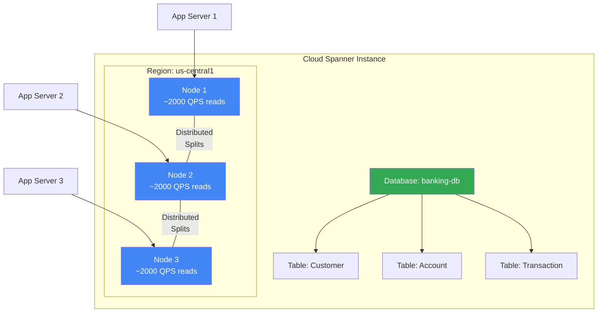
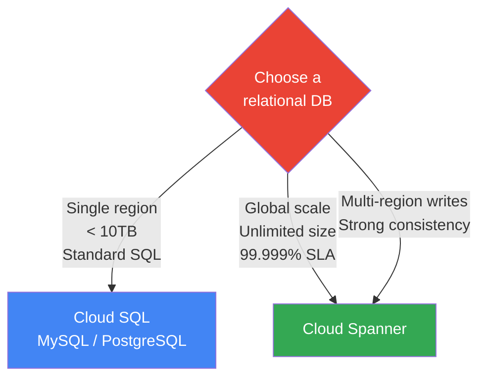

# Cloud Spanner — Command Reference & Guide

Cloud Spanner is a fully managed, horizontally scalable, globally distributed relational database service from Google Cloud. It combines the consistency of relational databases with the scalability of NoSQL systems.

## Architecture



## Spanner vs Cloud SQL



---

## Prerequisites

```bash
# Enable the Cloud Spanner API
gcloud services enable spanner.googleapis.com

# Set your project
gcloud config set project YOUR_PROJECT_ID
```

---

## Instance Operations

### Create a Spanner Instance
```bash
gcloud spanner instances create first-instance \
    --config=regional-us-central1 \
    --description="First instance" \
    --nodes=1
```
> For production, use at least 3 nodes. For dev/test, 1 node is sufficient.

### List Instances
```bash
gcloud spanner instances list
```

### Describe an Instance
```bash
gcloud spanner instances describe first-instance
```

### Update Instance (scale nodes)
```bash
gcloud spanner instances update first-instance --nodes=3
```

### Delete an Instance
```bash
gcloud spanner instances delete first-instance
```

---

## Database Operations

### Create a Database
```bash
gcloud spanner databases create banking-db \
    --instance=first-instance
```

### List Databases
```bash
gcloud spanner databases list --instance=first-instance
```

### Delete a Database
```bash
gcloud spanner databases delete banking-db --instance=first-instance
```

---

## DDL — Create Tables

Connect via Cloud Spanner Studio in the GCP Console, or use the `gcloud spanner databases ddl update` command:

```bash
gcloud spanner databases ddl update banking-db \
    --instance=first-instance \
    --ddl='CREATE TABLE Customer (
      CustomerId STRING(36) NOT NULL,
      Name       STRING(MAX) NOT NULL,
      Location   STRING(MAX) NOT NULL,
    ) PRIMARY KEY (CustomerId);'
```

Or interactively via the Spanner CLI:

```sql
-- Create a table
CREATE TABLE Customer (
  CustomerId STRING(36) NOT NULL,
  Name       STRING(MAX) NOT NULL,
  Location   STRING(MAX) NOT NULL,
) PRIMARY KEY (CustomerId);
```

---

## DML — Insert & Query Data

### Insert Records

```sql
-- Insert first record
INSERT INTO Customer (CustomerId, Name, Location)
VALUES ('bdaaaa97-1b4b-4e58-b4ad-84030de92235', 'Siva', 'Mumbai');

-- Insert second record
INSERT INTO Customer (CustomerId, Name, Location)
VALUES ('b2b4002d-7813-4551-b83b-366ef95f9273', 'Jeff', 'Bangalore');
```

### Query Records

```sql
-- Select all records
SELECT * FROM Customer;

-- Filter by location
SELECT * FROM Customer WHERE Location = 'Mumbai';

-- Count records
SELECT COUNT(*) AS TotalCustomers FROM Customer;
```

### Update & Delete

```sql
-- Update a record
UPDATE Customer SET Location = 'Hyderabad'
WHERE CustomerId = 'bdaaaa97-1b4b-4e58-b4ad-84030de92235';

-- Delete a record
DELETE FROM Customer
WHERE CustomerId = 'b2b4002d-7813-4551-b83b-366ef95f9273';
```

---

## Spanner CLI — Execute SQL via gcloud

```bash
# Execute a query directly
gcloud spanner databases execute-sql banking-db \
    --instance=first-instance \
    --sql="SELECT * FROM Customer"

# Run a SQL file
gcloud spanner databases execute-sql banking-db \
    --instance=first-instance \
    --sql="$(cat query.sql)"
```

---

## Key Concepts

| Concept | Description |
|---------|-------------|
| **Instance** | Compute and storage resource — choose regional or multi-regional |
| **Database** | Logical database within an instance |
| **Table** | Schema-defined relational table with a required PRIMARY KEY |
| **Nodes** | Processing units (1 node = ~2000 QPS reads, ~1800 QPS writes) |
| **Processing Units** | Finer-grained compute unit (100 PU = 1 node) |
| **Strong reads** | Always see the latest committed data (Spanner default) |
| **Stale reads** | Read slightly older data — lower latency, useful for analytics |
