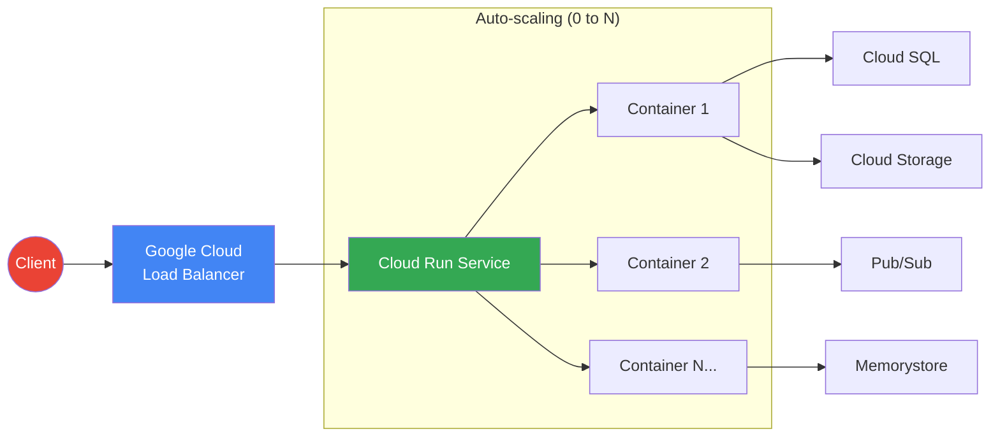
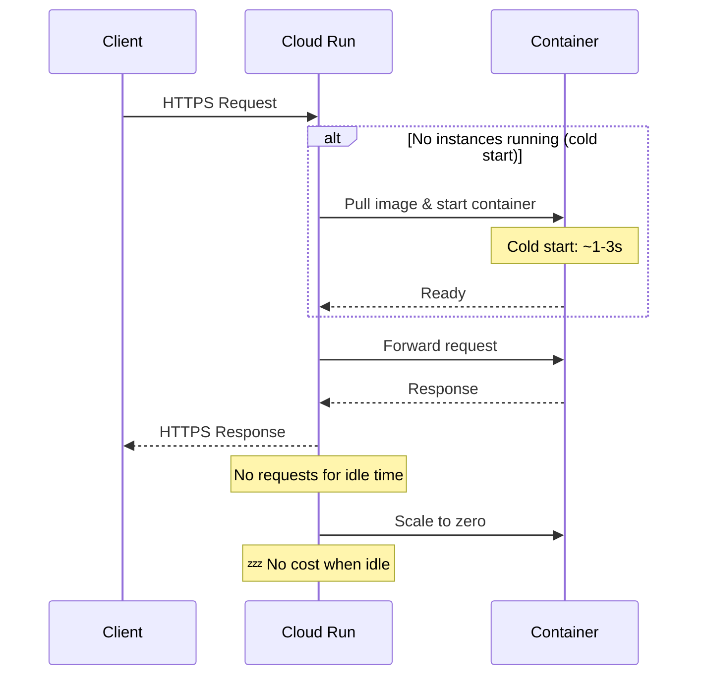
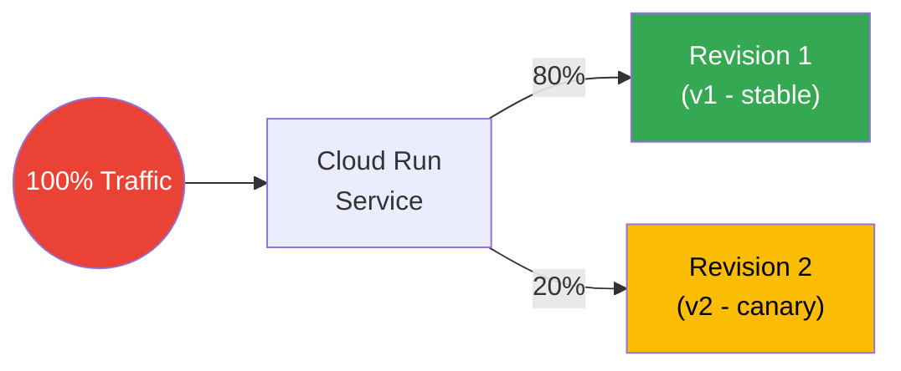

# Cloud Run — Command Reference & Guide

Cloud Run is a fully managed serverless platform that runs containerized applications on Google Cloud. It automatically scales to zero and handles infrastructure management.

## Architecture Overview



## Request Lifecycle



---

## Prerequisites

```bash
# Enable required APIs
gcloud services enable run.googleapis.com
gcloud services enable artifactregistry.googleapis.com
gcloud services enable cloudbuild.googleapis.com

# Set your project
gcloud config set project YOUR_PROJECT_ID

# Set default region
gcloud config set run/region us-central1
```

---

## Artifact Registry — Push an Image

```bash
# Create a repository
gcloud artifacts repositories create my-repo \
    --repository-format=docker \
    --location=us-central1

# Configure Docker auth
gcloud auth configure-docker us-central1-docker.pkg.dev

# Build and push image
docker build -t us-central1-docker.pkg.dev/YOUR_PROJECT_ID/my-repo/my-app:v1 .
docker push us-central1-docker.pkg.dev/YOUR_PROJECT_ID/my-repo/my-app:v1
```

---

## Deploy a Service

### Deploy with Public Access
```bash
gcloud run deploy my-service \
    --image us-central1-docker.pkg.dev/YOUR_PROJECT_ID/my-repo/my-app:v1 \
    --region us-central1 \
    --allow-unauthenticated
```

### Deploy with Authenticated Access Only
```bash
gcloud run deploy my-service \
    --image us-central1-docker.pkg.dev/YOUR_PROJECT_ID/my-repo/my-app:v1 \
    --region us-central1 \
    --no-allow-unauthenticated
```

### Deploy with Environment Variables
```bash
gcloud run deploy my-service \
    --image us-central1-docker.pkg.dev/YOUR_PROJECT_ID/my-repo/my-app:v1 \
    --region us-central1 \
    --set-env-vars="ENV=production,DB_HOST=10.0.0.1" \
    --allow-unauthenticated
```

### Deploy with Custom CPU and Memory
```bash
gcloud run deploy my-service \
    --image us-central1-docker.pkg.dev/YOUR_PROJECT_ID/my-repo/my-app:v1 \
    --region us-central1 \
    --cpu=2 \
    --memory=1Gi \
    --allow-unauthenticated
```

### Deploy with Min/Max Instances (prevent cold starts)
```bash
gcloud run deploy my-service \
    --image us-central1-docker.pkg.dev/YOUR_PROJECT_ID/my-repo/my-app:v1 \
    --region us-central1 \
    --min-instances=1 \
    --max-instances=10 \
    --allow-unauthenticated
```

---

## Traffic Management

### Traffic Splitting — Canary Deployment



### Deploy a New Revision Without Sending Traffic
```bash
gcloud run deploy my-service \
    --image us-central1-docker.pkg.dev/YOUR_PROJECT_ID/my-repo/my-app:v2 \
    --region us-central1 \
    --no-traffic
```

### Split Traffic Between Revisions (Canary / Blue-Green)
```bash
# 80% to v1, 20% to v2
gcloud run services update-traffic my-service \
    --region us-central1 \
    --to-revisions my-service-00001-abc=80,my-service-00002-def=20
```

### Route 100% Traffic to the Latest Revision
```bash
gcloud run services update-traffic my-service \
    --region us-central1 \
    --to-latest
```

### Roll Back to a Previous Revision
```bash
gcloud run services update-traffic my-service \
    --region us-central1 \
    --to-revisions my-service-00001-abc=100
```

---

## Service Management

### List All Services
```bash
gcloud run services list --region us-central1
```

### Describe a Service
```bash
gcloud run services describe my-service --region us-central1
```

### Get the Service URL
```bash
gcloud run services describe my-service \
    --region us-central1 \
    --format="value(status.url)"
```

### List Revisions
```bash
gcloud run revisions list --service my-service --region us-central1
```

### Delete a Revision
```bash
gcloud run revisions delete my-service-00001-abc --region us-central1
```

### Delete a Service
```bash
gcloud run services delete my-service --region us-central1
```

---

## Integrations & Connectivity

### Connect to Cloud SQL via VPC Connector
```bash
gcloud run deploy my-service \
    --image us-central1-docker.pkg.dev/YOUR_PROJECT_ID/my-repo/my-app:v1 \
    --region us-central1 \
    --add-cloudsql-instances YOUR_PROJECT_ID:us-central1:my-sql-instance \
    --set-env-vars="CLOUD_SQL_CONNECTION_NAME=YOUR_PROJECT_ID:us-central1:my-sql-instance" \
    --allow-unauthenticated
```

### Connect to a VPC Network
```bash
gcloud run deploy my-service \
    --image us-central1-docker.pkg.dev/YOUR_PROJECT_ID/my-repo/my-app:v1 \
    --region us-central1 \
    --vpc-connector my-vpc-connector \
    --vpc-egress all-traffic \
    --allow-unauthenticated
```

---

## IAM — Control Who Can Invoke a Service

### Allow All Users (public)
```bash
gcloud run services add-iam-policy-binding my-service \
    --region us-central1 \
    --member="allUsers" \
    --role="roles/run.invoker"
```

### Allow a Specific Service Account
```bash
gcloud run services add-iam-policy-binding my-service \
    --region us-central1 \
    --member="serviceAccount:my-svc@YOUR_PROJECT_ID.iam.gserviceaccount.com" \
    --role="roles/run.invoker"
```

---

## Logs & Monitoring

```bash
# Stream logs from a service
gcloud beta run services logs tail my-service --region us-central1

# View logs in Cloud Logging
gcloud logging read "resource.type=cloud_run_revision AND resource.labels.service_name=my-service" \
    --limit 50 \
    --format json
```

---

## Key Concepts

| Term | Description |
|------|-------------|
| **Service** | The top-level Cloud Run resource — represents your application |
| **Revision** | An immutable snapshot of your service configuration + image |
| **Traffic split** | Route percentages of requests to different revisions |
| **Cold start** | Delay when a new container instance starts (use `--min-instances=1` to avoid) |
| **Concurrency** | Number of simultaneous requests per container instance (default: 80) |